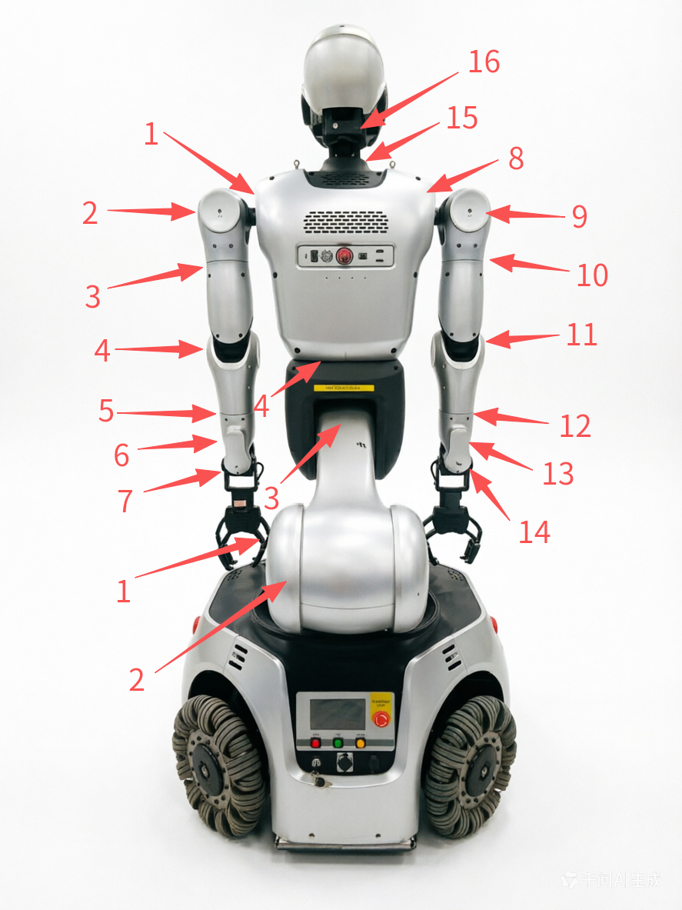
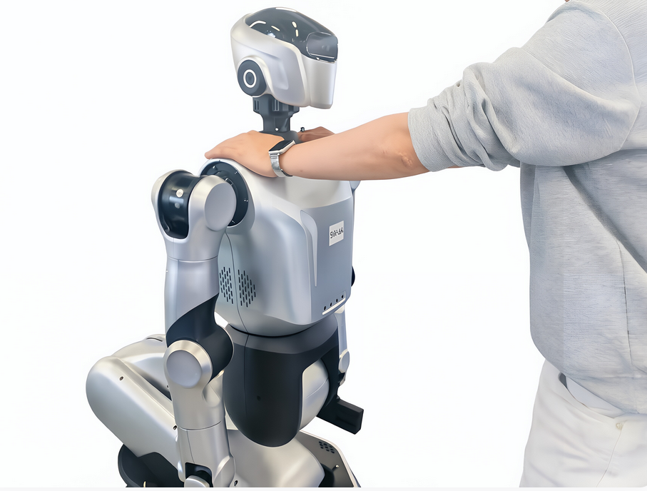
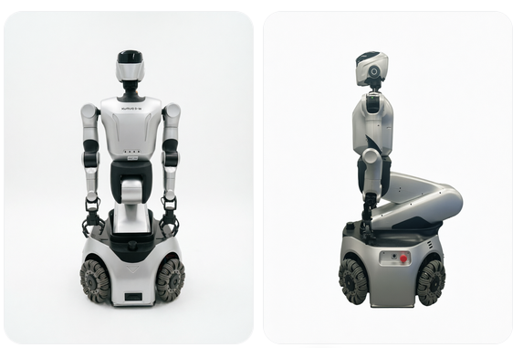
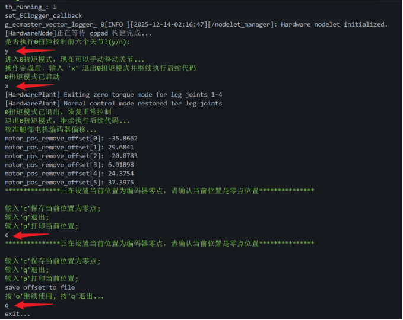

# Kuavo 5-W 标定全身零点

## 1、轮臂电机编号



新建终端，将手臂与头部调整到**零点姿态**后，启动标定程序：

```txt
cd kuavo-ros-opensource  
sudo su  
source devel/setup.bash  
roslaunch humanoid_controllers load_kuavo_real_wheel.launch cali:=true cali_leg:=true cali_arm:=true ##标定腿部和手臂、头部
```

## 2、按提示进入 0 扭矩并调整到零点

当日志提示“是否执行 0 扭矩控制前六个关节”时：

1. 如下图所示，人工处于正前方扶住机器人，避免机器人前倾或后仰下坠。



2. 在终端输入 `y` 确认后，腿部电机将进入“软”状态。
3. 由于重力影响，下半身部分关节会下压；此时手动将 **下肢3、4 号电机**摆正到位。

完成后，该姿态即为机器人零点位置，如下图所示：



## 3、保存零点并退出

零点姿态调整完成后，按以下顺序操作：

- 按 `x`：退出当前控制/调整流程  
- 按 `c`：保存零点  
- 按 `q`：退出程序  

如下图所示：



至此，零点标定完成。

## 4、下肢限位标零（v60/v62/v63）

除启动时 0 扭矩粗标（`cali_leg:=true`）外，轮臂还支持交互式**下肢限位标零**，用于精调 4 个 PA115 下肢关节零点。

### 4.1 启动标定

```bash
cd kuavo-ros-opensource
sudo su
source devel/setup.bash
roslaunch humanoid_controllers load_kuavo_real_wheel.launch cali:=true
```

> v62/v63（`ROBOT_MODULE: LUNBI_V62`）H12 遥控器启动时仅附加 `cali:=true`，不自动执行 `cali_arm`。

按提示进入标零模式后（如按 `a`），选择：

1. 自动 / 逐个校准模式
2. 校准范围（轮臂可选）：
   - `4` - 校准手臂和腿
   - `5` - 校准手臂、头部和腿
   - `6` - 仅校准腿

### 4.2 配置说明（kuavo.json）

下肢限位标零依赖以下 3 个字段（关节索引 0~3，对应 4 个下肢 EC 电机）：

| 字段 | 含义 |
|------|------|
| `leg_calibration_safe_pose` | 标零前移动到安全姿态（度） |
| `leg_calibration_limits` | 各关节限位处的目标角度，作为零点基准（度） |
| `leg_calibration_directions` | 朝限位运动方向（1 正向，-1 反向） |

v62/v63 当前参数与 v60 一致，来源于 `kuavo_v60/kuavo.json`。

### 4.3 ROBOT_MODULE 说明

| 值 | 适用版本 | EC 电机数 | 说明 |
|----|---------|----------|------|
| `LUNBI` | v60/v61 | 6（4 腿 + 2 肩） | 旧轮臂拓扑 |
| `LUNBI_V62` | v62/v63 | 4（全为腿） | 肩部改 Ruiwo，支持气泵末端 |

两者在标零流程上共用同一套逻辑，但 EC Master 电机映射不同，**不可合并为同一模块名**。

### 4.4 安全提示

- 标零前确认关节能运动到限位且无遮挡
- 仅校准腿时，手臂会先移动到 `calibration_safe_pose` 安全姿态
- 标零完成后按 `s` 保存零点
