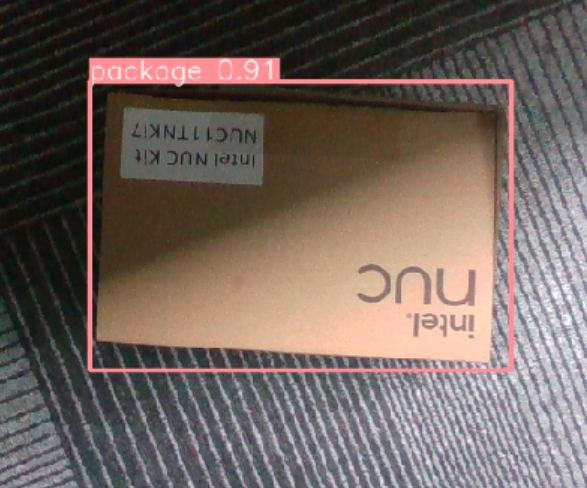

# yolov8目标检测案例

- [yolov8目标检测案例](#yolov8目标检测案例)
  - [说明](#说明)
  - [🎯 针对于 YOLOv8 训练模型检测调用](#-针对于-yolov8-训练模型检测调用)
  - [📁 模型路径及说明](#-模型路径及说明)
  - [📡 箱子识别 ROS 话题订阅](#-箱子识别-ros-话题订阅)
  - [💻 yolo\_box\_object\_detection 功能包代码说明 (头部 NUC)](#-yolo_box_object_detection-功能包代码说明-头部-nuc)
  - [🔧 识别姿态四元数说明](#-识别姿态四元数说明)
  - [示例代码](#示例代码)

## 说明
- 功能包：`yolo_box_object_detection` (位于上位机代码仓库)：`<kuavo_ros_application>/src/ros_vision/detection_industrial_yolo/yolo_box_object_detection`
- 📦 箱子识别

**使用前需要打开摄像头**
```bash
cd ~/kuavo_ros_application
source /opt/ros/noetic/setup.bash
source ~/kuavo_ros_application/devel/setup.bash 
# 旧版4代, 4Pro
roslaunch dynamic_biped load_robot_head.launch
# 标准版, 进阶版, 展厅版, 展厅算力版
roslaunch dynamic_biped load_robot_head.launch use_orbbec:=true
```
## 🎯 针对于 YOLOv8 训练模型检测调用

- 🔍 **yolo_box_object_detection** -- 箱子识别 YOLO ROS 功能包

## 📁 模型路径及说明

- 📂 路径：`<kuavo_ros_application>/src/ros_vision/detection_industrial_yolo/yolo_box_object_detection`
- 📄 模型格式：`.pt`
- 🗂️ 模型路径：`<kuavo_ros_application>/src/ros_vision/detection_industrial_yolo/yolo_box_object_detection/scripts/models/`

**打开检测程序**
```bash
cd ~/kuavo_ros_application
source /opt/ros/noetic/setup.bash
source ~/kuavo_ros_application/devel/setup.bash 
roslaunch yolo_box_object_detection yolo_segment_detect.launch 
```
- 如果上位机为agx或NX可能或出现下面报错：


在终端输入下面命令：
```bash
echo 'export LD_PRELOAD=/usr/lib/aarch64-linux-gnu/libgomp.so.1:$LD_PRELOAD' >> ~/.bashrc
```
开一个新的终端重新打开检测程序。

如果需要可视化检测效果，需要打开rqt_image_view或rviz(需要接显示屏或者远程桌面查看)，订阅object_yolo_box_segment_image话题查看效果



## 📡 箱子识别 ROS 话题订阅

```bash
/object_yolo_box_segment_result   # 基于相机坐标系下的箱子中心点的3D位置
/object_yolo_box_segment_image    # 识别箱子的绘制结果
/object_yolo_box_tf2_torso_result # 基于机器人基坐标系下的箱子中心点的3D位置
```

## 💻 yolo_box_object_detection 功能包代码说明 (头部 NUC)

- `yolo_box_segment_ros.py`: 
  - 调用模型检测并获取识别框中心点三维坐标位置
  - 发布到 `/object_yolo_box_segment_result`
  - 过滤低于 0.6 置信度的结果
- `yolo_box_transform_torso.py`: 
  - 订阅 `/object_yolo_box_segment_result` 
  - 将坐标转换到机器人基坐标系
  - 发布转换结果到 `/object_yolo_box_tf2_torso_result`


## 🔧 识别姿态四元数说明

- 📄 查看 `yolo_box_transform_torso.py` 文件第 71-74 行，由于检测只获取检测目标中心点空间位置无姿态信息，四元数为固定值非实际值

## 示例代码
- 路径：`<kuavo-ros-opensource>/src/demo/examples_code/yolo_detect/yolo_detect_info.py`
- `yolo_detect_info.py`: 获取一次 `/object_yolo_box_tf2_torso_result` 检测结果基于机器人基座标系的位姿