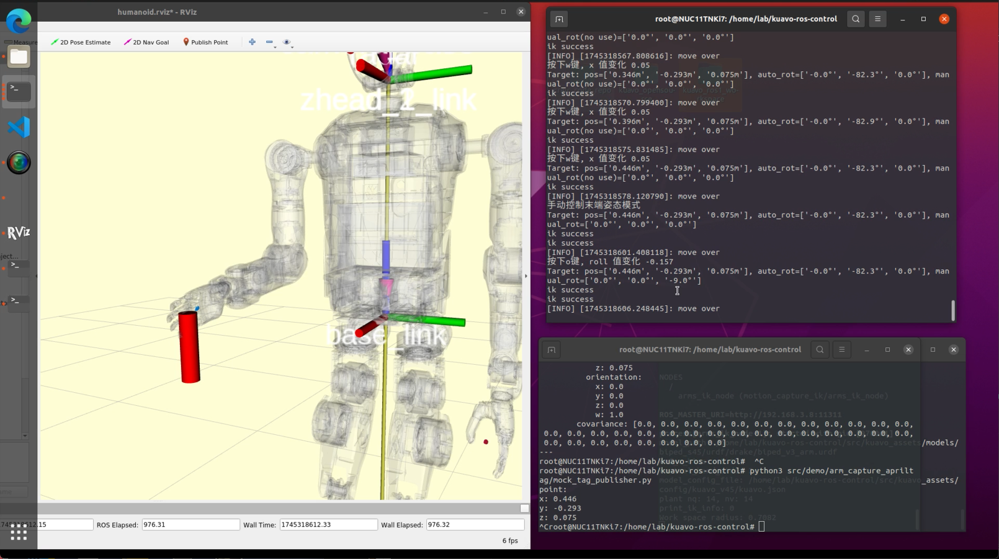
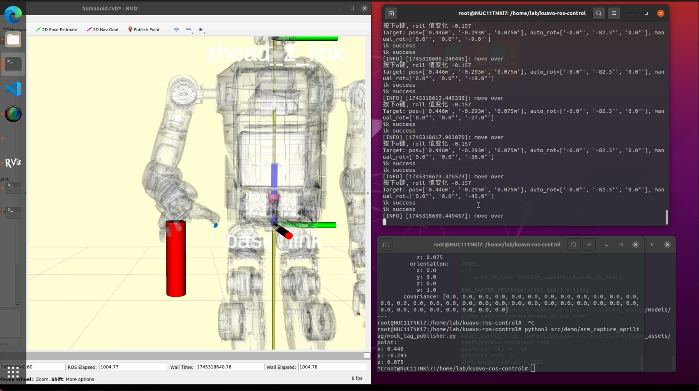
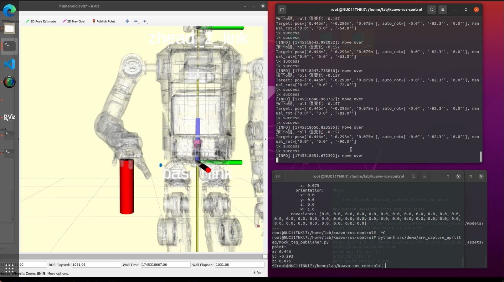

# 键盘控制案例


## 描述

  - 使用键盘控制机器人的运动

  - 使用键盘控制机器人手臂移动

  - 示例代码路径:`<kuavo-ros-opensource>/src/kuavo_sdk/scripts/keyboard_control/robot_keyboard_control.py`

## 程序逻辑

1. 程序初始化

    - 程序启动时，初始化ROS节点，节点名称为simulated_joystick

    - 创建一个SimulatedJoystick类的实例

    - 订阅/stop_robot话题，用于接收停止机器人的信号

    - 使用termios库设置键盘输入为非阻塞模式，以便实时读取键盘输入

    - 手臂移动控制

      - 读取传感器数据得到当前各关节角度,再通过fk正解,得到初始末端位姿

      - 初始化程序参数，储存机器人的末端位姿期望信息

      - 调用termios库设置键盘输入模式，实时读取键盘输入

      - 手臂切换至控制模式二(外部控制)

      - 发布/kuavo_arm_target_poses话题，用于控制手臂目标姿态

    - 整机运动控制

      - 发布/joy话题，用于发送模拟的遥控器信号

2. 键盘输入处理
    - getKey函数：

      使用select库监听键盘输入，设置超时时间为0.1秒

      如果有键盘输入，读取单个字符并返回；否则返回空字符串

      如果键盘输入ctrl+c 则恢复键盘的原始设置 并退出程序

    - update_joy函数：

      - 手臂移动控制

        根据键盘输入更新末端执行器`位置控制(XYZ)`与`姿态控制(RPY)`的参数值

      - 整机运动控制

        根据键盘输入更新模拟遥控器的状态（按钮和摇杆信号）

3. 控制指令发布

    - 主循环：

      在run函数中，程序进入主循环，不断监听键盘输入。

    - 手臂移动控制

      - 自适应处理：

        根据设定的末端位置，计算得出一个相对合理的末端姿态
        
        自适应处理能确保在`自动控制末端姿态模式`下，最大的可达空间。

      - 手动修改：

        若处在`手动控制末端姿态模式`下，则启用输入的角度参数。

        以`自适应处理`得到的末端姿态为参照，进行二次旋转。

        将最后的结果作为最终参数发给ik进行求解

    - 整机运动控制

      如果有键盘输入，调用update_joy函数更新遥控器状态。

      将更新后的遥控器信号（joy_msg）发布到/joy话题。

    - 退出条件：

      如果按下Ctrl-C，程序退出主循环。

      如果接收到/stop_robot话题的消息，程序调用rospy.signal_shutdown关闭ROS节点。

4. 程序退出

    - 资源清理：

      程序退出时，恢复键盘的原始设置，避免键盘输入异常。


## 参数说明

  - `joystick_sensitivity`:灵敏度,无单位.

  - 修改路径:`<kuavo-ros-opensource>/src/humanoid-control/humanoid_controllers/launch/joy/joy_control_sim.launch`

## 编译

```bash
cd <kuavo-ros-opensource>
sudo su
catkin build kuavo_sdk motion_capture_ik kuavo_msgs
```

## 执行

  - 启动机器人
    - **注意: joystick_type不能设定为bt2pro, 否则键盘控制的映射会出现问题**
    ```bash
    cd kuavo-ros-opensource  # 进入下位机工作空间
    sudo su
    source devel/setup.bash
    # 仿真环境运行
    roslaunch humanoid_controllers load_kuavo_mujoco_sim.launch 
    # 实物运行
    roslaunch humanoid_controllers load_kuavo_real.launch 
    ```

  - 启动ik逆解服务器  

    - **注意: 部分版本的ik逆解服务会在上一步启动机器人时自动启动,注意不要重复启动**
    - 判断方式: 终端输入`rosnode list | grep ik`
    - 若已存在`/arms_ik_node`, 则跳过此步
    - 若不存在`/arms_ik_node`, 则运行:
      ```bash
      cd kuavo-ros-opensource  # 进入下位机工作空间
      sudo su
      source devel/setup.bash
      roslaunch motion_capture_ik ik_node.launch 
      ```

  - 启动键盘控制案例
    - **注意: 请确保机器人身上没有插着北通手柄的接受器**
    ```bash
    cd kuavo-ros-opensource  # 进入下位机工作空间
    sudo su
    source devel/setup.bash
    python3 src/kuavo_sdk/scripts/keyboard_control/robot_keyboard_control.py 
    ```

  - 操作说明
    
    - 初始为`键盘控制手臂模式`

    - 按`v`在`键盘控制手臂模式`和`键盘控制机器人移动模式`间切换

    - 键盘控制机器人移动模式:

        - 键盘`WASD`为左操纵杆，控制前进/后退，左/右横移,每按动一次值增加或减小10%；
        - 键盘`IK`和`JL/QE`为右操纵杆，控制上/下、左转/右转,每按动一次值增加或减小10%；
        - 键盘`R`是walk(原地踏步)；`C`是stance(原地站立)；
        - 键盘空格是将左右操纵杆的输入重置为零。

    - 键盘控制手臂模式:

      根据键盘输入更新末端执行器`位置控制(XYZ)`与`姿态控制(RPY)`的参数值:

      | 控制 |   X   |   Y   |   Z   | Roll  | Pitch  | Yaw  |
      |:----:|:-----:|:-----:|:-----:|:-----:|:------:|:----:|
      |  加  |  `w`  |  `d`  |  `q`  |  `u`  |  `i`   | `j`  |
      |  减  |  `s`  |  `a`  |  `e`  |  `o`  |  `k`   | `l`  |

      按`G`切换控制模式,在`手动控制`和`自动控制`两者间切换

      `位置控制(XYZ)`的变化会相应修改`self.eef_target_xyz`的值

      `姿态控制(RPY)`的变化会相应修改`self.eef_angle_manual`的值

      注: 
        - `self.eef_target_ypr`的值为自动生成,不要手动修改
        - `Yaw`的推荐赋值范围为`负九十度 ~ 正九十度`
        - `Pitch`和`Roll`的推荐赋值范围为`负三十度 ~ 正三十度`

## 运行效果 

  - 键盘控制机器人移动:

    

  - 键盘控制手臂移动到指定位置:

    

  - 键盘按`G`切换至`手动控制模式` , 再控制手臂末端期望姿态绕新x轴旋转四十五度:

    

  - 键盘控制手臂末端期望姿态绕新x轴旋转九十度:

    

