# Kuavo机器人桌面软件使用手册

> 1: 本工具是一个可视化的机器人动作编辑软件，支持机械臂、手指和头部的动作编辑，可以直观地设计和预览机器人动作，并导出为可编辑的json动作文件。

> 2: 可以连接机器人以便实现下面功能（不连接机器人也可以编辑动作）：机器人的wifi连接以及切换，下载日志分析定位问题，遥控器语音动作文件快速更换，以及代码版本管理功能

> 3：编辑完动作以后可以记住当前目录位置，直接导入设计好的动作，使用遥控器快捷键实现真实机器人演示（建议先仿真验证动作，在迁移到实机）

- [Kuavo机器人桌面软件使用手册](#kuavo机器人桌面软件使用手册)
  - [下载和安装](#下载和安装)
  - [动作设计](#动作设计)
    - [使用须知](#使用须知)
    - [机器人型号选择](#机器人型号选择)
    - [手臂关节点编辑学习](#手臂关节点编辑学习)
    - [实际动作设计](#实际动作设计)
    - [手指控制](#手指控制)
    - [头部控制](#头部控制)
  - [连接机器人](#连接机器人)
    - [热点连接和WIFI连接](#热点连接和wifi连接)
    - [设置机器人网络](#设置机器人网络)
    - [下载日志和rosbag](#下载日志和rosbag)
    - [H12遥控器语音动作配置](#h12遥控器语音动作配置)
    - [代码版本管理](#代码版本管理)
      - [注意事项](#注意事项)
      - [操作步骤](#操作步骤)

## 下载和安装
工具是Windows平台下的应用程序，下载exe文件即可使用。
- 下载地址为： [Kuavo机器人桌面软件](https://kuavo.lejurobot.com/kuavo-desktop-beta/Kuavo-0.0.3-683-g0b1ef48-win.exe )
- 下载完成后，双击exe文件，即可运行，运行打开后如下图所示：

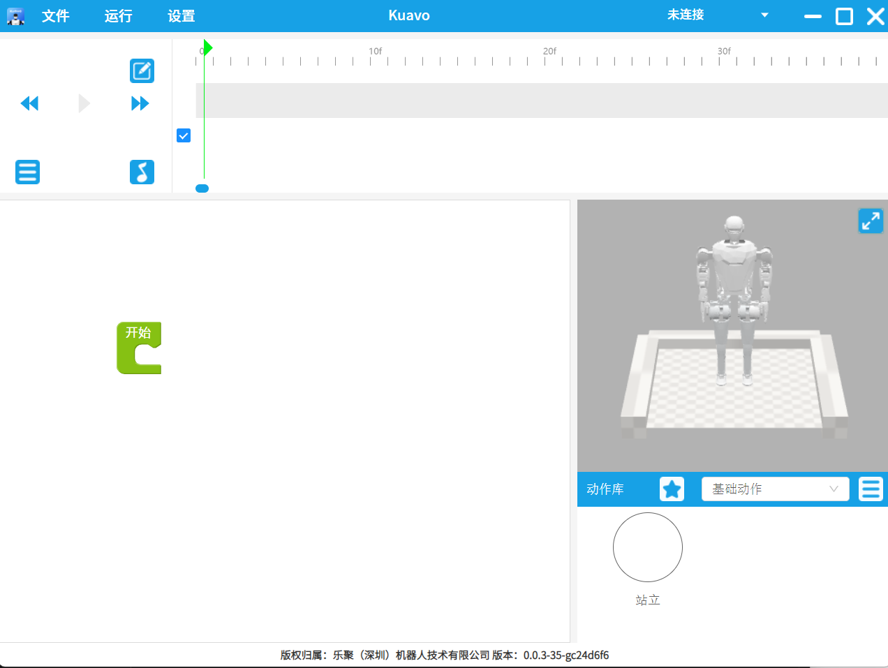

## 动作设计
### 使用须知
- 电机的旋转方向和机器人的坐标系正方向一致，符合右手定则。用右手握住电机旋转轴，让拇指指向旋转轴的正方向（旋转轴正方向和机器人的坐标系正方向一致）其余四指的弯曲方向表示旋转的正方向。
- 时间轴上的帧率为100帧/秒
- 两个动作之间要有一定时间间隔，不然动作不能完成执行
- 建议在编辑前保存当前工作，避免意外丢失
- 动作设计时注意机械臂的运动范围限制，避免碰撞
- 工具界面说明：
  - 右侧区域：3D机器人模型预览
  - 头部时间轴：用于编辑关键帧
  - 右下角：基础动作库
  - 右上角工具栏：包含播放、保存等功能按钮
- 不连接机器人也可以编辑动作
### 机器人型号选择
> 根据实际需要选择适合的版本，本案例为4pro短手示例，但对于不同机器人版本，操作不会发生变化
- 点击文件，然后点击新建即可选择机器人版本


### 手臂关节点编辑学习

- 首先单击机器人手臂，左侧会弹出机器人可以编辑的关节点，如下图所示：


- 为了更直观地学习和编辑动作，在开始编辑前可以将各个关节的角度归零。这是因为在机械臂的坐标系中，一个关节的角度变化会影响其他关节的运动。当所有关节角度归零时，可以更清晰地观察和理解单个关节的独立运动效果，了解单个关节的转动情况后，可以开始编辑动作。

### 实际动作设计
- 机器人手臂的动作是由多个独立的关节动作组合而成的。每个关节的动作可以看作是一个子动作，这些子动作按照一定的顺序和逻辑组合在一起，形成一个完整的手臂动作。例如，挥手动作可以分解为肩关节的抬起、肘关节的弯曲和手腕的旋转等多个子动作。通过精确控制每个关节的运动，可以实现复杂的手臂动作。下面通过一个案例来说明如何设计挥手动作。

- 设置机械臂角度，然后点击确定：

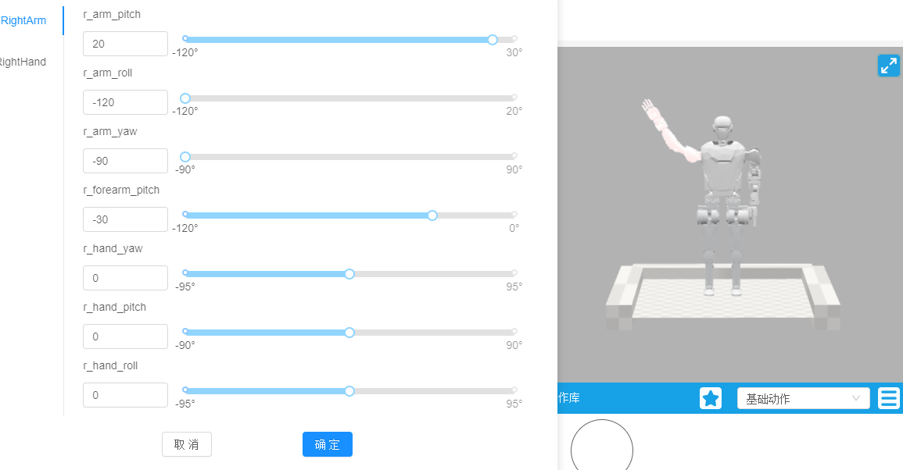

- 在约60帧位置右键鼠标，选择插入关键帧，然后点击全身：

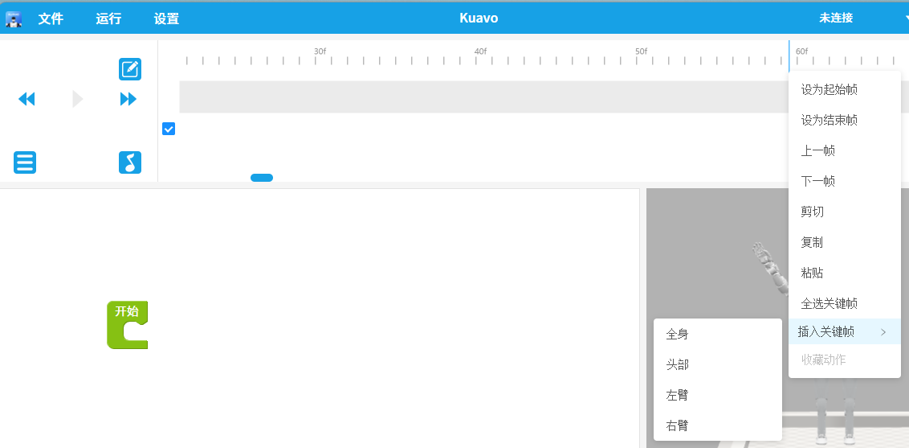

- 此时再次右键，收藏动作亮起，点击收藏动作，将动作命名为挥手1：


- 此时右下角基础动作库中会多出一个动作：


- 开始设计第二个子动作，操作流程同上，以下给出机械臂角度和关键帧数，具体操作步骤参考挥手1：

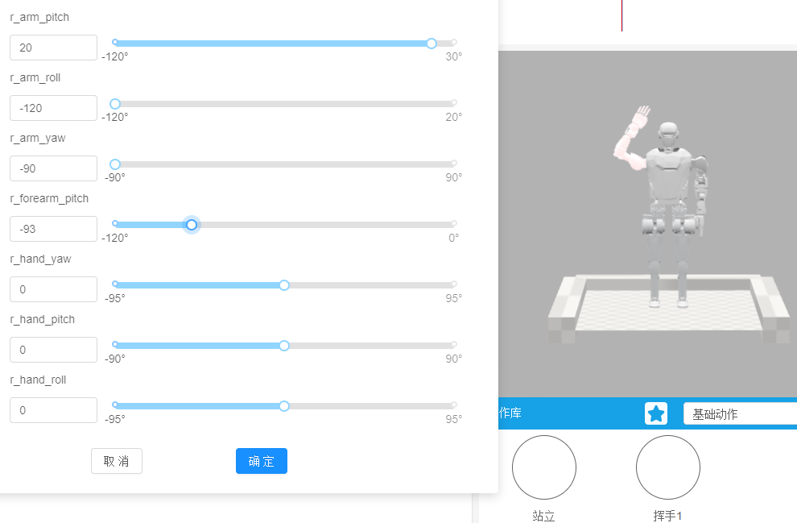

- 关键帧数155左右：

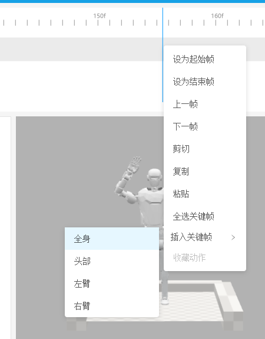

- 收藏动作，命名为挥手2。  
- 现在开始设计第三个子动作，流程如上。角度：

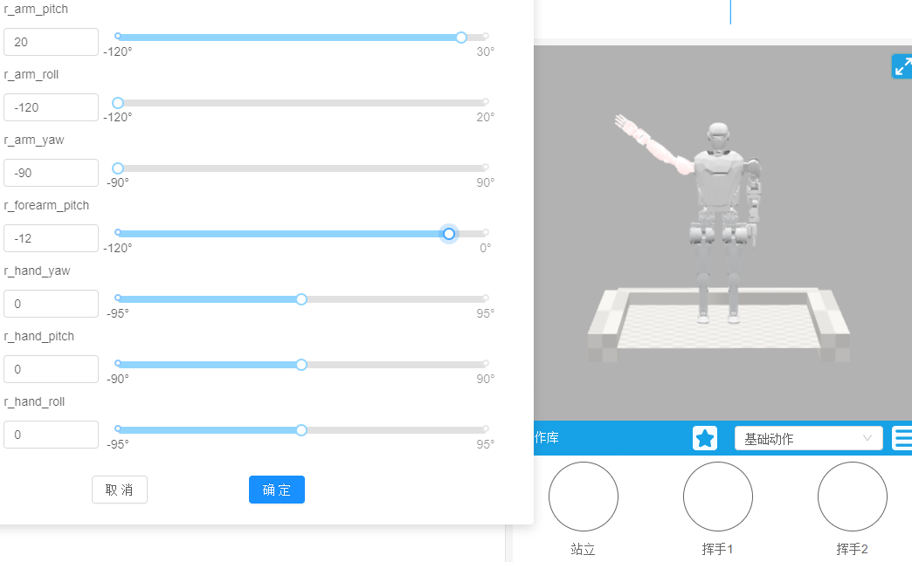

- 关键帧数240：


- 收藏动作，命名为挥手3。

### 手指控制
- 工具还可以实现手指和头部的控制，和手臂的控制类似，手指的关节点一共只有6个，大拇指两个，其余手指只有一个关节点，头部只有两个关节点，所以头部和手指的控制相对简单。

- 接着上面的240帧，在320帧插入一个握拳动作，关节点角度如下：

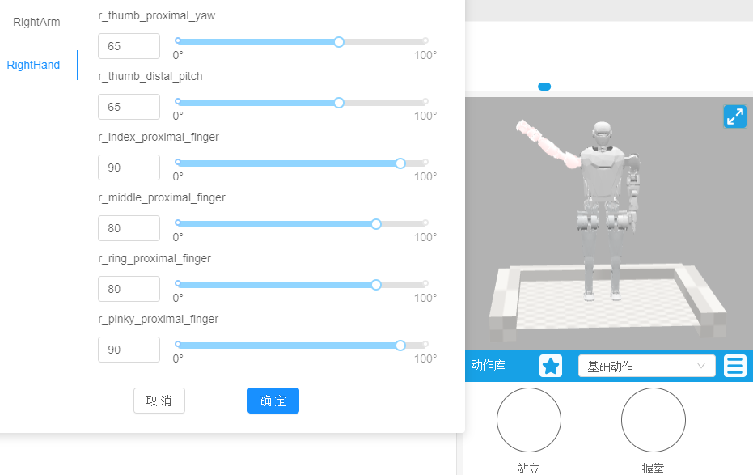

### 头部控制

- 在380帧插入一个头部抬头动作，关节点角度如下：

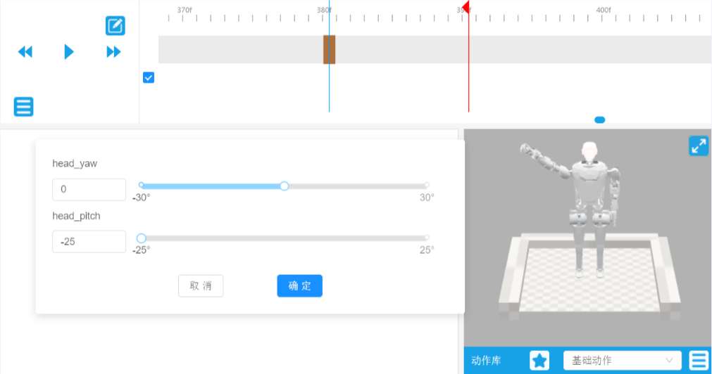

- 最后在最后一个动作帧右边一点，设置为结束帧，如图中红线所示：


- 现在点击播放按钮即可播放挥手握拳抬头动作。


- 单击下图按钮，然后点击生成模块，将模块命名为挥手握拳抬头：


- 此时在界面中会出现一个挥手模块握拳抬头模块，各个模块间可以相互组合。
- 再次单击下图按钮，然后点击导出动作，即可生成程序可以读取的.tact文件：


- 生成文件如下图所示：


## 连接机器人 
> 如希望实现此功能，先在机器人下位机运行下面命令
```bash
sudo su
cd /home/lab/kuavo-ros-opensource/src/manipulation_nodes/planarmwebsocketservice/service/
chmod +x websocket_deploy_script.sh 
./websocket_deploy_script.sh
# 等待上面成功运行，然后运行下面命令
cd /home/lab/kuavo-ros-opensource/tools/user_groups_tools/
chmod +x add_user_groups.sh
./add_user_groups.sh
```

### 热点连接和WIFI连接
- 热点连接是指Windows电脑连接上机器人发出的热点，热点名为下面格式（“机器人编号”+的热点）：


- WIFI连接是指机器人下位机连接WiFi和Windows连接WIFI是同一个

- 上面两种情况，实现其中一种即可，此时鼠标左键单击：


- 会弹出机器人广播的IP，点击即可连接:


### 设置机器人网络
- 如果是第一次拿到机器人，可以选择先连接机器人热点，在选择设置然后设置机器人网络，切换到WIFI，Windows的热点也要对应更换为WIFI：

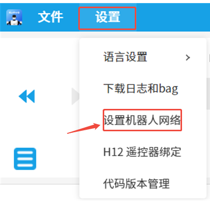

- 当然，如果此时通过WIFI连接的机器人，也可以通过设置网络切换机器人WiFi，但随后Windows的WIFI也要对应更换。

### 下载日志和rosbag
- 下载日志通常是机器人出现异常时才需要进行的操作，不管是日志或者rosbag都是根据时间排序，当机器人出现问题时先查看但前时间，方便后续提取下载日志和rosbag。
- 点击设置，然后点击下载日志和bag，找到对应时间的日志和bag即可，日志只会产生一份，但bag为防止太大，会在500M左右裁剪一次，所以bag有多个，下载时下载出问题相应时间段的即可。

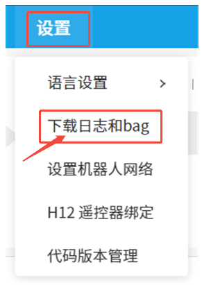
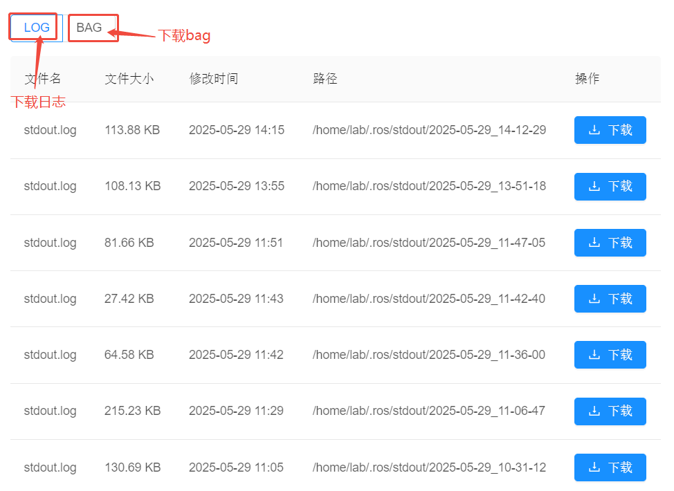

### H12遥控器语音动作配置
- 需要确保本身有遥控器控制语音动作功能，才能进行下面操作
- 点击设置，然后点击h12遥控器绑定：

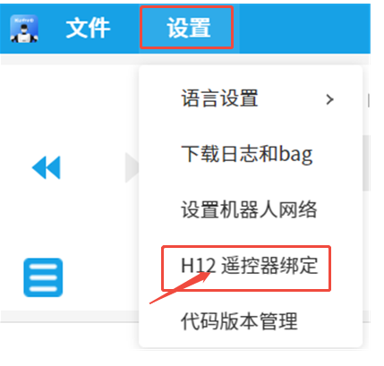

- 包含下面功能：语音动作恢复出厂设置（三套）、自定义语音动作文件导入
- 如需恢复出厂设置，直接点击即可，成功后有下面三套配套动作语音

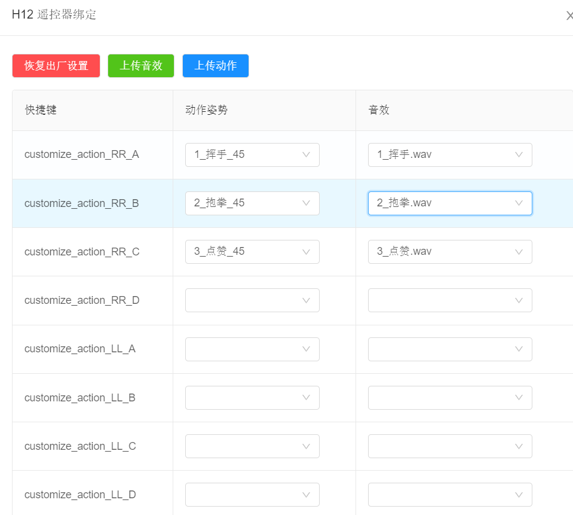

- 之前设计的动作此时已经可以用到，再提前准备好配套语音文件，导入语音动作文件，替换即可

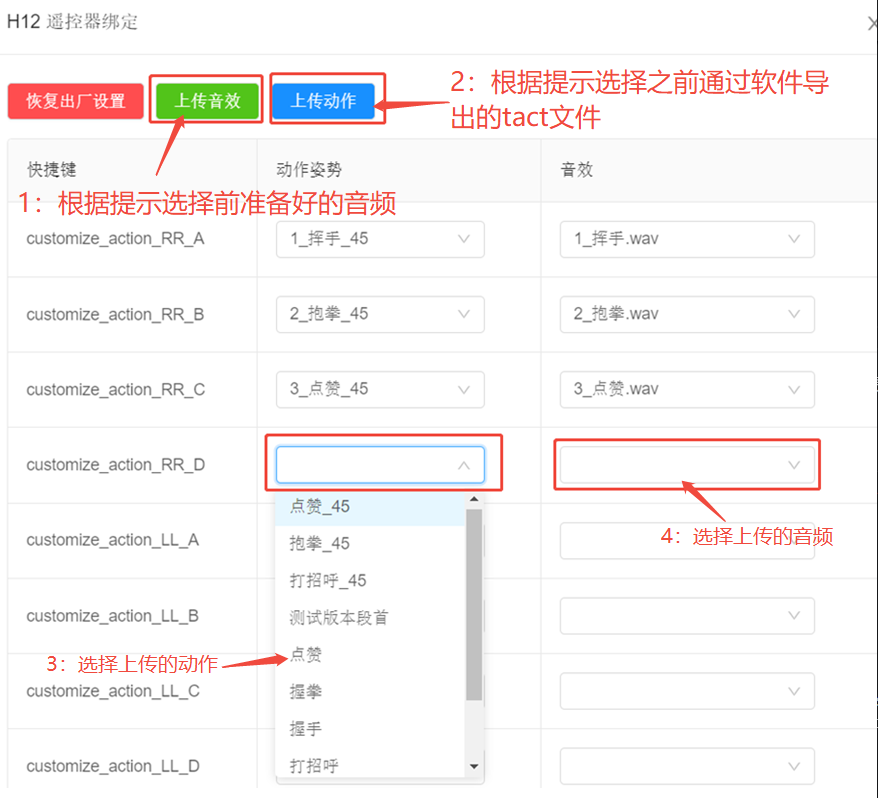

- 设置完成之后，点击确认即可

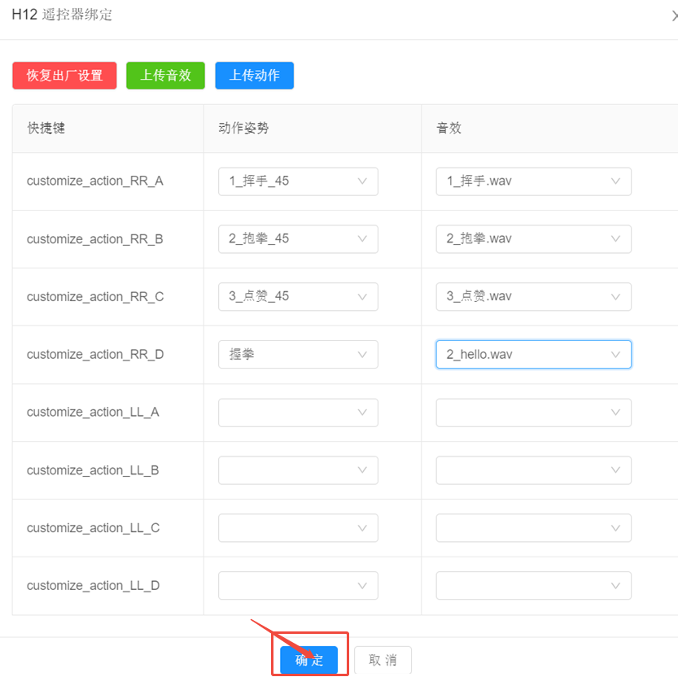

- 此时对应遥控器快捷键会有相应动作

> 在机器人打开时h12的E、F拨杆位于两边，RR_A代表把E、F都拨到最右边，然后按A就能播放对应动作和语音，而LL_D就是把E、F都拨到最左边，然后按D，其余动作语音也是同理，RR意思是right，LL意思是lift。
- E和F拨杆位置：


### 代码版本管理

#### 注意事项

- **用户使用时只能选择tag进行切换, 否则可能会存在问题**
- **tag的标准格式为x.x.x , 推荐更新最新的版本**
- **代码更新会自动覆盖之前的代码, 用户自己的代码需要自行备份**

#### 操作步骤

- 选择设置，然后选择代码版本管理，弹出下面界面，

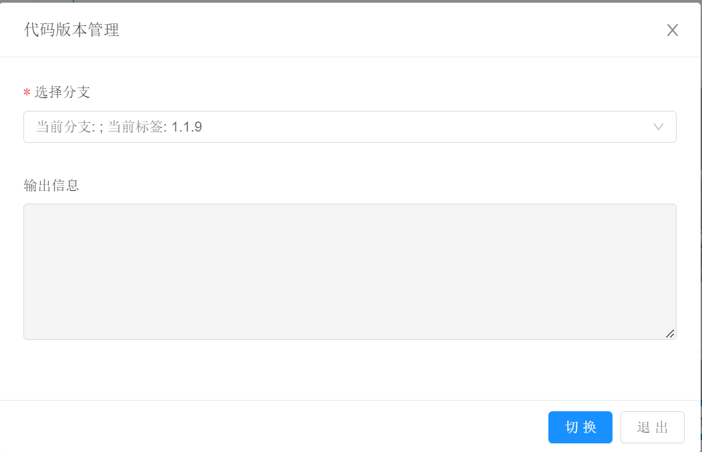

- 选择所需版本，点击切换，即可自动切换分支并编译代码

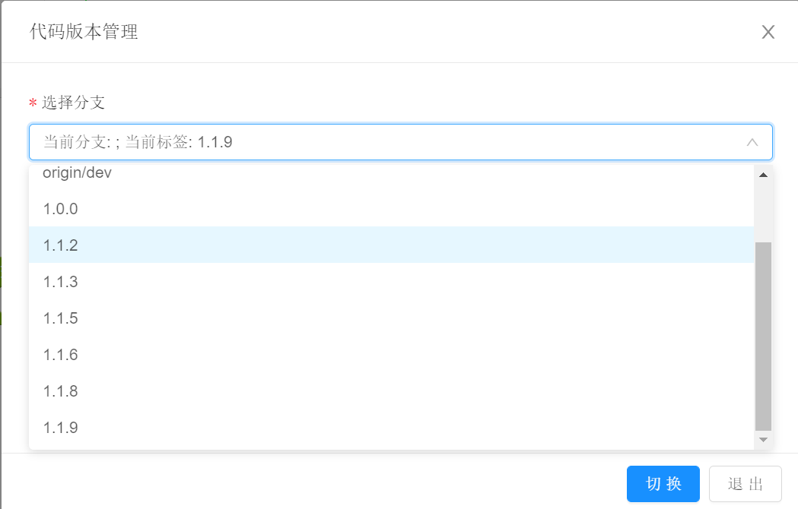

- 若输出信息正常，即为切换成功

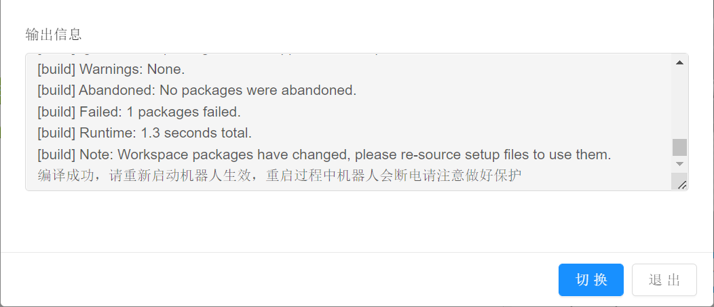