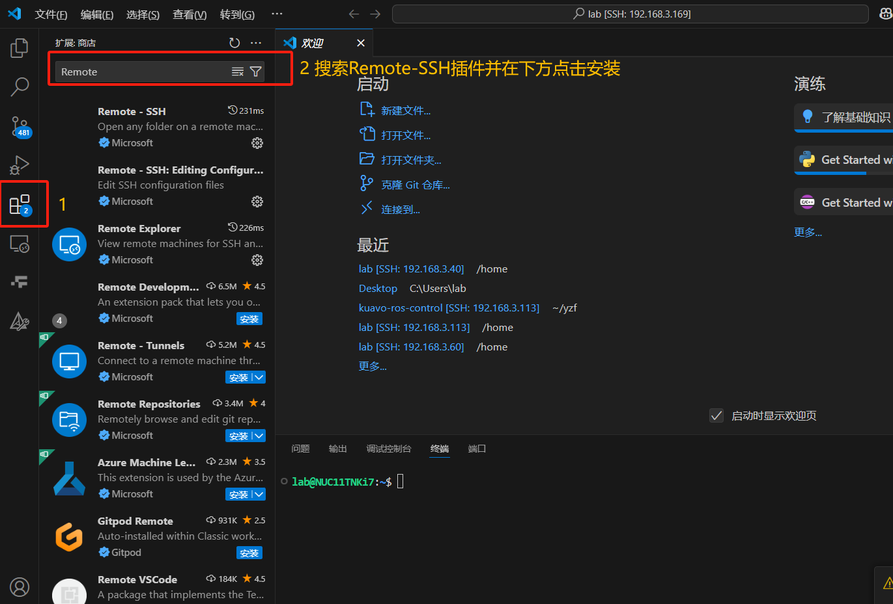
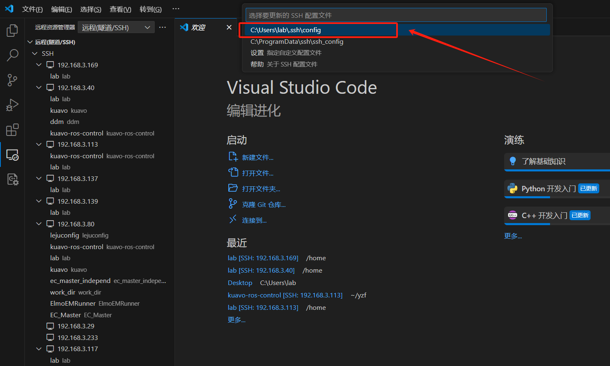
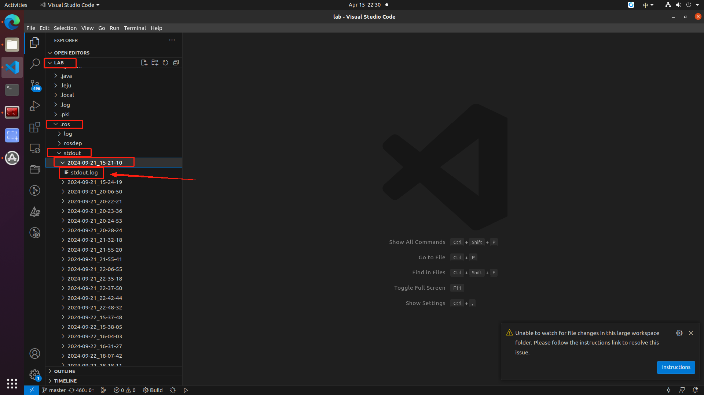
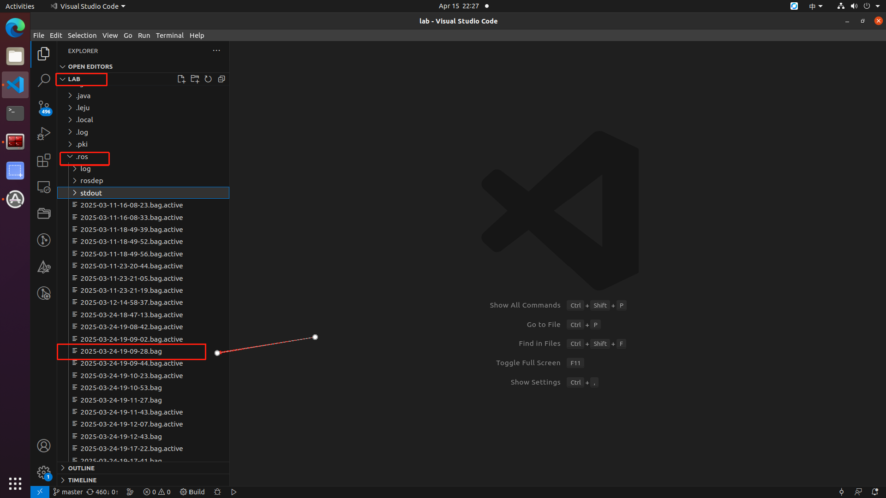
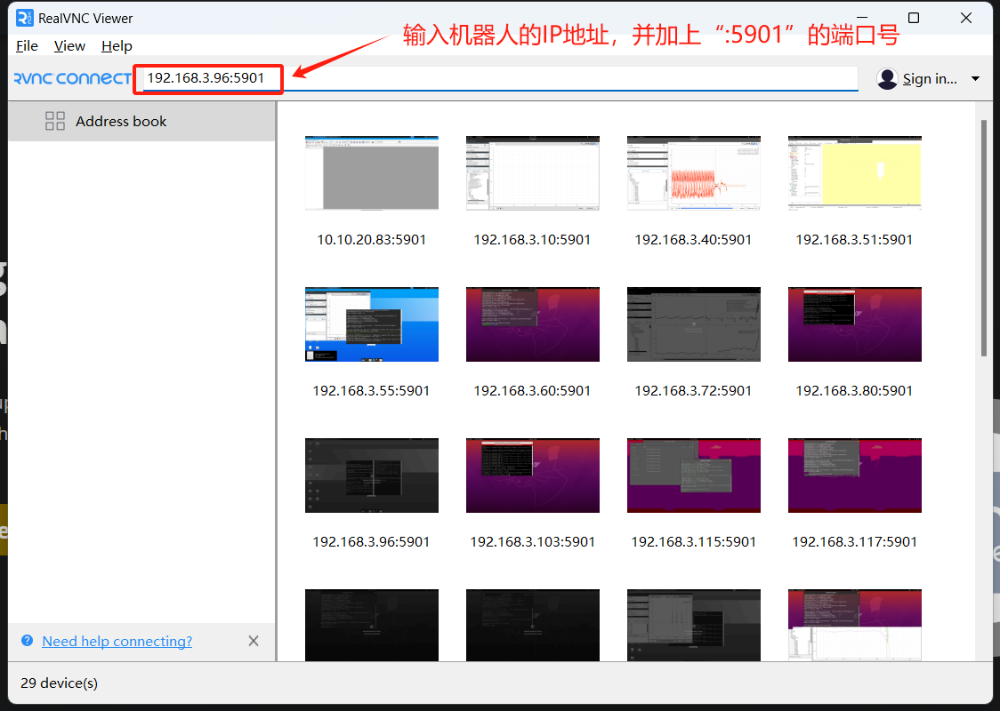
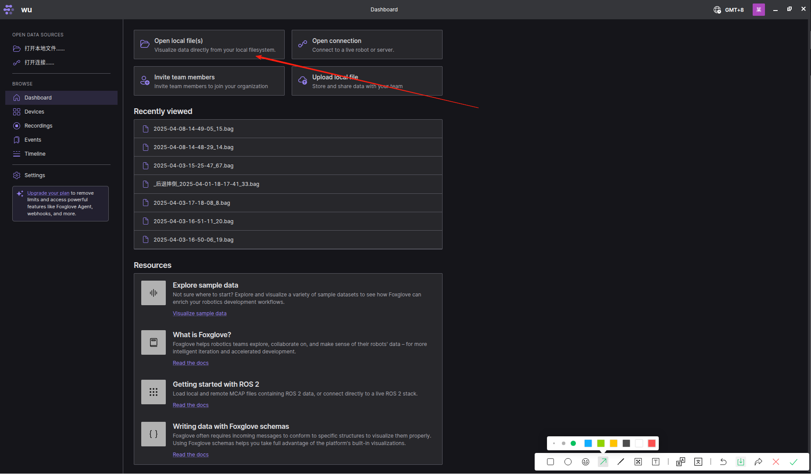
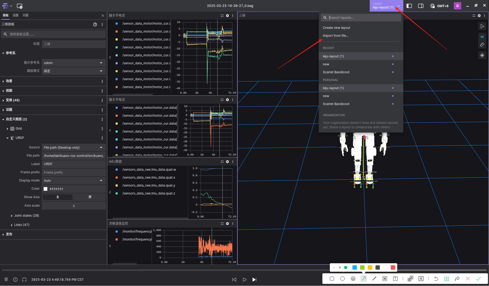
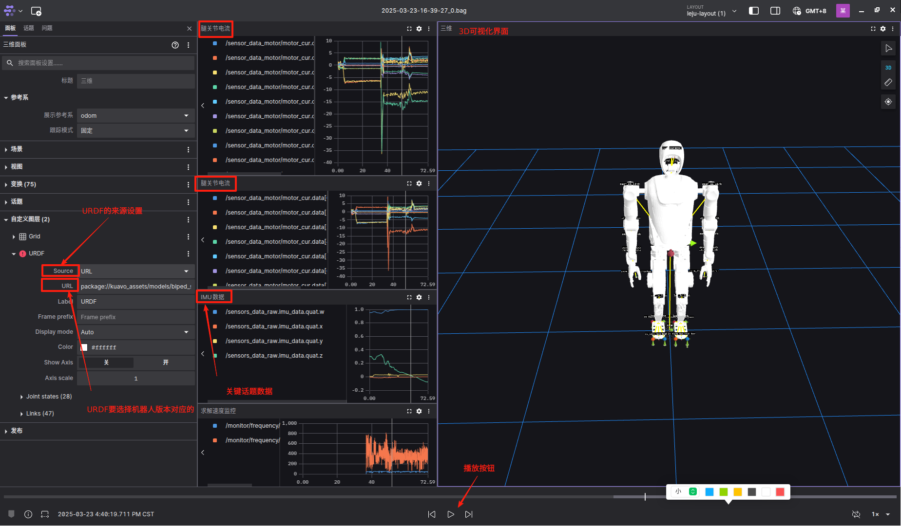

# 日志导出及可视化

- [日志导出及可视化](#日志导出及可视化)
  - [日志说明](#日志说明)
    - [下载日志](#下载日志)
    - [日志数据说明](#日志数据说明)
    - [bag可视化](#bag可视化)
      - [PlotJuggler](#plotjuggler)
      - [Foxglove](#foxglove)
        - [推荐配置](#推荐配置)
        - [使用步骤](#使用步骤)
        - [官方文档](#官方文档)


## 日志说明

我们提供的日志有.log和.bag两种文件，都存放在下位机，这两种文件均以系统时间命名，例如`2025-04-14-13-59-42_6.bag`。log文件路径为`/home/lab/.ros/stdout/年-月-日_时-分-秒/`，bag文件路径为`/home/lab/.ros/`。排查问题时需要查看对应的文件。

### 下载日志

- 用VScode下载远程连接的插件
  
  

- 用ssh远程连接机器人电脑
  
  

- 点击配置ssh config
  
  

- 点击连接开始连接机器人电脑
  
  

- 输入密码进入远程连接
  
  

- 找到~/.ros/stdout/目录并右击文件下载

  

- 找到~/.ros目录并右击文件下载
  
  

  - 有的bag文件后面有.active的后缀，这通常是未正常关闭导致的，索引有问题，使用`rosbag reindex XXXXX.bag`修复。如果文件损坏，可能需要恢复或使用工具进一步修复。

### 日志数据说明

一般在查询的时候也是主要针对以下几组数据进行问题的排查

```
/monitor/system_info/cpu_frequency    #cpu内核运行频率
/monitor/system_info/cpu_temperature  #cpu内核温度
/monitor/system_info/cpu_usage        #cpu利用率占比

/motor_cmd/motor_cur  #算法下发的电机目标电流
/motor_cmd/motor_pos  #算法下发的电机目标位置
/motor_cmd/motor_vel  #算法下发的电机目标速度

/sensor_data/joint_data/error_vec         #驱动器报错信息
/sensor_data/joint_data/joint_cmd_torque  #驱动器收到的电流指令

/sensor_data_motor/motor_cur  #电机反馈的真实电流
/sensor_data_motor/motor_pos  #电机反馈的真实位置
/sensor_data_motor/motor_vel  #电机反馈的真实速度

/state_estimate/imu_data_flitered/angularVel   #经过滤波后的质心欧拉角数据
/state_estimate/imu_data_flitered/linearAccel  #经过滤波后的质心线加速度
```
1. 电机编号定义


2. 控制类相关的数据 `/humanoid_controller/*`

   - 机器人质心部分 `/humanoid_controller/com`

     - `/com/r`：质心位置，依次为x，y，z轴向的平移位置，单位 m

     - `/com/r_des`: 质心期望位置，同上，可与质心位置对比跟踪效果

     - `/com/rd`:质心速度 单位m/s

     - `/com/rd_des`:质心期望速度

3. 监控类型数据 `/monitor/*`

   - 监控wbc、mpc控制频率 `/monitor/frequency/*`

     - `/frequency/mpc`:mpc控制频率  单位: Hz

     - `/frequency/wbc`:wbc控制频率 单位：Hz

   - 监控wbc、mpc计算时间 `/monitor/time_cost/*`

     - `/time_cost/mpc`:mpc每次计算所花费的时间  单位：ms

     - `/time_cost/wbc`:wbc每次计算所花费的时间  单位：ms

   - 监控CPU `/monitor/system_info/*`

     - `/system_info/cpu_frequency`:运动控制电脑的CPU各个核心的运算频率  单位：MHz

     - `/system_info/cpu_temperature`:运动控制电脑的CPU各个核心的温度  单位：℃

     - `/system_info/cpu_usage`:运动控制电脑的CPU各个核心的使用占比 单位：%

4. IMU传感器的原始数据 `/sensor_data_raw/imu_data/*`

   - `imu_data/acc`:IMU反馈的加速度计数据   

   - `imu_data/free_acc`:去掉重力项的IMU加速度计数据

   - `imu_data/gyro`:IMU反馈的角速度计数据

   - `imu_data/quat`:IMU反馈的四元数数据

5. 实物电机的下发指令和反馈数据

  - 经过处理和换算后的下发给电机驱动层的数据 `/motor_cmd/*`

     - `motor_cmd/motor_cur`:经过换算、滤波等步骤后下发给驱动电机层的力矩 单位：N*m

     - `motor_cmd/motor_pos`:经过换算、滤波等步骤后下发给驱动电机层的角度 单位：rad

     - `motor_cmd/motor_vel`:经过换算、滤波等步骤后下发给驱动电机层的角速度 单位：rad/sec

  - 电机驱动层反馈回来的电机传感器数据 `/sensor_data_motor/*`

     - `sensor_data_motor/motor_cur`:电机驱动层反馈的电机电流值 单位：安培，A

     - `sensor_data_motor/motor_pos`:电机驱动层反馈的电机角度值 单位：rad

     - `sensor_data_motor/motor_vel`:电机驱动层反馈的电机角速度值 单位：rad/sec


### bag可视化

  - 可视化ros的bag有多种方式，例如ros的插件PlotJuggler或者Foxglove这种开源的机器人开发工具，主要用于机器人数据的可视化和调试。

#### PlotJuggler

- 软件下载链接 https://www.realvnc.com/en/connect/download/viewer/

- 根据机器人IP连接机器人电脑界面
  
  
  
  

- 启动plotjuggler软件
  
  鼠标点击窗口进入VNC内部，按Ctrl+Alt+T打开终端，输入以下指令并按回车打开软件
  
  ```
  rosrun plotjuggler plotjuggler
  ```

- plotjuggler界面
  
  

#### Foxglove

##### 推荐配置

  - 我们提供一个配置模板，用户也可以根据自身需求自定义。模板路径：`<kuavo-ros-opensource>/docs/6常用工具/leju-layout.json`

##### 使用步骤

1. 导入bag包

    

2. 导入json配置文件

    

3. 可视化界面介绍 

    

##### 官方文档

 - foxglove中组件的说明详见官方文档：https://docs.foxglove.dev/docs
