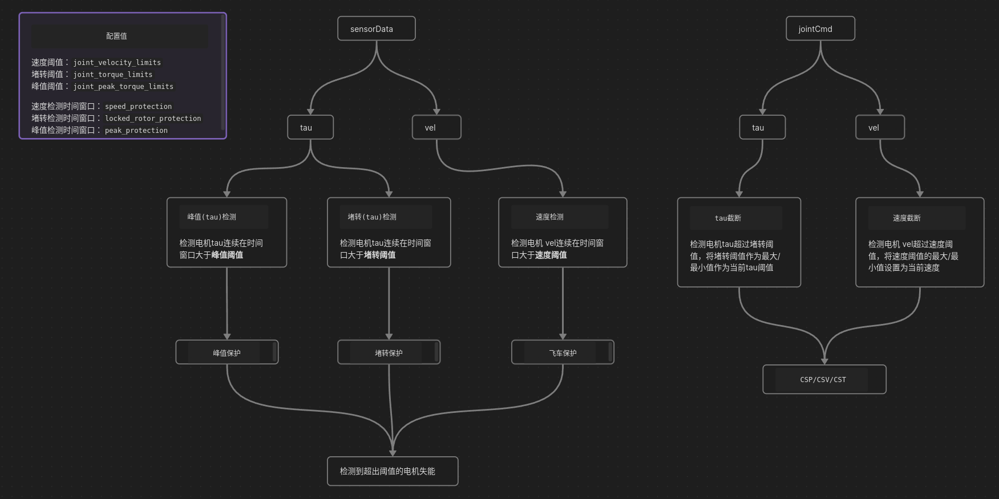
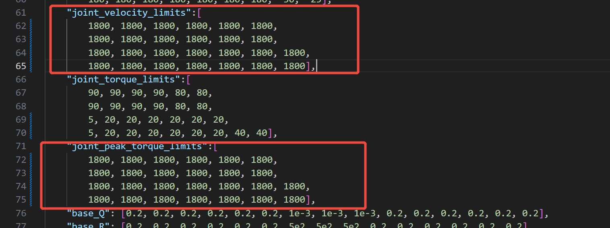

# 关节保护
- [v1.0](#关节保护v10)
- [v2.0](#关节保护v20)
  - [数据截断](#一-数据截断)
    - [功能简介](#1-功能简介)
  - [峰值保护](#二-扭矩峰值保护)
  - [飞车保护](#三-速度飞车保护)
  - [堵转保护](#四-堵转保护)
  - [日志](#五-日志查看)
    - [触发日志](#1-触发日志)
    - [电机失能日志](#2-电机disable日志)
    - [电机状态日志](#3-电机状态map)
    - [数据截断日志](#4-jointcmd数据截断)
  - [阈值配置](#六-阈值配置更新)
    - [时间窗口配置](#1-时间窗口配置)
    - [各版本阈值对比](#2-各版本阈值对比)
    - [参数含义说明](#3-参数含义说明)
  - [功能优化](#七-功能优化)
    - [已实现优化](#1-已实现优化)
    - [安全性增强](#2-安全性增强)
    - [配置管理优化](#3-配置管理优化)
    - [可靠性提升](#4-可靠性提升)
  - [测试案例](#八-测试案例)

## 关节保护v1.0
略

## 关节保护v2.0
  #### 1. 简介
  关节保护(v2.0)功能相较之间做了较大修改，在hardware_node硬件层分为两层保护：
    
    1）数据截断： 对jointCmd的位置、扭矩、速度数据做截断
    2）实时保护： 检测sensor获取每个电机的实时vel和tau数据

  

  实时保护即对所有电机进行峰值(扭矩)保护，堵转保护，以及飞车保护，当触发保护措施时，对相应的电机做失能操作。本文将分别对每种保护功能进行简要阐述

  * **风险**: 当前action只有电机的失能，没有停止电机的功能，所以速度较大的情况下比较危险

  #### 2. 使用说明

  当前在load_kuavo_real.launch文件中分别设置了两个参数，默认为**false**，即这两个功能都不启动

    <arg name="joint_protect_enable" default="false" />
    <arg name="cmd_truncation_enable" default="false" />

  如果要使用两个功能，请分别将其设置为**true**

### 一 数据截断

#### 1. 功能简介
 在将控制命令数据发给CSP/CSV/CST之前，数据截断功能将对经过`cmds2Cmdr`转换后的电机指令数据`cmd_out`进行检测，分别检测电机的位置/速度/扭矩数据是否超过阈值。
 
 **位置阈值：** (以v46为例)

    "min_joint_position_limits":[
        -40, -60, -140, -8, -100, -100,
        -40, -60, -140, -8, -100, -100,
        -180, -180, -180, -180, -180, -180, -180,
        -180, -180, -180, -180, -180, -180, -180, -30, -25],
    "max_joint_position_limits":[
        40, 60, 40, 170, 90, 90,
        40, 60, 40, 170, 90, 90,
        180, 180, 180, 180, 180, 180, 180,
        180, 180, 180, 180, 180, 180, 180, 30, 25],

  检测`cmd_out[i]`(电机位置数据，度为单位)是否超出最大/最小阈值

    超过最大值，将阈值的最大值赋值给位置：cmd_out[i] = pos_max_deg
    超过最小值，将阈值的最小值赋值给位置：cmd_out[i] = pos_min_deg

  **速度阈值：** (以v46为例)

    "joint_velocity_limits":[
        8.0, 8.0, 15.0, 9.0, 8.0, 8.0,
        8.0, 8.0, 15.0, 9.0, 8.0, 8.0,
        12.0, 6.0, 5.5, 6.0, 5.0, 5.0, 5.0,
        12.0, 6.0, 5.5, 6.0, 5.0, 5.0, 5.0, 200.0, 200.0],

  检测`cmd_out[num_joint + i]`(电机速度数据，度/秒为单位)的绝对值是否超出速度阈值

    超过最大值，将阈值的最大值赋值给速度：cmd_out[num_joint + i] = vel_limit_deg
    超过最小值，将阈值的最小值赋值给速度：cmd_out[num_joint + i] = -vel_limit_deg

  **扭矩阈值：** (以v46为例)

    "joint_peak_torque_limits":[
        200, 200, 200, 200, 200, 200,
        200, 200, 200, 200, 200, 200,
        200, 200, 200, 200, 200, 200, 200,
        200, 200, 200, 200, 200, 200, 200, 200, 200],

  检测`cmd_out[2 * num_joint + i]`(电流值)转换后的扭矩数据是否超出扭矩阈值
  
  **转换关系：** `扭矩 = 电流 / c2t系数`

    超过最大值，将阈值转换为电流后赋值：cmd_out[2 * num_joint + i] = peak_torque_limit * c2t_coeff[i]
    超过最小值，将阈值转换为电流后赋值：cmd_out[2 * num_joint + i] = -peak_torque_limit * c2t_coeff[i]

  * 数据截断功能由程序内部自动完成，用户只需要设置相应的阈值配置即可

### 二 扭矩峰值保护
  * **原理**

      **场景：** 由于电机在接受的**很大**扭矩**短时间**就容易导致电机损坏。

      峰值保护是获取传感器实时电流数据，通过c2t系数转换为扭矩数据后，检测每个电机扭矩数值在**时间窗口**中**连续**超过设定的阈值来触发电机的保护功能。

  * **检测数据来源**

      `motorTorqueVec[i] = motorCurVec[i] / c2t_coeff[i]`
      
      其中`motorCurVec`来自传感器原始电流数据`sensor_data_motor.joint_current`

  * **阈值设定**

    * 时间窗口阈值：

          "peak_protection": 0.1,   //单位秒

    * 峰值阈值：(以v46为例)

          "joint_peak_torque_limits":[
              200, 200, 200, 200, 200, 200,
              200, 200, 200, 200, 200, 200,
              200, 200, 200, 200, 200, 200, 200,
              200, 200, 200, 200, 200, 200, 200, 200, 200],

### 三 速度飞车保护
  * **原理**

    **场景：** 机器人关节在某些情况下由于需要调整姿态等原因，给了电机一个很大速度，导致机器人出现踢腿，甩手臂等飞车现象。

    飞车保护是通过获取关节空间的实时速度数据，检测其是否在**时间窗口**中连续超过设定阈值。

  * **检测数据来源**

      `velVec` - 来自关节空间速度数据`sensor_data_joint.joint_v`（关注关节空间运动安全，而非电机转速）

  * **阈值设定**

    * 时间窗口阈值：
    
          "speed_protection": 0.1,   //单位秒，飞车保护的时间窗口阈值建议设定更短

    * 速度阈值：(以v46为例)

          "joint_velocity_limits":[
              8.0, 8.0, 15.0, 9.0, 8.0, 8.0,
              8.0, 8.0, 15.0, 9.0, 8.0, 8.0,
              12.0, 6.0, 5.5, 6.0, 5.0, 5.0, 5.0,
              12.0, 6.0, 5.5, 6.0, 5.0, 5.0, 5.0, 200.0, 200.0],

 ### 四 堵转保护
   * **原理**

    **场景：** 当电机接收一个**较大**扭矩命令，由于外部原因导致电机无法转时，这个扭矩持续作用**时间较长**会出现发热导致烧机的问题。

    堵转保护是获取传感器实时电流数据，通过c2t系数转换为扭矩数据后，检测每个电机扭矩数值是否在**时间窗口**中**连续**超过设定的阈值来触发电机的保护功能。

  * **检测数据来源**

      `motorTorqueVec[i] = motorCurVec[i] / c2t_coeff[i]`
      
      其中`motorCurVec`来自传感器原始电流数据`sensor_data_motor.joint_current`

  * **阈值设定**

    * 时间窗口阈值：
    
          "locked_rotor_protection": 2.0,   //单位秒

    * 堵转阈值：(以v46为例)

          "joint_torque_limits":[
              88.9, 15.54, 50.4, 94.5, 18.9, 18.9,
              88.9, 15.54, 50.4, 94.5, 18.9, 18.9,
              46.67, 52.5, 39.9, 52.5, 9.87, 9.87, 9.87,
              46.67, 52.5, 39.9, 52.5, 9.87, 9.87, 9.87, 140, 140],

### 五 日志查看
   #### 1. 触发日志

    ################# Trigger peak protection #################
     joint[21] cur pos=-0.0804489
     value 5.05129 is over limit[5], time window 0.106036
    ###########################  ###########################

   如上所示，是触发了**峰值保护**，触发的是21号电机，触发时的电流值是5.05129，超过了设定的阈值5，触发的时间窗口是0.106036秒，表示它在这个时间区间内连续超过了阈值

   #### 2. 电机disable日志

    ####### set motor 21 disable #######
   表示将当前21号电机失能（*此时用户可以去感受当前电机是否解锁*）

   #### 3. 电机状态map

    motor status map[1 1 1 1 1 1 1 1 1 1 1 1 0 0 0 0 1 1 1 0 0 1 0 1 1 1 1 1 ]
   如上所示日志，会在每次电机失能的时候都打印一次，方便用户查看当前有电机的状态（*1：使能 ，0：失能*）

   #### 4. jointCmd数据截断

    [orig] tau 19 value 24.5883 -> [max] 5
   
   表示 19 号电机输入扭矩值 24.5883 被截断成设定阈值5
   *ps[0]：数据截断日志会刷屏*

### 六 阈值配置更新

#### 1. 时间窗口配置
关节保护系统支持三种时间窗口配置，分别对应不同的保护模式：

    "peak_protection": 0.1,        // 峰值保护时间窗口（秒）
    "speed_protection": 0.1,       // 速度保护时间窗口（秒）
    "locked_rotor_protection": 2.0, // 堵转保护时间窗口（秒）

**参数含义：**
- **peak_protection**: 扭矩连续超过峰值阈值的时间窗口，通常设置较短(0.1s)，防止瞬间大扭矩损坏电机
- **speed_protection**: 速度连续超过阈值的时间窗口，设置较短(0.1s)，快速响应飞车现象
- **locked_rotor_protection**: 堵转检测时间窗口，设置较长(2.0s)，避免正常运动时误触发

#### 2. 各版本阈值对比
不同版本的机器人配置文件中存在阈值差异，以下是关键版本的对比：

**位置限制对比：**
- **v40/v43**: 腿部位置限制较宽松 (-180~180度)
- **v46/v48**: 腿部位置限制较严格 (-40~40度)
- **v45**: 左腿第二关节限制不对称 (-90~60度)

**扭矩限制对比：**
- **v40/v43/v45**: 使用实际电机扭矩限制 (88.9~140 Nm)
- **v46**: 统一使用200 Nm的保守限制

#### 3. 参数含义说明

**关节编号说明：**
- 0-5: 左腿关节 (leg_l1~leg_l6)
- 6-11: 右腿关节 (leg_r1~leg_r6)
- 12-18: 左臂关节 (arm_l1~arm_l7)
- 19-25: 右臂关节 (arm_r1~arm_r7)
- 26-27: 头部关节 (head_yaw, head_pitch)

**阈值类型说明：**
- **joint_velocity_limits**: 常规速度限制，用于数据截断和飞车保护
- **joint_peak_velocity_limits**: 峰值速度限制，用于极限情况检测
- **joint_torque_limits**: 堵转保护扭矩限制，长时间超过会触发保护
- **joint_peak_torque_limits**: 峰值扭矩限制，短时间超过会触发保护

### 七 功能优化

#### 1. 已实现优化

**时间戳管理优化：**
- 在硬件未就绪时正确初始化时间戳，避免时间差异常

**数据转换优化：**
- 实现了电流到扭矩的正确转换，使用c2t系数进行单位转换
- 峰值保护和堵转保护现在使用转换后的扭矩数据而非直接的电流数据进行比较
- 飞车保护使用关节空间速度数据，关注关节空间运动安全而非电机转速

**电机状态管理：**
- 添加了电机状态管理器，避免重复失能同一电机
- 优化了电机失能状态的检查逻辑

#### 2. 安全性增强

**风险识别：**
- ⚠️ **重大安全风险**: EC电机（腿部关节）失能后只是设为0扭矩控制，在高速运动时非常危险
- ⚠️ **保护恢复机制缺失**: 当前电机失能后没有自动恢复机制

**建议改进：**
- 添加急停功能，在检测到危险时立即停止整个机器人
- 考虑实现渐进式制动而非直接失能
- 实现电机状态自动恢复机制

#### 3. 配置管理优化

**配置验证：**
- 建立配置验证机制，确保阈值合理性
- 添加版本间配置差异检查
- 实现配置参数的动态调整功能

**参数调优建议：**
- 根据实际电机规格设置合理的扭矩限制
- 考虑不同关节的运动特性设置差异化速度限制
- 建立配置模板，便于新版本机器人的配置

#### 4. 可靠性提升

**数据截断与实时保护协调：**
- 当数据截断频繁触发时，应该降低实时保护的敏感度
- 添加预警机制，在接近阈值时给出提示

**线程安全优化：**
- 完善mutex保护机制，确保多线程访问安全
- 优化电机状态更新逻辑，减少竞争条件

**关联关节保护：**
- 当一个腿部关节失能时，考虑保护相关关节（如同侧其他关节）
- 实现关节组保护策略，提高整体安全性

### 八 测试案例
 #### 1. 单项测试

  
  如图所示，单项功能测试时，请将其他两个阈值设置很大，等于屏蔽相关测试项

 #### 2. 指定关节测试

  将不需要测试的电机阈值设置成1800，即屏蔽不需要电机，只保留相关电机

 #### 3. 配置验证测试

  **测试步骤：**
  1. 检查配置文件中各阈值是否在合理范围内
  2. 验证时间窗口配置是否符合实际需求
  3. 测试不同版本间配置的兼容性

 #### 4. 安全性测试

  **测试场景：**
  - 高速运动时触发保护的响应时间
  - 多关节同时触发保护的系统稳定性
  - 电机失能后的系统恢复能力

  **注意事项：**
  - 在安全环境下进行测试，确保人员安全
  - 建议先在仿真环境中验证保护逻辑
  - 测试时准备好急停装置

*(更多测试案例请根据实际需求补充)*

**总体评价：**
关节保护功能基础架构良好，覆盖了主要的保护场景，但在安全性、可靠性和可维护性方面仍有提升空间。建议优先解决安全风险问题，然后逐步完善其他功能。特别需要注意的是，机器人的安全保护不仅要防止硬件损坏，更要保护人员安全，建议在高危情况下实现整机急停而非仅仅电机失能。
