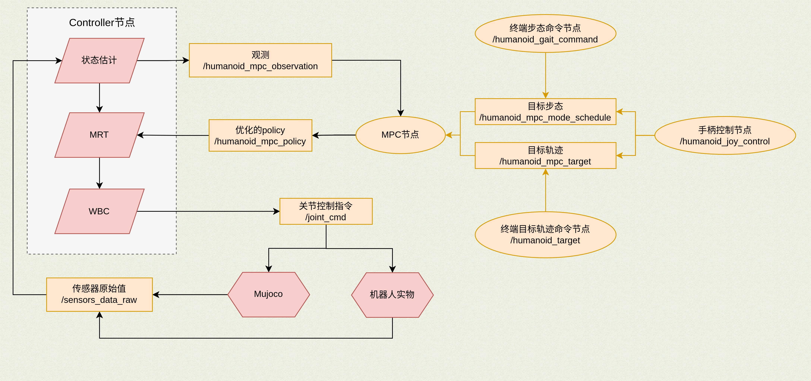

# 1. 通信流程图

---

## 目录

- [1. 通信流程图](#1-通信流程图)
- [2. mpc的x和u](#2-mpc的x和u)
- [3. 话题说明](#3-话题说明)

---

# 2. mpc的x和u

## 2.1 OCS2中状态向量顺序

也即话题 `/humanoid_mpc_observation` 里的 `state`。

| idx   | 类型 | content         |
| ----- | --- | --------------- |
| 0     | float64 | `vcom_x`        |
| 1     | float64 | vcom_y          |
| 2     | float64 | vcom_z          |
| 3     | float64 | L_x / robotMass |
| 4     | float64 | L_y / robotMass |
| 5     | float64 | L_z / robotMass |
| 6     | float64 | `p_base_x`      |
| 7     | float64 | p_base_y        |
| 8     | float64 | p_base_z        |
| 9     | float64 | theta_base_z    |
| 10    | float64 | theta_base_y    |
| 11    | float64 | theta_base_x    |
| 12:na | float64[] | 关节角度            |

> **注意**: `na` 表示由 `NUM_JOINT` 配置决定，例如 `NUM_JOINT=28` 时关节角度索引为 `12:28`

## 2.2 OCS2中控制向量顺序

也即话题 `/humanoid_mpc_observation` 里的 `input`, 顺序如下：

| idx   | 类型 | content       |
| ----- | --- | ------------- |
| 0:3   | float64 | ll_heel_force |
| 3:3   | float64 | ll_toe_force  |
| 6:3   | float64 | lr_heel_force |
| 9:3   | float64 | lr_toe_force  |
| 12:3  | float64 | rl_heel_force |
| 15:3  | float64 | rl_toe_force  |
| 18:3  | float64 | rr_heel_force |
| 21:3  | float64 | rr_toe_force  |
| 24:na | float64[] | 关节速度          |

> **注意**: `na` 表示由 `NUM_JOINT` 配置决定

# 3. 话题说明

## /humanoid/**

**类型:** (可视化相关)

用于可视化的话题,可以忽略

## /humanoid_controller/**

**类型:** (多个)

控制器相关的话题,主要有:

| 话题 | 消息类型 | 描述 |
| --- | --- | --- |
| `/humanoid_controller/com/r` | std_msgs/Float64MultiArray | 质心位置 |
| `/humanoid_controller/com/r_des` | std_msgs/Float64MultiArray | 质心期望位置 |
| `/humanoid_controller/com/rd` | std_msgs/Float64MultiArray | 质心速度 |
| `/humanoid_controller/com/rd_des` | std_msgs/Float64MultiArray | 质心期望速度 |
| `/humanoid_controller/optimizedState_mrt_/angular_vel_xyz` | std_msgs/Float64MultiArray | 从mpc(mrt)取得的质心线速度,顺序为xyz（注意：话题名为 angular_vel 但实际发布的是线速度，单位 m/s） |
| `/humanoid_controller/optimizedState_mrt/com/angular_zyx` | std_msgs/Float64MultiArray | 从mpc(mrt)取得的质心角速度,顺序为zyx |
| `/humanoid_controller/optimizedState_mrt/base/linear_vel_xyz` | std_msgs/Float64MultiArray | 从mpc(mrt)取得的躯干线速度 |
| `/humanoid_controller/optimizedState_mrt/base/pos_xyz` | std_msgs/Float64MultiArray | 从mpc(mrt)取得的躯干位置 |
| `/humanoid_controller/optimizedState_mrt/joint_pos` | std_msgs/Float64MultiArray | 从mpc(mrt)取得的关节位置 |
| `/humanoid_controller/optimizedInput_mrt/force_*` | std_msgs/Float64MultiArray | 从mpc(mrt)取得的第x个接触点的接触力 |
| `/humanoid_controller/optimizedInput_mrt/joint_vel` | std_msgs/Float64MultiArray | 从mpc(mrt)取得的关节期望速度 |
| `/humanoid_controller/optimized_mode` | std_msgs/Float64 | mpc给出的mode |
| `/humanoid_controller/swing_leg` | — | 摆动腿控制相关话题 |
| `/humanoid_controller/wbc_planned_body_acc/angular` | std_msgs/Float64MultiArray | wbc优化后的躯干角加速度 |
| `/humanoid_controller/wbc_planned_body_acc/linear` | std_msgs/Float64MultiArray | wbc优化后的躯干线性加速度 |
| `/humanoid_controller/wbc_planned_contact_force/left_foot` | std_msgs/Float64MultiArray | wbc优化后的左脚所有接触点的接触力 |
| `/humanoid_controller/wbc_planned_contact_force/right_foot` | std_msgs/Float64MultiArray | wbc优化后的右脚所有接触点的接触力 |
| `/humanoid_controller/wbc_planned_joint_acc` | std_msgs/Float64MultiArray | wbc优化后的关节加速度 |

`/humanoid_controller/transport_mode_command`(**service**): 搬运模式控制服务，进入/退出/掉使能

`/humanoid_controller/controller_switch_event`(latching): 控制器切换事件 (`kuavo_msgs/ControllerSwitchEvent`)，包含 from_controller / to_controller
## /humanoid_mpc_**

**类型:** (多个)

ocs2源码中mpc交互的相关话题.

| 话题 | 消息类型 | 描述 |
| --- | --- | --- |
| `/humanoid_mpc_gait_time_name` | kuavo_msgs/gaitTimeName | 步态的时间和名字 |
| `/humanoid_mpc_mode_scale` | std_msgs/Float32 | 步态的缩放比例,用于控制步频 |
| `/humanoid_mpc_mode_schedule` | ocs2_msgs/mode_schedule | 步态序列 |
| `/humanoid_mpc_observation` | ocs2_msgs/mpc_observation | 观测,mpc端接收 |
| `/humanoid_mpc_policy` | ocs2_msgs/mpc_flattened_controller | mpc计算的结果 |
| `/humanoid_mpc_target` | ocs2_msgs/mpc_target_trajectories | 发送给mpc的期望状态 |

## /joint_cmd

**类型:** `kuavo_msgs/jointCmd`

用于控制机器人

**消息字段:**

| 字段 | 类型 | 描述 |
| --- | --- | --- |
| header | std_msgs/Header | 时间戳等信息 |
| joint_q | float64[] | 关节角度 |
| joint_v | float64[] | 关节速度 |
| tau | float64[] | 关节扭矩 |
| tau_max | float64[] | 最大关节扭矩 |
| tau_ratio | float64[] | 扭矩系数 |
| joint_kp | float64[] | kp 参数 |
| joint_kd | float64[] | kd 参数 |
| control_modes | int32[] | 每一个关节对应的控制模式 |

**使用说明:**

- 数组长度为配置文件中的 `NUM_JOINT`，即关节总数
- 关节控制模式中, 0: Torque 控制模式, 1: Velocity 控制模式, 2: Position 控制模式

## /monitor

**类型:** `std_msgs/Float64`

监控mpc,wbc等模块的频率(Hz)与耗时(ms)

## /sensors_data_raw

**类型:** `kuavo_msgs/sensorsData`

实物机器人, 仿真器发布的传感器原始数据

## /state_estimate/**

**类型:** (多个)

| 话题 | 消息类型 | 描述 |
| --- | --- | --- |
| `/state_estimate/end_effector/contact_point_*/feet_height` | std_msgs/Float64MultiArray | 第x个接触点的"足端高度" |
| `/state_estimate/end_effector/contact_point_*/pos` | std_msgs/Float64MultiArray | 第x个接触点的位置 |
| `/state_estimate/end_effector/contact_point_*/vel` | std_msgs/Float64MultiArray | 第x个接触点的速度 |
| `/state_estimate/mode` | std_msgs/Float64 | 估计的步态mode |
| `/state_estimate/base/linear_vel` | std_msgs/Float64MultiArray | 估计的躯干线速度,顺序为xyz |
| `/state_estimate/base/pos_xyz` | std_msgs/Float64MultiArray | 估计的躯干位置,顺序为xyz |
| `/state_estimate/base/angular_vel_zyx` | std_msgs/Float64MultiArray | 估计的角速度,顺序为zyx |
| `/state_estimate/base/angular_zyx` | std_msgs/Float64MultiArray | 估计的欧拉角,顺序为zyx(ypr) |
| `/state_estimate/joint/pos` | std_msgs/Float64MultiArray | 估计的关节位置 |
| `/state_estimate/joint/vel` | std_msgs/Float64MultiArray | 估计的关节速度 |

## /tf

**类型:** `tf2_msgs/TFMessage`

tf树

## /odom

**类型:** `nav_msgs/Odometry`

用于可视化,无需关注

## /pose

**类型:** (状态估计器定义)

由状态估计器发布,无需关注