# 动捕系统

## 部署准备：
1. 摄像头以及安装组成。
2. 交换机并且有效连接，正常通信。
3. 物理硬件加密狗。
4. 软件 LICENSE。
5. 交换机与软件主机上电并连接

## 场地标定
### 由于采用的动捕系统是纯光学的采集系统，所以需要对场地中的强反光物体进行清理，以避免过多的噪点导致标定时产生误差，建议进行场地标定时清场。

### 标定步骤：
1. 插入硬件加密狗，将软件的 LICENSE 放到软件根目录的 License 目录下:
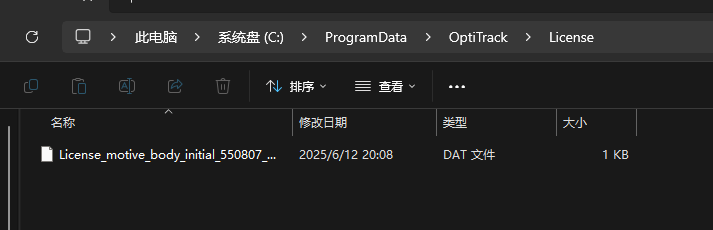
---
2. 打开软件，初始界面如下：
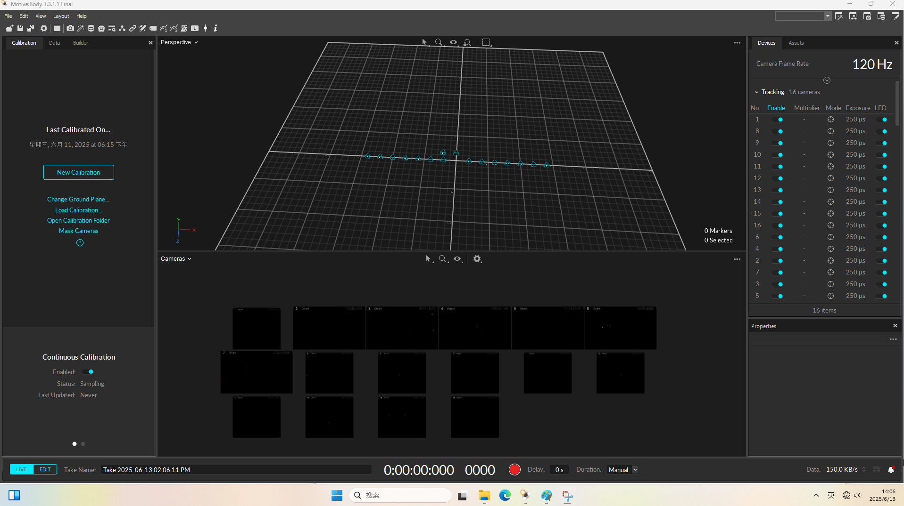
- 此时应当确认相机状态是否为正常连接，如上图中右侧 Device 状态栏中的 Enable 标签是否打开。
- 确认相机数量与实际物理安装数量一致。
- 单击按钮 'New Calibration' 即可开始标定场地以及相机的位置关系。
---
3. 清除反光噪点
- 初始的环境中可能会存在一系列的噪点，这是因为该动捕系统是纯光学系统，不同的材质物体和地面均有可能会造成反光，导致对光学系统的影响，所以在本步骤中会对无法物理清理的反光噪点进行 mask 。
#### **注意**
- 软件的自动 mask 应当尽可能地少，如果过多地使用否则可能会导致正常的反光点也会丢失数据！
- 点击 'New Calibration' 后的软件界面如下：
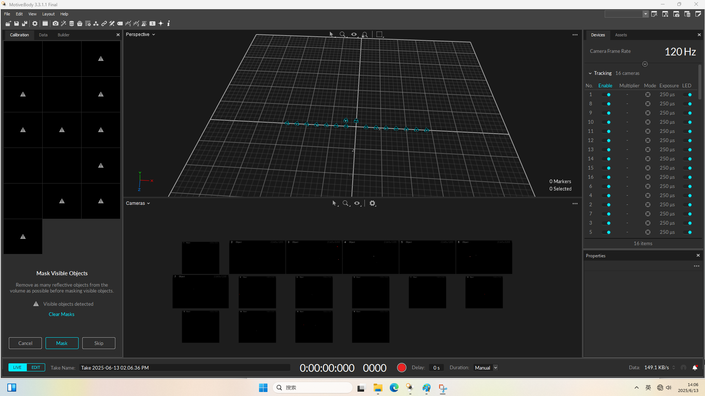
- 左侧状态栏中会出现 16 个黑色的窗口，代表 16 个相机的状态，若相机中存在较强的反光噪点，则会在窗口中显示一个感叹号的三角形标志。
- 此时可以在中央下面的窗台栏中查看是在对应相机的哪个位置出现了噪点，以供人工物理清除噪点。
- 选中相机窗口，对应的物理相机颜色会从蓝色转变为绿色，以供确定选中和判断相机位置。
- 自动遮掩反光点功能，在左侧边栏中最下面有一个蓝色的按钮 "Mask",点击后会将当前相机视野中的反光点屏蔽，**请确保已无法继续物理清除噪点时再点击**！
- 清除完噪点后参考下图：
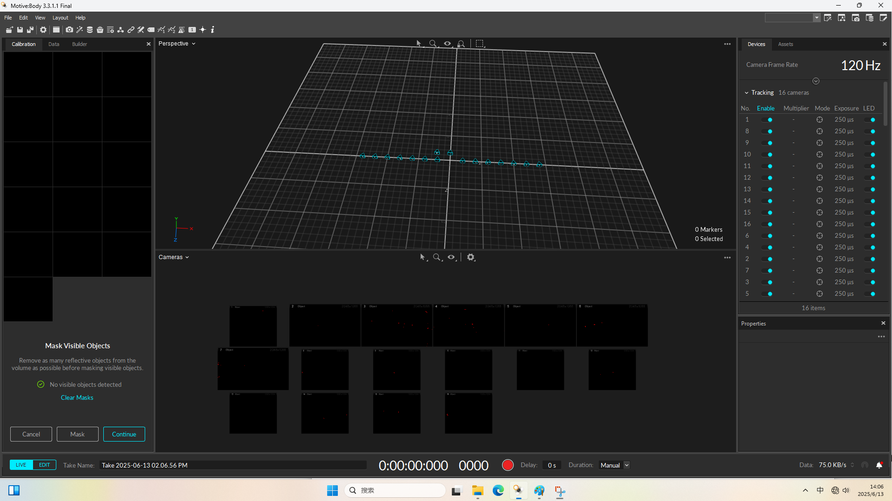
- 左侧状态栏的 "Continue" 按钮亮起，说明当前噪点已清除完毕，点击该按钮进入下一步操作，标定相机的位置关系
---
4. 标定相机间的位置关系
- 完成噪点的清除后会进入到以下页面：
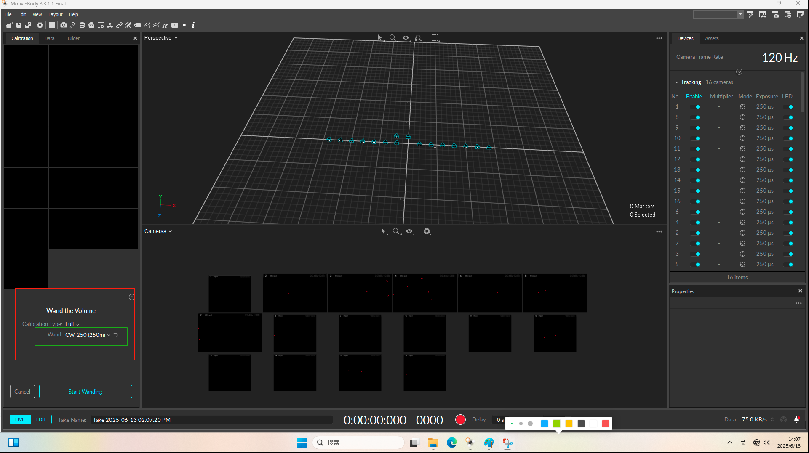
- 在左侧状态栏中选择不同精度的标定棒规格，绿色方框标注处选择，一般中小场地时用 250mm 的标定棒即可，标定棒的规格如下：
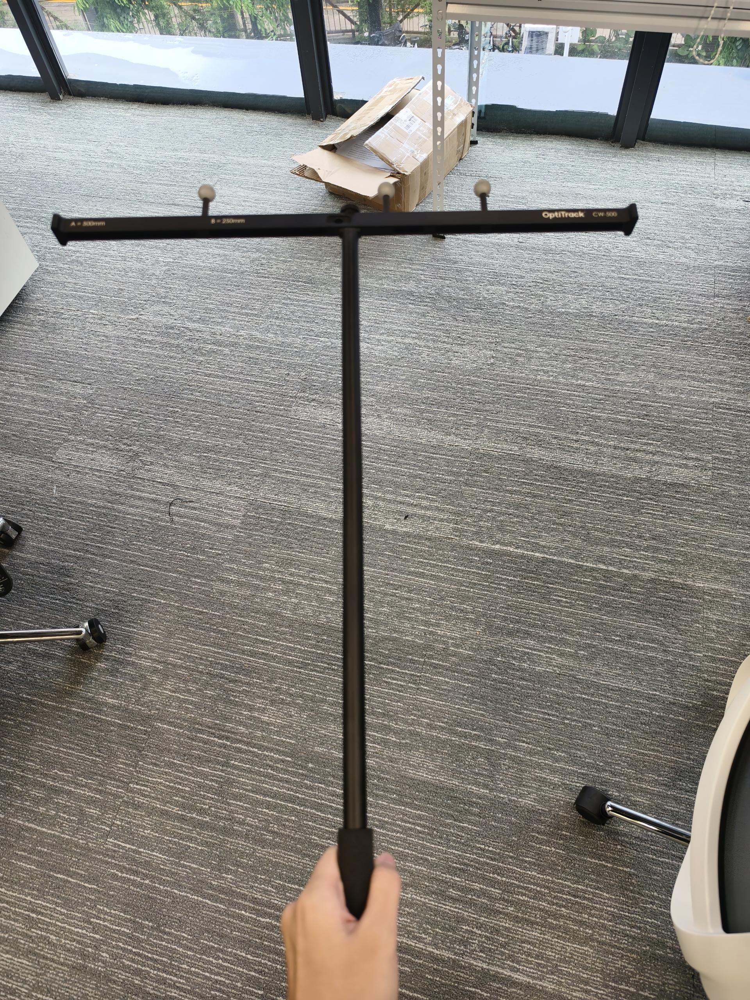
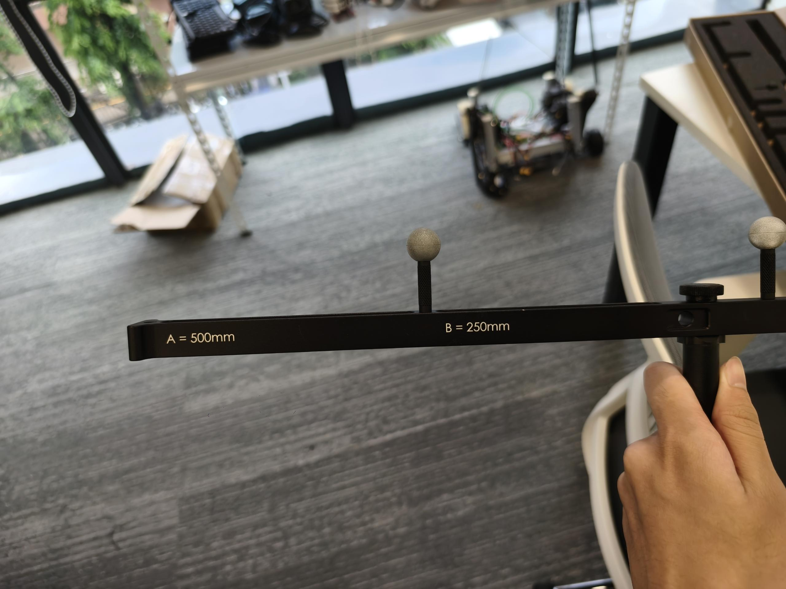
- 单击 "Start Wanding" 按钮即可对相机的位置在关系进行标定。
- 标定方式：手持标定棒在场地中行走，同时挥舞手中标定棒，在空间中画 "∞" 的符号即可，期间可以观察摄像头绿色光圈的进度条，当所有摄像头的绿色进度条满了即可认为标定完成，标定完成后的界面应当如下，左侧相机状态栏均为绿色：
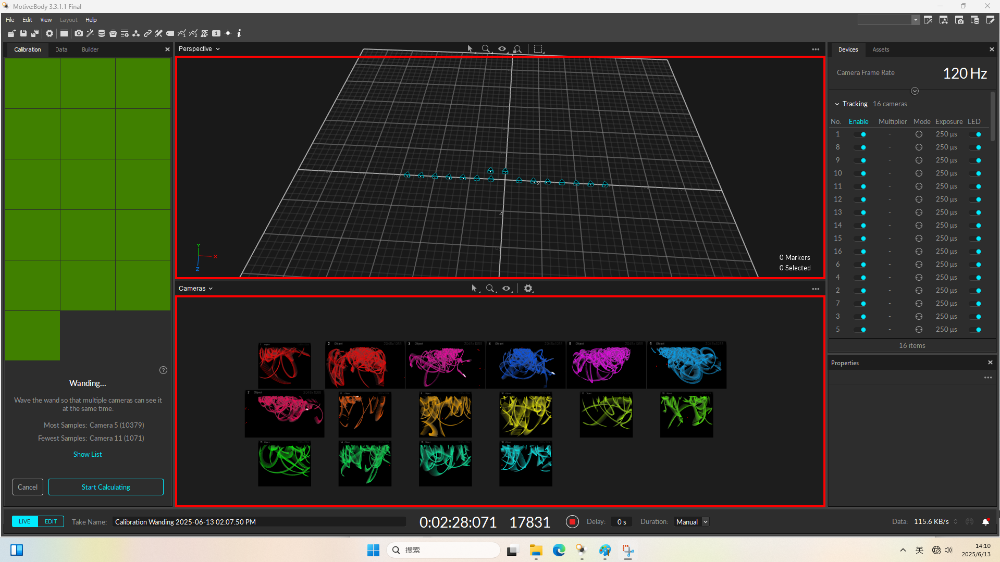
- 单击 "Start Calculating" 按钮后即可进行计算相机之间的相对位置，并进行预览：
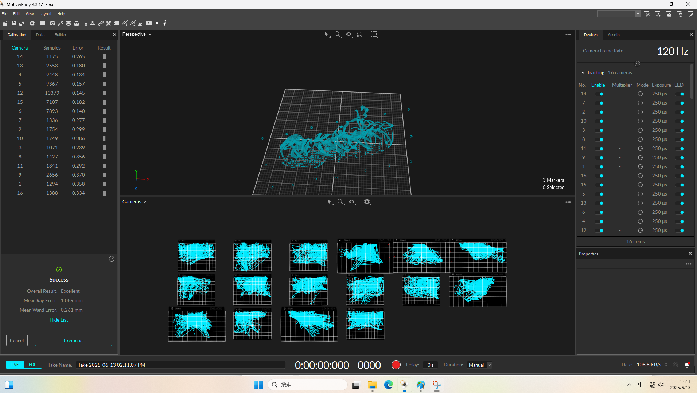
---
5. 标定相机与地面的位置关系
- 上一步只是标定了相机与相机之间的位置关系，但是地面的位置关系并没有确定，故而需要在本步骤操作中确定地面关系。
- 标定地面关系需要使用一个直角的标定棒，置于平地上即可,其中长的一端为 Z 轴，代表场地的正方向，短的一端为 X 轴，大致关系如下：
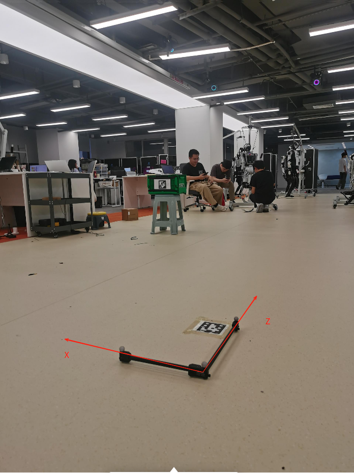
- 将标定棒置于平地后，软件页面应当如下：
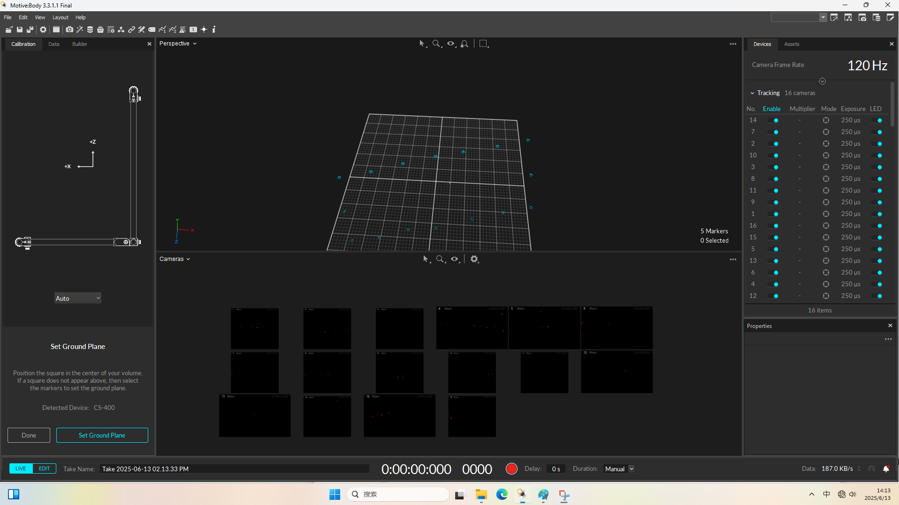
- 点击左下角的 "Set Ground Plane" 按钮，即可保存相机与地面的位置关系。
---
6. 标定最终结果：
- 经过上述的标定流程后，整个动捕系统的位置关系就已经确定，可以在软件中预览并保存：
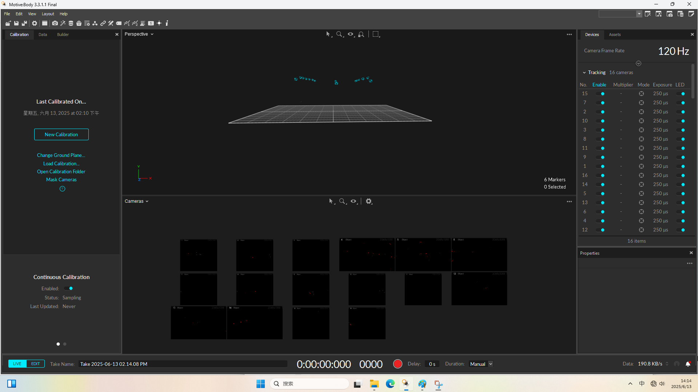
---
## 创建目标刚体
- 在部署好的动捕系统中放置贴好对应的反光小球的刚体，可以在软件页面中选择对应的刚体小球，并且创建刚体：
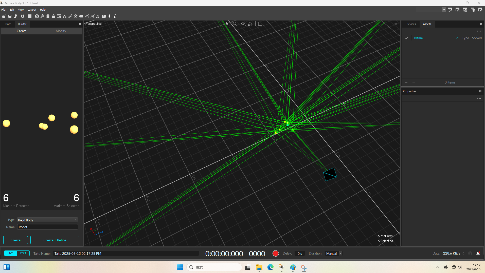
-点击左下角的 "Create+Refine",即可自动生成刚体的几何中心：
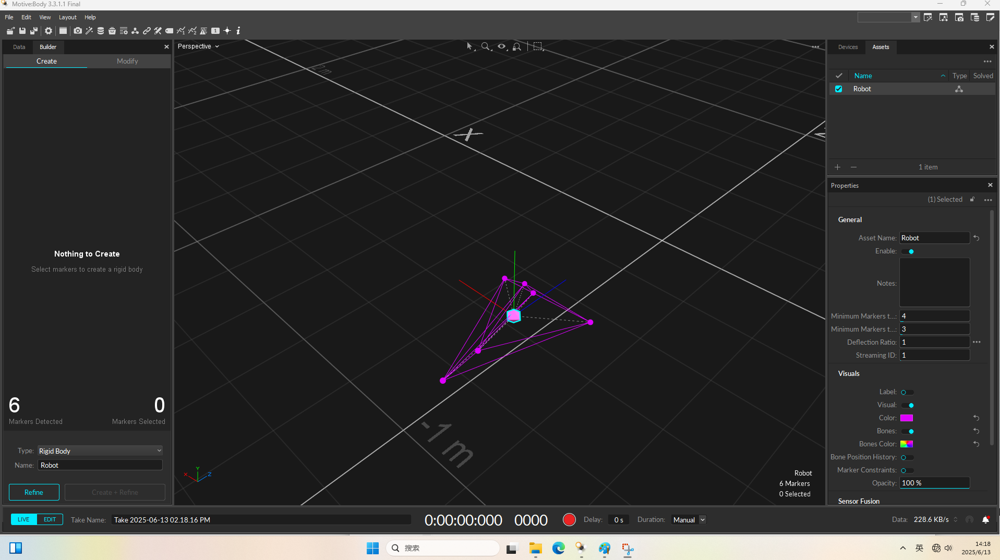
---
## 录制数据并推流
- 当创建完刚体后，刚体在系统中移动时会自动跟踪其轨迹，如果需要将刚体的信息数据上传可以通过如下方式推流：
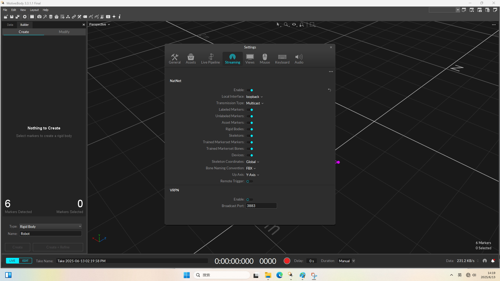

