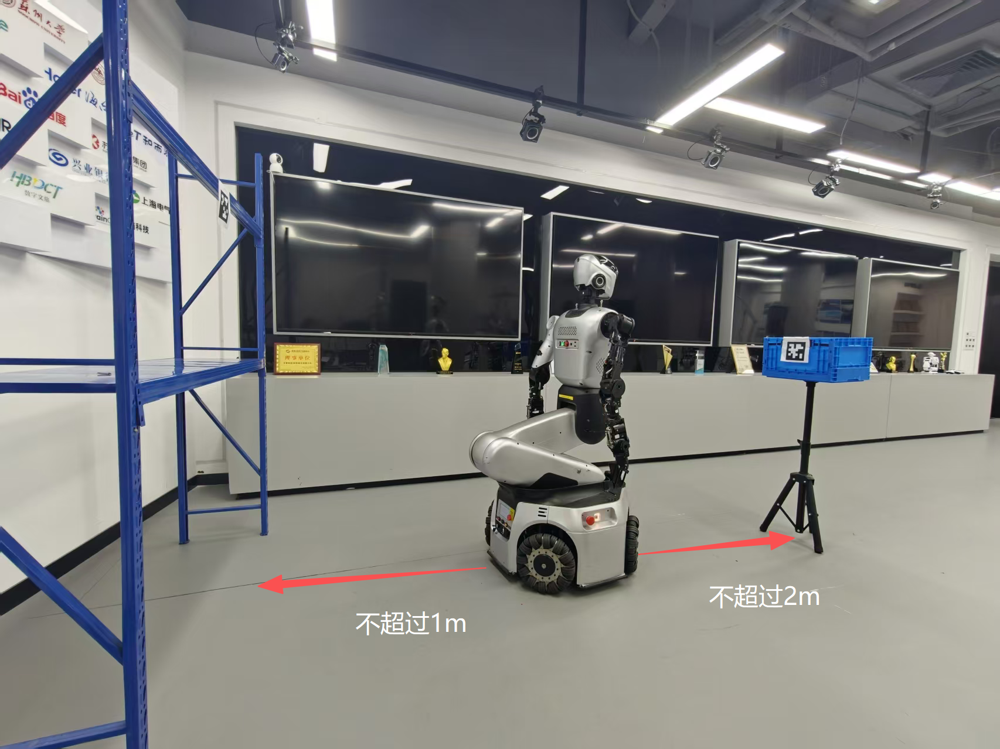
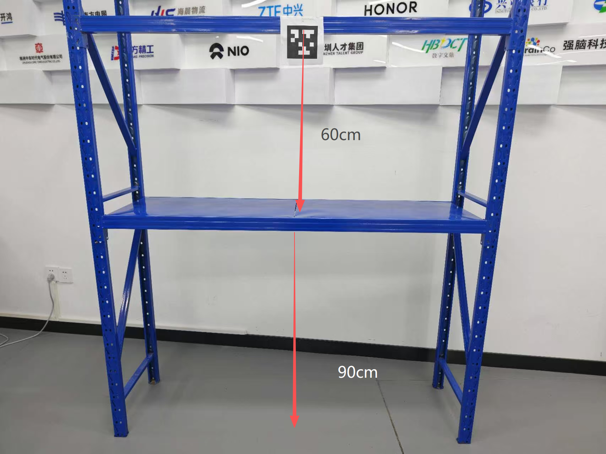
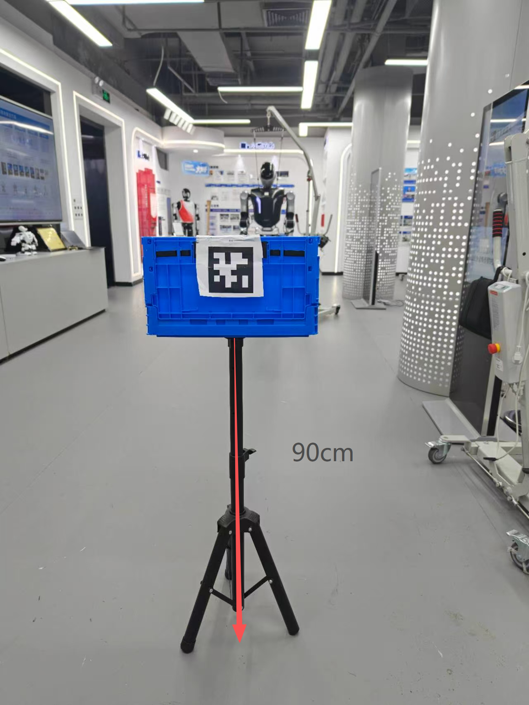

# 搬箱子代码使用教程

本文档说明如何使用人形版搬箱子脚本 `box_pick_place.py` 和轮臂版搬箱子脚本 `box_pick_place_wheel.py` 完成双臂夹箱搬运流程。

---

- [搬箱子代码使用教程](#搬箱子代码使用教程)
  - [(一) 文件说明](#一-文件说明)
  - [(二) 编译](#二-编译)
    - [上位机编译](#上位机编译)
    - [下位机编译](#下位机编译)
  - [(三) 场景布置](#三-场景布置)
    - [人形版场景布置](#人形版场景布置)
    - [轮臂版场景布置](#轮臂版场景布置)
    - [二维码粘贴说明](#二维码粘贴说明)
    - [箱子与货架要求](#箱子与货架要求)
    - [场景布置注意事项](#场景布置注意事项)
  - [(四) box_pick_place.py 人形版使用教程](#四-box_pick_placepy-人形版使用教程)
    - [配置文件 box_pick_place.yaml](#配置文件-box_pick_placeyaml)
      - [4.1 二维码配置](#41-二维码配置)
      - [4.2 箱体尺寸与抓取位置](#42-箱体尺寸与抓取位置)
      - [4.3 行走接近配置](#43-行走接近配置)
      - [4.4 掌心关节偏置](#44-掌心关节偏置)
    - [运行步骤](#运行步骤)
      - [下位机](#下位机)
      - [上位机](#上位机)
      - [下位机程序](#下位机程序)
  - [(五) box_pick_place_wheel.py 轮臂版使用教程](#五-box_pick_place_wheelpy-轮臂版使用教程)
    - [配置文件 wheel.yaml](#配置文件-wheelyaml)
      - [5.1 二维码配置](#51-二维码配置)
      - [5.2 箱体尺寸与抓取位置](#52-箱体尺寸与抓取位置)
      - [5.3 行走接近配置](#53-行走接近配置)
      - [5.4 掌心关节偏置](#54-掌心关节偏置)
      - [5.5 轮臂 IK 配置](#55-轮臂-ik-配置)
    - [运行步骤](#运行步骤-1)
      - [下位机（轮臂）](#下位机轮臂)
      - [上位机](#上位机-1)
  - [(六) 常用调参方法](#六-常用调参方法)
    - [6.1 手伸不到箱子](#61-手伸不到箱子)
    - [6.2 双手抓得太高或太低](#62-双手抓得太高或太低)
    - [6.3 双手夹得太松或太紧](#63-双手夹得太松或太紧)
    - [6.4 接近二维码后距离不合适](#64-接近二维码后距离不合适)
    - [6.5 二维码识别不到或识别不准](#65-二维码识别不到或识别不准)
  - [(七) TF 树报错解决](#七-tf-树报错解决)

---

## (一) 文件说明


| 文件                        | 适用平台    | 作用                              |
| --------------------------- | ----------- | --------------------------------- |
| `box_pick_place.py`         | 人形机器人  | 双臂夹箱搬运主程序（base_link 坐标系）      |
| `box_pick_place.yaml`       | 人形机器人  | 人形搬箱参数配置                        |
| `box_pick_place_wheel.py`   | 轮臂机器人  | 轮臂夹箱搬运主程序（waist_yaw_link 坐标系） |
| `wheel.yaml`                | 轮臂机器人  | 轮臂搬箱参数配置                        |


**流程概述**：扫描抓取二维码 → 接近箱子 → 双臂夹取箱子 → 后退转身 → 扫描放置二维码 → 接近放置位置 → 放下箱子 → 复位

---

## (二) 编译

使用前需先编译上、下位机代码。以下步骤**人形版和轮臂版通用**。

### 上位机编译

```bash
cd ~/kuavo_ros_application
git checkout dev
catkin build apriltag_ros   # 优先编译 apriltag_ros
catkin build                # 编译所有功能包
```

### 下位机编译

```bash
cd ~/kuavo-ros-control
git checkout hb/pickbox
catkin config -DCMAKE_ASM_COMPILER=/usr/bin/as -DCMAKE_BUILD_TYPE=Release   # Important!
source installed/setup.bash   # 加载已安装的 ROS 包依赖环境（包括硬件包等）
catkin build humanoid_controllers ar_control
```

> **说明**：首次使用或代码有更新时需重新编译。编译成功后，按照下方对应版本的运行步骤启动即可。

---

## (三) 场景布置

⚠️⚠️⚠️ **核心变化：此版搬箱子依赖机器人的** `base_link`**，不依赖旧版的** `odom` **预设坐标，因此对场景距离的要求更灵活，只需保证箱子在机器人手臂末端可到达的工作空间内，二维码在能识别的范围内即可。**

### 人形版场景布置

- **初始站位**：机器人正对需要搬运的箱子上的二维码，初始距离不超过 **2 米**（超过 2 米会降低二维码识别效果）。
- **箱子位置**：箱子放置在机器人正前方，二维码朝向机器人。
- **放置位置**：放置位置的二维码与抓取二维码大致在**同一条直线上**，机器人抓取后直接 **180° 转身**即可面对放置二维码。
- 场景俯视示意：  

- 货架布置：

货架二维码黏贴

- 箱子二维码布置：  
**二维码黏贴在箱子最上方，并且需要留一点白边，只有二维码有可能会导致识别有问题**

箱子二维码黏贴

### 轮臂版场景布置（和人形基本一致）

- **初始站位**：轮臂底盘正对箱子上的二维码，初始距离不超过 **2 米**。
- **箱子位置**：箱子放置在轮臂正前方，二维码朝向机器人。箱子放置高度建议使二维码中心距地面约 **0.5m ~ 1.0m**，具体根据轮臂手臂工作空间调整。
- **放置位置**：放置二维码与抓取二维码大致在**同一条直线上**，轮臂抓取后执行原地转身即可面对放置二维码。
- **特别提醒**：轮臂二维码坐标在 `waist_yaw_link` 下识别，行走时自动转换到 `base_link`。放置二维码的粘贴高度应低于或等于抓取二维码的高度，因为轮臂放置时 z 轴使用二维码中心高度减去 0.40m 的固定偏移。

### 二维码粘贴说明

- 二维码（AprilTag）粘贴在箱子**正面中央位置**。
- 二维码尺寸 **100mm** ｜ 二维码下载网站：[https://chev.me/arucogen/](https://chev.me/arucogen/) 族群 36h11。
- 粘贴到箱子时需要记录二维码中心到箱子四条边的距离（单位：米），后续填写到 YAML 配置中：
  - `left`：二维码中心到箱子**左边缘**的距离
  - `right`：二维码中心到箱子**右边缘**的距离
  - `top`：二维码中心到箱子**上边缘**的距离
  - `bottom`：二维码中心到箱子**下边缘**的距离
- 二维码坐标说明：
  - 箱体中心 x = 二维码 x + 箱子长度 / 2（因为二维码贴在正面）
  - 箱体中心 y = 二维码 y + (left - right) / 2
  - 箱体中心 z = 二维码 z + (top - bottom) / 2  
  - **修改 tag 尺寸**：在上位机工作空间 `kuavo_ros_application\src\ros_vision\detection_apriltag\apriltag_ros\config\tags.yaml` 中，将各 tag 的 `size` 修改为与你打印的二维码尺寸一致 （0.1m）：

    ```yaml
    standalone_tags:
      [
        {id: 0, size: 0.1, name: 'tag_0'},
        {id: 1, size: 0.1, name: 'tag_1'},
        {id: 2, size: 0.1, name: 'tag_2'},
        {id: 3, size: 0.1, name: 'tag_3'},
        {id: 4, size: 0.1, name: 'tag_4'},
        {id: 5, size: 0.1, name: 'tag_5'},
        {id: 6, size: 0.1, name: 'tag_6'},
        {id: 7, size: 0.1, name: 'tag_7'},
        {id: 8, size: 0.1, name: 'tag_8'},
        {id: 9, size: 0.1, name: 'tag_9'}
      ]
    ```

### 箱子与货架要求

- **箱子**：推荐使用尺寸约为 400 × 300 × 230mm 的塑料折叠箱。
  - 箱子不宜过重，建议不超过 2kg。
  - 箱子表面平整，便于二维码粘贴和识别。
- **货架**（放置点）：推荐使用多层货架，放置层高度约 0.7m ~ 1.0m。
  - 货架上粘贴放置位置的二维码。 物料表如下：

### 场景布置注意事项

1. 机器人与箱子之间没有障碍物，确保手臂运动空间足够。
2. 地面平整，二维码识别时避免强光直射或反光干扰。
3. 机器人的安全工作空间（base_link 坐标系）：
   - x 方向：0.20m ~ 0.70m（机器人胸前范围）
   - y 方向：-0.25m ~ 0.25m（左右范围）
   - z 方向：0.10m ~ 0.60m（高度范围）  箱子抓取中心必须落在此范围内，否则程序会报错中止。

---

## (四) box_pick_place.py 人形版使用教程

人形版 `box_pick_place.py` 适用于人形机器人，使用 `base_link` 坐标系下二维码和 IK 求解，通过 `/cmd_vel` 闭环行走接近目标。

### 配置文件 box_pick_place.yaml(如果默认的参数不适合当前机器，则再进行调整)

配置文件所有距离单位为**米（m）**，速度单位为**米/秒（m/s）**。

```yaml
# 双臂夹箱搬运任务配置
# 单位：
# - 距离：米 m
# - 速度：米/秒 m/s

qr:
  # 抓取区二维码 ID
  pick_qr_id: 1

  # 放置区二维码 ID
  place_qr_id: 2

box:
  # 箱子长度：前后方向尺寸。二维码贴在正面时，抓取中心 x 会自动加 length_x / 2。
  length_x: 0.29

  # 抓取中心 x 方向微调：正数让双手更往前伸，负数让双手更靠近机器人。
  grasp_offset_x: 0.10

  # 抓取中心 z 方向微调：正数让双手抓得更高，负数让双手抓得更低。
  grasp_height_offset_z: 0.02

  # 抓取夹紧量：数值越大，clamp/lift 阶段双手夹得越紧。
  # 双手间距 = 箱子宽度 - 2 * grasp_clamp_inset_y。
  grasp_clamp_inset_y: 0.02

  # 箱子宽度：左右方向尺寸。用于计算左右手夹取位置。
  width_y: 0.39

  # 箱子高度：上下方向尺寸。用于校验二维码上下边距。
  height_z: 0.22

  # 正面二维码位置：二维码中心到箱子正面四条边的距离。
  # 如果二维码贴在正面中心：left=right=箱子宽度/2，top=bottom=箱子高度/2。
  front_qr_margins:
    # 二维码中心到箱子左边缘的距离
    left: 0.18

    # 二维码中心到箱子右边缘的距离
    right: 0.21

    # 二维码中心到箱子上边缘的距离
    top: 0.06

    # 二维码中心到箱子下边缘的距离
    bottom: 0.16

walk:
  # 接近二维码时 /cmd_vel 闭环行走的最大前进速度
  linear_speed: 0.15

  # 抓取阶段：机器人接近抓取二维码后，与二维码保持的前向距离
  pick_approach_distance: 0.30

  # 放置阶段：机器人接近放置二维码后，与二维码保持的前向距离
  place_approach_distance: 0.38

grasp:
  # 是否在抓取流程中使用掌心关节偏置
  use_palm_joint_bias: false
```

#### 4.1 二维码配置

```yaml
qr:
  pick_qr_id: 1
  place_qr_id: 2
```


| 参数            | 说明                                       |
| --------------- | ------------------------------------------ |
| `pick_qr_id`    | 箱子正面粘贴的二维码 ID，按实际使用的 AprilTag ID 填写 |
| `place_qr_id`   | 放置位置粘贴的二维码 ID，按实际使用的 AprilTag ID 填写 |


**注意**：两个 ID 不能相同，且必须是实际使用的二维码 ID。

#### 4.2 箱体尺寸与抓取位置

```yaml
box:
  length_x: 0.29
  grasp_offset_x: 0.10
  grasp_height_offset_z: 0.02
  grasp_clamp_inset_y: 0.02
  width_y: 0.39
  height_z: 0.22
  front_qr_margins:
    left: 0.18
    right: 0.21
    top: 0.06
    bottom: 0.16
```


| 参数                          | 说明                 | 调参建议                                  |
| ----------------------------- | -------------------- | ----------------------------------------- |
| `length_x`                    | 箱子前后方向长度（m）        | 二维码贴在正面，抓取中心 x 会自动加 `length_x/2`      |
| `width_y`                     | 箱子左右方向宽度（m）        | 决定左右手夹取时的间距                             |
| `height_z`                    | 箱子上下方向高度（m）        | 用于校验二维码上下边距是否合理                       |
| `grasp_offset_x`              | 抓取中心 x 方向微调（m）     | 正数让双手更往前伸，负数让双手更靠近身体。**手伸不到时优先调大**    |
| `grasp_height_offset_z`       | 抓取中心 z 方向微调（m）     | 正数抓得更高，负数抓得更低。**抓太高减小，抓太低增大**         |
| `grasp_clamp_inset_y`         | 夹紧量（m）             | 越大夹得越紧。**转身或搬运掉箱时调大**。过大可能挤压箱子或 IK 失败 |
| `front_qr_margins.left`       | 二维码中心到箱子左边缘距离（m） | 按实物测量填写，贴正中则填 `width_y/2`               |
| `front_qr_margins.right`      | 二维码中心到箱子右边缘距离（m） | 按实物测量填写，贴正中则填 `width_y/2`               |
| `front_qr_margins.top`        | 二维码中心到箱子上边缘距离（m） | 按实物测量填写，贴正中则填 `height_z/2`              |
| `front_qr_margins.bottom`     | 二维码中心到箱子下边缘距离（m） | 按实物测量填写，贴正中则填 `height_z/2`              |


#### 4.3 行走接近配置

```yaml
walk:
  linear_speed: 0.15
  pick_approach_distance: 0.30
  place_approach_distance: 0.38
```


| 参数                          | 说明                       | 调参建议               |
| ----------------------------- | -------------------------- | ---------------------- |
| `linear_speed`                | 闭环接近时最大前进速度              | 地面滑时降低，正常地面保持 0.15 |
| `pick_approach_distance`      | 抓取阶段：机器人与二维码保持的前向距离（m） | 停太远减小，停太近增大        |
| `place_approach_distance`     | 放置阶段：机器人与二维码保持的前向距离（m） | 停太远减小，停太近增大        |


#### 4.4 掌心关节偏置

```yaml
grasp:
  use_palm_joint_bias: false
```


| 参数                      | 说明                                        |
| ------------------------- | ------------------------------------------- |
| `use_palm_joint_bias`     | 是否在 open 后对第 6 和第 13 个手臂关节施加掌心偏置，使手掌向内扣 |


⚠️ **末端执行器选择**：

- **夹板**：设置为 `false`，夹板本身有夹持力，不需要掌心偏置。

### 运行步骤

#### 下位机

打开终端，启动机器人站立：

```bash
cd ~/kuavo-ros-opensource
sudo su
source devel/setup.bash
roslaunch humanoid_controllers load_kuavo_real.launch
```

#### 上位机

打开终端，启动头部传感器，此时可以在终端开头查看 tags.yaml 打印出来的二维码 size 是否正确，  
并且在下位机开启终端使用rostopic echo /robot_tag_info来查看二维码识别的x,y,z轴是否准确，如果不准则进行限位标定再进行搬运任务，否则会对效果产生影响：

```bash
cd ~/kuavo_ros_application
source devel/setup.bash
roslaunch dynamic_biped kuavo5_sensor_robot_enable.launch
```

#### 下位机程序

机器人站稳后，另启终端运行搬箱子程序：

```bash
cd ~/kuavo-ros-opensource
sudo su
source devel/setup.bash
cd src/demo/box_pick/
python3 box_pick_place.py
```

---

## (五) box_pick_place_wheel.py 轮臂版使用教程

轮臂版 `box_pick_place_wheel.py` 适配轮臂机器人。在 62 版本的轮臂机器人上使用。

### 配置文件 wheel.yaml(如果默认的参数不适合当前机器，则再进行调整)

配置文件所有距离单位为**米（m）**，速度单位为**米/秒（m/s）**。

```yaml
# 轮臂夹箱搬运任务配置
# 单位：
# - 距离：米 m
# - 速度：米/秒 m/s

qr:
  # 抓取区二维码 ID
  pick_qr_id: 1

  # 放置区二维码 ID
  place_qr_id: 2

box:
  # 箱子长度：前后方向尺寸。二维码贴在正面时，抓取中心 x 会自动加 length_x / 2。
  length_x: 0.29

  # 抓取中心 x 方向微调：正数让双手更往前伸，负数让双手更靠近机器人。
  grasp_offset_x: 0.05

  # 抓取中心 z 方向微调：正数让双手抓得更高，负数让双手抓得更低。
  grasp_height_offset_z: 0.02

  # 抓取夹紧量：数值越大，clamp/lift 阶段双手夹得越紧。
  # 双手间距 = 箱子宽度 - 2 * grasp_clamp_inset_y。
  grasp_clamp_inset_y: 0

  # 箱子宽度：左右方向尺寸。用于计算左右手夹取位置。
  width_y: 0.39

  # 箱子高度：上下方向尺寸。用于校验二维码上下边距。
  height_z: 0.22

  # 正面二维码位置：二维码中心到箱子正面四条边的距离。
  # 如果二维码贴在正面中心：left=right=箱子宽度/2，top=bottom=箱子高度/2。
  front_qr_margins:
    # 二维码中心到箱子左边缘的距离
    left: 0.19

    # 二维码中心到箱子右边缘的距离
    right: 0.20

    # 二维码中心到箱子上边缘的距离
    top: 0.065

    # 二维码中心到箱子下边缘的距离
    bottom: 0.145

walk:
  # 接近二维码时 /cmd_vel 闭环行走的最大前进速度
  linear_speed: 0.15

  # 抓取阶段：机器人接近抓取二维码后，与二维码保持的前向距离
  pick_approach_distance: 0.35

  # 放置阶段：机器人接近放置二维码后，与二维码保持的前向距离
  place_approach_distance: 0.40

grasp:
  # 是否在抓取流程中使用掌心关节偏置；偏置角度固定在代码中，不在 YAML 配置。
  use_palm_joint_bias: false

wheel:
  ik:
    # IK target frame:
    # 0 keep current frame
    # 1 world frame (based on odom)
    # 2 local frame
    # 3 VRFrame
    # 4 manipulation world frame
    # 5 joint space
    frame: 0
```

#### 5.1 二维码配置

与人形版相同，按实际二维码 ID 填写。

#### 5.2 箱体尺寸与抓取位置

与人形版配置项相同，参数含义和调参方法一致。轮臂版默认值不同：

| 参数                        | 轮臂默认值 | 人形默认值 |
| --------------------------- | ---------- | ---------- |
| `grasp_offset_x`            | 0.05       | 0.10       |
| `grasp_height_offset_z`     | 0.02       | 0.02       |
| `grasp_clamp_inset_y`       | 0          | 0.02       |
| `use_palm_joint_bias`       | false      | false      |


#### 5.3 行走接近配置


| 参数                          | 轮臂默认值 | 说明                     |
| ----------------------------- | ---------- | ------------------------ |
| `linear_speed`                | 0.15       | 前进和左右平移的最大速度           |
| `pick_approach_distance`      | 0.35       | 抓取阶段接近距离（m）            |
| `place_approach_distance`     | 0.40       | 放置阶段接近距离（m），轮臂建议比抓取稍大 |


⚠️ 轮臂的 `walk_to` 需要先通过 TF 将二维码坐标从 `waist_yaw_link` 转换到 `base_link`，因此必须确保 TF 树中 `odom → base_link → waist_yaw_link` 的变换关系正常发布。

#### 5.4 掌心关节偏置

```yaml
grasp:
  use_palm_joint_bias: false
```

夹板关闭掌心关节偏置。

#### 5.5 轮臂 IK 配置

```yaml
wheel:
  ik:
    frame: 0
```

⚠️ **不需要修改** `frame` **参数**，保持默认值 0 即可。

### 运行步骤

#### 下位机（轮臂）

打开终端，启动轮臂控制器：

```bash
cd ~/kuavo-ros-opensource
sudo su
source devel/setup.bash
roslaunch humanoid_controllers load_kuavo_real_wheel.launch
```
再开一个终端，启动：
```bash
cd ~/kuavo-ros-opensource
sudo su
source devel/setup.bash
rosrun ar_control ar_control_node.py
```


#### 上位机

启动头部传感器：

需要注意上位机需要修改传感器 launch 文件，如下：

```xml
    <node pkg="ar_control" type="ar_control_node.py" name="ar_control_node"
          args="--target_frame base_link --source_frame head_camera_color_optical_frame"
          output="screen"
          if="false"
          />
```

```bash
cd ~/kuavo_ros_application
source devel/setup.bash
roslaunch dynamic_biped apriltag.launch
```

上述程序启动后，同样并且在下位机开启终端使用rostopic echo /robot_tag_info来查看二维码识别的x,y,z轴是否准确，如果不准则进行限位标定再进行搬运任务，否则会对效果产生影响：  
下位机另启终端运行搬箱子程序：

```bash
cd ~/kuavo-ros-opensource
sudo su
source devel/setup.bash
cd src/demo/box_pick/
python3 box_pick_place_wheel.py
```

---

## (六) 常用调参方法

⚠️⚠️⚠️ **(如果默认的参数不适合当前机器，则再根据情况进行调整)
**

### 6.1 手伸不到箱子

优先调整：

```yaml
box:
  grasp_offset_x: 0.15   # 增大此值
```

增大 `grasp_offset_x` 会让左右手目标整体向 x 正方向（远离身体）偏移。

如果增大 `grasp_offset_x` 后报 `safe_space 超限` 错误（x 超过 0.70m），说明箱子放得太远，需要把箱子移近。

### 6.2 双手抓得太高或太低

调整：

```yaml
box:
  grasp_height_offset_z: 0   # 抓太高→减小；抓太低→增大
```

- 双手抓得比箱子实际位置高 → **减小** `grasp_height_offset_z`（如从 -0.05 改为 -0.10）。
- 双手抓得比箱子实际位置低 → **增大** `grasp_height_offset_z`（如从 -0.05 改为 0.00）。

### 6.3 双手夹得太松或太紧

调整：

```yaml
box:
  grasp_clamp_inset_y: 0.01
```

- 箱子在 lift（抬起）或转身过程中掉落 → **增大** 此值。
- 箱子被夹得变形或 IK 求解失败 → **减小** 此值。

> 计算公式：左右手间距 = `width_y` - 2 × `grasp_clamp_inset_y`。例如 `width_y=0.39` 且 `grasp_clamp_inset_y=0.01` 时，双手间距 = 0.39 - 0.02 = 0.37m。

### 6.4 接近二维码后距离不合适

调整：

```yaml
walk:
  pick_approach_distance: 0.35
  place_approach_distance: 0.35
```

- 机器人停得太远（手够不到） → **减小** 对应值。
- 机器人停得太近（手臂无法伸展） → **增大** 对应值。

### 6.5 二维码识别不到或识别不准

1. 确认机器人初始位置距离二维码不超过 2 米。
2. 确认二维码清晰无遮挡，光照充足。
3. 确认上位机 `tags.yaml` 中的二维码 size 与实际标签尺寸一致。


---

## (七) TF 树报错解决

如果出现以下报错：

```
[WARN] [1780909261.547880]: 无法转换 AprilTag ID (1,) 的位姿: Could not find a connection between
'base_link' and 'camera_color_optical_frame' because they are not part of the same tree.
Tf has two or more unconnected trees.
```

则进入人形/轮臂的上位机对应的启动传感器的 launch 文件中，将其中的 `camera` 修改为 `head_camera_depth`：  
**轮臂**：
```xml
<node pkg="tf2_ros" type="static_transform_publisher" name="camera_to_real_frame"
      args="0 0 0 0 0 0 camera head_camera_link" />
```

修改为：

```xml
<node pkg="tf2_ros" type="static_transform_publisher" name="camera_to_real_frame"
      args="0 0 0 0 0 0 head_camera_depth head_camera_link" />
```
  
**人形**：

```xml
<node pkg="tf2_ros" type="static_transform_publisher" name="camera_to_real_frame"
      args="0.02292 0 0 0 0 0 camera_base camera_link" />
```

修改为：

```xml
<node pkg="tf2_ros" type="static_transform_publisher" name="camera_to_real_frame"
      args="0.02292 0 0 0 0 0 head_camera_depth camera_link" />
```  