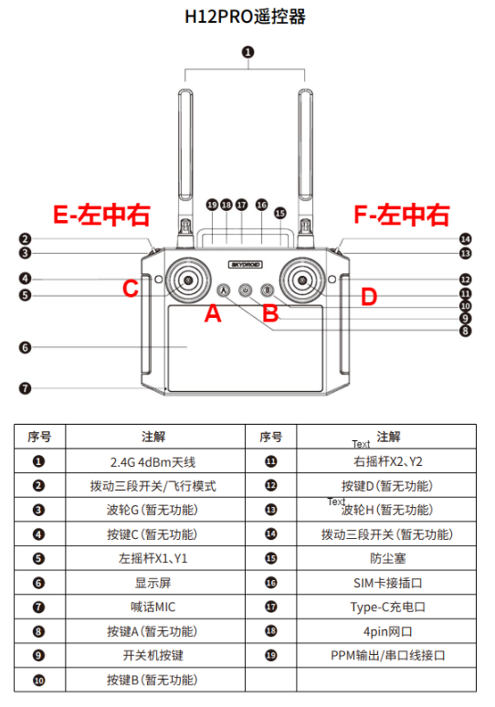

# OCS2 控制器文档

## 1. 部署流程

### 1.1 执行部署脚本

```bash
cd <kuavo-ros-control>
git submodule update --init --recursive
cd <kuavo-ros-control>/src/humanoid-control/h12pro_controller_node/scripts
sudo su
./deploy_autostart.sh
```

⚠️ **注意: h12pro 遥控器的程序以及机器人程序，vr 程序都会使用部署时的 ROS_MASTER_URI 与 ROS_IP，请确保部署时的 ROS_MASTER_URI 与 ROS_IP 正确。**

执行后，会自动安装依赖，并启动 h12pro 遥控器程序。

此服务集成了遥控器节点和监控功能，会根据系统状态自动管理遥控器程序的启停。当用户手动启动机器人程序时，h12pro 遥控器程序会自动下线。

开启服务：

```bash
sudo systemctl start ocs2_h12pro_monitor.service
```

关闭服务：

```bash
sudo systemctl stop ocs2_h12pro_monitor.service
```

开机自启动：

```bash
sudo systemctl enable ocs2_h12pro_monitor.service
```

关闭开机自启动：

```bash
sudo systemctl disable ocs2_h12pro_monitor.service
```

查看服务日志：

```bash
sudo journalctl -u ocs2_h12pro_monitor.service -f
```

### 1.3 查看机器人程序运行 LOG

```bash
sudo su
tmux attach -t humanoid_robot
```

### 1.4 检查遥控器数据是否正常

```bash
cd <kuavo-ros-control>
source devel/setup.bash
rostopic echo /h12pro_channel
```

### 1.5 注意事项

- 由于此服务 priority 比较低, 如果用户**手动启动** `roslaunch humanoid_controllers load_kuavo_real.launch` 程序时，`ocs2_h12pro_node` 程序将会自动下线，直到用户结束机器人程序后， `ocs2_h12pro_node` 程序才会自动重新上线。
- 存在可能用户结束机器人程序后， `ocs2_h12pro_node` 仍然没有上线或者没响应，请先 `pkill ros` 或者 `sudo pkill ros` 结束所有 ros 进程后，再重新启动 `sudo systemctl restart ocs2_h12pro_monitor.service` 服务。
- 如果使用的是遥控器外接模块(一个接着遥控器接收器的 **USB 的设备**)去接收器遥控器的数据，请在机器人上电后大概20-30秒后，再将外接模块插到机器人上。
- 如果重启机器人 NUC 后，遥控器数据无法正常接收，请热插拔外接模块后再试。

## 2. 状态机概述

### 2.1 基本状态

- `initial`: 初始状态(机器人 NUC 开机， 程序未启动状态)
- `calibrate`: 校准状态(启动机器人程序带上校正参数的状态)
- `ready_stance`: 准备姿态(启动机器人程序后，尚未站立的状态)
- `stance`: 站立姿态
- `walk`: walk 状态
- `trot`: trot 状态
- `vr_remote_control`: VR 遥控器控制状态
- `climb_stair`: 爬楼梯状态

### 2.2 状态转换流程图

{:height="640px" width="480px"}


- `Source` 表示当前机器人状态，上图中线段的起点
- `Trigger` 表示触发状态转换，上图中线段上的文字
- `Dest` 表示机器人目标状态，上图中线段箭头的终点


状态转换如下：

1. 从 initial 状态:
   - `initial_pre` -> ready_stance
   - `calibrate` -> calibrate

2. 从 ready_stance 状态:
   - `ready_stance` -> stance
   - `stop` -> initial

3. 从 stance 状态:
   - `walk` -> walk
   - `trot` -> trot
   - `arm_pose1/2/3/4` -> stance (手臂姿态控制)
   - `stop` -> initial
   - `start_vr_remote_control` -> vr_remote_control
   - `start_stair_detect` -> climb_stair

4. 从 walk 状态:
   - `stance` -> stance
   - `trot` -> trot
   - `stop` -> initial

5. 从 trot 状态:
   - `stance` -> stance
   - `walk` -> walk
   - `stop` -> initial

6. 从 vr_remote_control 状态:
   - `stop_vr_remote_control` -> stance
   - `stop` -> initial
   - `record_vr_rosbag` -> vr_remote_control
   - `stop_record_vr_rosbag` -> vr_remote_control

7. 从 climb_stair 状态:
   - `stair_climb` -> stance
   - `stop_stair_detect` -> stance
   - `stop` -> initial

## 3. 遥控器配置

### 3.1 按键示意图

{:height="640px" width="480px"}

### 3.2 状态转换按键组合

#### Initial (机器人 NUC 开机， 程序未启动状态) 状态转换

| 目标状态 | 按键组合 | 开关位置 |
|---------|---------|---------|
| ready_stance | C_PRESS | E_LEFT + F_RIGHT |
| calibrate | D_PRESS | E_LEFT + F_RIGHT |

#### Ready_stance (启动机器人程序后，尚未站立的状态) 状态转换

| 目标状态 | 按键组合 | 开关位置 |
|---------|---------|---------|
| stance | C_PRESS | E_LEFT + F_RIGHT |
| initial | C_LONG_PRESS + D_LONG_PRESS | 任意 |

#### Calibrate (启动机器人程序带上校正参数的状态)状态转换

| 目标状态 | 按键组合 | 开关位置 |
|---------|---------|---------|
| initial | C_LONG_PRESS + D_LONG_PRESS | 任意 |

#### RL_control (使用 RL 步态) 状态转换

| 目标状态 | 按键组合 | 开关位置 |
|---------|---------|---------|
| stance | C_PRESS | E_MIDDLE + F_MIDDLE |

#### Stance 状态转换

| 目标状态 | 按键组合 | 开关位置 |
|---------|---------|---------|
| walk | A_PRESS | E_MIDDLE + F_MIDDLE |
| trot | B_PRESS | E_MIDDLE + F_MIDDLE |
| arm_pose1 | A_PRESS | E_RIGHT + F_LEFT |
| arm_pose2 | B_PRESS | E_RIGHT + F_LEFT |
| arm_pose3 | C_PRESS | E_RIGHT + F_LEFT |
| arm_pose4 | D_PRESS | E_RIGHT + F_LEFT |
| start_vr_remote_control | A_LONG_PRESS | 任意 |
| initial | C_LONG_PRESS + D_LONG_PRESS | 任意 |
| start_stair_detect | C_LONG_PRESS | 任意 |

#### Walk 状态转换

| 目标状态 | 按键组合 | 开关位置 |
|---------|---------|---------|
| stance | D_PRESS | E_MIDDLE + F_MIDDLE |
| trot | B_PRESS | E_MIDDLE + F_MIDDLE |
| initial | C_LONG_PRESS + D_LONG_PRESS | 任意 |

#### Trot 状态转换

| 目标状态 | 按键组合 | 开关位置 |
|---------|---------|---------|
| stance | D_PRESS | E_MIDDLE + F_MIDDLE |
| walk | A_PRESS | E_MIDDLE + F_MIDDLE |
| initial | C_LONG_PRESS + D_LONG_PRESS | 任意 |

#### VR_remote_control 状态转换

| 目标状态 | 按键组合 | 开关位置 |
|---------|---------|---------|
| stance  | B_LONG_PRESS | 任意 |
| initial | C_LONG_PRESS + D_LONG_PRESS | 任意 |
| record_vr_rosbag | C_PRESS | 任意 |
| stop_record_vr_rosbag | D_PRESS | 任意 |

#### Climb_stair 状态转换

| 目标状态 | 按键组合 | 开关位置 |
|---------|---------|---------|
| stair_climb | A_PRESS | 任意 |
| stop_stair_detect | B_PRESS | 任意 |
| initial | C_LONG_PRESS + D_LONG_PRESS | 任意 |


**NOTE**

- 部署时会询问建图的相机类型，目前支持奥比中光和realsense相机，请根据实际情况选择
- 执行上楼梯前需要手动在上位机部署建图程序, 上楼梯相关文档：[文档](./../humanoid_controllers/scripts/上楼梯案例说明.md)
- 上楼梯前，你需要手动把 `load_kuavo_real.launch` 中的 `joint_protect_enable` 参数设置为 `false`
- 使用 RL 步态一键部署开机自启动 [脚本](scripts/deploy_autostart.sh) 。在运行之前，需要修改环境变量 ROBOT_VERSION=46. 由于使用了两个仓库，部署之前需要修改脚本中 `KUAVO_RL_WS_PATH`.
- 目前需要手动 VNC 连接上位机观察 Rviz 是否建图完毕
- 遥控器按键组合中，长按(LONG_PRESS)表示按键按下后持续保持按下状态，直到听到遥控器发出 “滴” 的一声
- 手臂动作存放在 `~/.config/lejuconfig/action_files` 路径下，文件名格式为 `arm_pose1.tact`, `arm_pose2.tact` 等
- 手臂动作做完后，假设手臂没有回到初始位置，可以通过 E中+F中+D键，将手臂回到初始位置
- 进入 VR 遥控遥操作状态后，遥控器将不再响应遥控器按键组合（除了紧急停止按键组合和退出 VR 遥控遥操作按键组合），直到退出 VR 遥控遥操作状态
- VR 遥操作文档请参考 [LINK](https://www.lejuhub.com/highlydynamic/craic_code_repo/-/tree/dev?ref_type=heads#quest3-vr%E6%8E%A7%E5%88%B6)
- VR 录制的 rosbag 文件存放在 `~/.log/vr_remote_control/rosbag` 路径下, 按照日期和时间命名
- VR 录制指定的话题配置文件存放在 `<kuavo-ros-control>/src/humanoid-control/h12pro_controller_node/config/record_topics.json` 路径下
- 指定录制的话题如下：
  - `/kuavo_arm_traj` #手臂关节值
  - `/control_robot_hand_position` #手指
  - `/robot_head_motion_data` #头部

  - 深度相机
    - `/camera/depth/image_rect_raw` # 深度相机图像
    - `/camera/depth/camera_info`    # 深度相机内参（由realsense出厂前设置标定好）
    - `/camera/depth/color/points`   # 带有深度的RGB点云（Point2D）

  - RGB相机
    - `/camera/color/image_raw`    # RGB相机图像
    - `/camera/color/camera_info`  # RGB相机内参（由realsense出厂前设置标定好）

  - 深度对齐RGB相机
    - `/camera/aligned_depth_to_color/image_raw`   # 深度对齐RGB后的深度图像
    - `/camera/aligned_depth_to_color/camera_info` # 深度对齐RGB后的相机内参


### 3.2 摇杆配置

摇杆支持在以下状态使用：

- stance
- walk
- trot

#### 左摇杆

- 垂直方向: X轴移动
- 水平方向: Y轴移动

#### 右摇杆

- 垂直方向: 躯干高度控制
- 水平方向: 旋转控制

### 3.3 紧急停止

- 组合键: C_LONG_PRESS + D_LONG_PRESS
- 适用状态: 所有状态(除了 initial 状态)
- **假如在站立状态下触发停止，机器人会先下蹲再停止**
