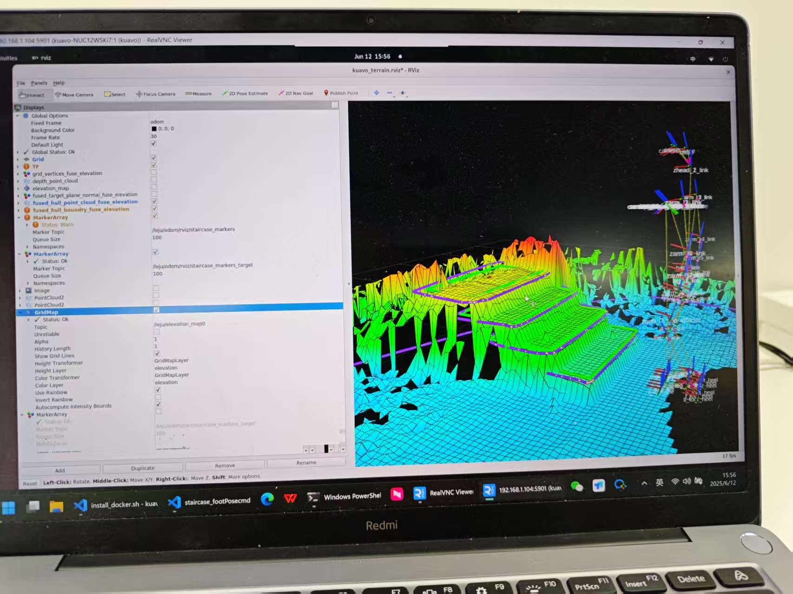

# 单步接口上楼梯案例说明
- 非视觉上楼梯脚本：`stairClimbPlanner.py`
- 视觉上楼梯案例依赖: `stairClimbPlanner-vision.py`
- 视觉功能依赖上位机的楼梯识别库，需要确保先配置好(查看后续章节)
### 固定位置上楼梯执行

- 将机器人放于楼梯前**固定距离**(大概2cm)，执行脚本`rosrun humanoid_controllers stairClimbPlanner.py` 即会根据规划的轨迹进行上楼梯(注意主函数可能会用于测试，自行打开上楼梯的注释即可)
- 一些函数注解：
    - plan_up_stairs：上楼梯轨迹规划
    - plan_down_stairs：下楼梯轨迹规划
    - plan_move_to：移动到指定位置轨迹规划
> 每个函数支持传递前一次规划的轨迹进去继续进行规划，比如可以先走台阶、再走平地、再走台阶....可以自行在主函数中实现规划组合
- 上楼梯的成功率非常依赖于轨迹的调控，一些参数如下：
```bash
self.dt = 0.6  # 腾空步态周期
self.ss_time = 0.5 # 支撑相时间
self.foot_width = 0.10  # 足宽
self.step_height = 0.13  # 台阶高度
self.step_length = 0.28  # 台阶长度,28,13

```
- 直接修改参数能够适合大部分情况，如果出现碰撞或者不稳定等情况时，可能需要调整plan_swing_phase中的参数，规划腾空相轨迹

### 视觉上楼梯调试
#### 1. 上位机配置
- 上位机连接胸部D435相机和腰部Orbbec相机

##### 上位机环境配置
- 上位机配置好容器环境(目前镜像里面上位机的环境都需要根据以下配置方便使用)
    - 配置sudo免密
```bash
sudo nano /etc/sudoers
# 在文件末尾添加：
# kuavo  ALL=(ALL) NOPASSWD:ALL
```
    - 配置普通用户加入docker用户组，避免重复输入密码
```bash
sudo groupadd docker
sudo usermod -aG docker ${USER}
sudo service docker restart
newgrp docker
```

- 下载[容器镜像](https://kuavo.lejurobot.com/docker_images/kuavo_staircase_sdk_2004_v1.0.tar.gz)并导入

```bash
docker load -i kuavo_staircase_sdk_2004_v1.0.tar.gz
```
- 克隆kauvo-terrain仓库,切换到最新的楼梯识别分支:
```bash
git clone https://www.lejuhub.com/highlydynamic/kauvo-terrain.git
cd kauvo-terrain
git checkout robot_real_stair_vision
```

- 打开容器编译：
```bash
cd kuavo-terrain
./docker/stair_docker_start.sh # 注意要使用这个脚本新建容器，后续方便在下位机调用
# 进入容器之后，编译
catkin build
```

##### 如果使用Orbbec相机，需要在kuavo_ros_application中启动，若使用D435相机则忽略这一步
- 克隆kuavo_ros_application仓库
```bash
git clone https://gitee.com/leju-robot/kuavo_ros_application.git
cd kuavo_ros_application
catkin build
source devel/setup.bash
roslaunch orbbec_camera gemini_330_series.launch
```

##### 上位机建图测试
- 建图之前需要先在下位机启动机器人，维护odom的tf树，否则无法可视化
- 配置xhost允许可视化输出到vnc, 在普通用户的终端执行：
```bash
export DISPLAY=:1.0; xhost +
```
- 建图前需要修改配置文件`kuavo-terrain/data/slam/backend/terrain_runner/sites/leju_terrain_params.yaml`
  - 若使用`D435`相机：将`depth_sensor_type`设置为2，`terrain_data_source`设置为1
  - 若使用`Orbbec`相机：将`depth_sensor_type`设置为1，`terrain_data_source`设置为3

- 进入容器，运行建图：
```bash
docker start kuavo_gendexgrasp_staircase_estimation_dev
docker exec -it kuavo_gendexgrasp_staircase_estimation_dev bash
## 运行腾讯sdk建图
./leju_terrain_run.sh

## 新开一个终端，重新进入容器，启动辅助节点(发布tf关系、后处理等)
docker exec -it kuavo_gendexgrasp_staircase_estimation_dev bash
source devel/setup.bash
## 如果使用胸部D435相机
roslaunch vision_staircase_estimation one_start_all.launch
## 如果使用腰部Orbbec相机
roslaunch vision_staircase_estimation one_start_all_orbbec.launch
```

- 此时连接上位机的VNC界面，即可看到建图和楼梯识别的效果



- 确认楼梯识别正常，没有识别出来多余的楼梯平面，地面高度和脚掌高度一致并且不倾斜(重要！！！)
- 如果出现识别结果不准，对应的一些解决方法：
    - 建图有许多空洞，尖刺：
        - 可能是摄像头点云输出不正常了，相机需要校准，并且确保安装上去没有压迫或者遮挡(十分容易导致深度图像不正常)
    - 高程图的地面高度和实际机器人脚掌高度不一致：
        - 相机安装精度问题，微调下位机使用的urdf中的细节位置
        - 若使用`胸部D435`相机，例如，调整`src/kuavo_assets/models/biped_s45/urdf/biped_s45.urdf`中的`torso-camera`和躯干链接的joint的高度
        - 若使用`腰部Orbbec`相机，可以在上位机`kuavo-terrain/src/vision_staircase_estimation/launch/one_start_all_orbbec.launch`中调整`waist-camera`与`camera_link`的tf2静态变换的偏移量;也可以在下位机调整`src/kuavo_assets/models/biped_s45/urdf/biped_s45.urdf`中的`waist-camera`和`base_link`链接的joint的高度
    - 高程图和机器人倾斜：
        - 一样可以通过根据建图效果调整相机姿态让地面变成水平

- 上述调整和校准只做一次，后续都无需登录上位机进行校准


#### 2. 下位机配置
- 下位机正常使用主分支(后续走楼梯功能会合并到主分支)即可，一些说明：
    - 可能需要根据建图效果调整urdf中的相机姿态
    - `src/humanoid-control/humanoid_controllers/scripts/upper_computer_service.py`中提供了一个上位机执行远程调用的服务，在上位机配置好建图环境之后，并且确认楼梯识别正常，即可全程在下位机执行上楼梯功能
    - upper_computer_service.py节点通过`load_kuavo_real.launch`正常启动，并提供以下服务：
        - 自动连接上位机ssh
        - 提供ros服务开启和关闭上位机高程图的功能(`/kuavo/start_stair_detection`和`/kuavo/stop_stair_detection`)
    - `stairClimbPlanner-vision.py`是基于视觉和单步接口上楼梯的脚步，可以实现在第一级楼梯前任意距离往前行走到楼梯前面开始上楼梯
       - 依赖于`stairClimbPlanner.py`中的接口和固定的楼梯参数(楼梯高度、宽度、级数等)

##### 前面准备工作做好之后，上楼梯启动流程：
- 在第一级楼梯前任意距离，启动建图
```bash
roslaunch humanoid_controllers load_kuavo_mujoco_sim.launch
```
- 启动上位机服务
```bash
rosservice call /kuavo/start_stair_detection
```
- 确认识别结果之后，启动上楼梯节点, 马上开始上楼梯
```bash
rosrun humanoid_controllers stairClimbPlanner-vision.py
```

> 为了避免干扰，需要尽量在楼梯前面一段距离才启动上位机建图服务，每次上楼梯前都需要重新启动上位机建图服务，避免上一次结果得干扰
> 平地走到楼梯前面的安全距离(safe_distance),可以根据实际机器人执行情况进行调整，调整之后没有硬件变动一般不会改变;安全距离是第一级楼梯中心距离机器人base的距离


#### 3. 上位机ssh服务接口和遥控器绑定
- 为了方便使用建图和上楼梯功能，对使用方法进行了封装
- 上位机服务节点`src/humanoid-control/humanoid_controllers/scripts/upper_computer_service.py`提供了通过ssh调用上位机的通用功能
  - 包含ssh自动连接，在上位机阻塞/非阻塞执行shell指令、阻塞/非阻塞执行容器内指令(建图等)
  - 配置文件位于`src/humanoid-control/humanoid_controllers/scripts/remote-config.json`
  - `commands`中预定义了一些上位机的指令
  - `container-commands`中预定义了一些容器内指令,如开启建图、开启腾讯sdk等
  - `upper_computer_service.py`还提供了一些ros接口，用于其他节点调用上位机的建图等功能
    - `/kuavo/start_stair_detection`：开启建图
    - `/kuavo/stop_stair_detection`：关闭建图
    - `/kuavo/start_stair_detection_orbbec`：开启建图(使用Orbbec相机)
    - `/kuavo/stop_stair_detection_orbbec`：关闭建图(使用Orbbec相机)
  
- 北通遥控器增加了组合按键绑定执行shell指令的功能
  - 在`src/humanoid-control/humanoid_controllers/config/commands.yaml`中配置了遥控器按键和指令的对应关系
  - 目前绑定的按键是：
    - 开启上位机建图功能：`LT+X`
    - 执行上楼梯脚本：`LT+B`
    - 具体是通过rosservice调用`upper_computer_service.py`中的服务调用上位机或者执行`rosrun`启动节点实现
  > 注意：在使用orbbec相机时，遥控器启动，需要自行修改`commands.yaml`中的指令，将`start_staircase_detection`改为调用奥比中光相机启动的service`start_staircase_detection_orbbec`


