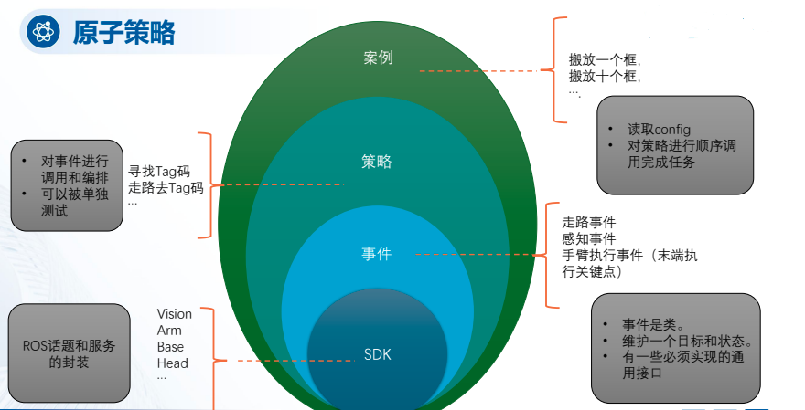
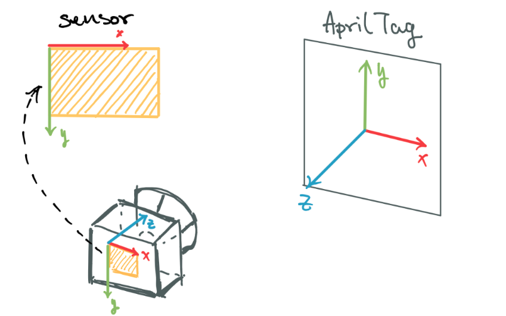

<a id="kuavo-strategy-v2"></a>

# 策略模块 v2

## 概述

策略模块 v2 调用 kuavo_humanoid_sdk 的sdk接口实现一些基本的任务，提供了更模块化和事件驱动的策略编写框架。
在不同层级上，这些任务可以被复用。

### 为什么有了sdk还需要策略模块？

例如简单的走路到一个指定点这件事情，可以调用kuavo_humanoid_sdk里发送/cmd_pos_world话题的接口实现，但是如果给定一个tag的位置，并要走到tag相对的一个位置，则需要对输入做坐标转换。并且，在走的过程中，我希望监听，走路是否成功到达目标，还是因为某种原因失败了。
事件就是这样一个封装：每个事件是一个类，可以在接收目标的时候做一些处理（如坐标转换，和范围检测），并且在执行过程中维护自己的状态，等等。

案例 >> 策略 >> 事件 >> SDK。它们之间的关系如下图：



## 数据结构

### *class* kuavo_humanoid_sdk.kuavo_strategy_v2.common.robot_sdk.RobotSDK

Bases: `object`

### *class* kuavo_humanoid_sdk.kuavo_strategy_v2.common.data_type.Frame(value)

Bases: `str`, `Enum`

An enumeration.

#### BASE *= 'base_link'*

#### CAMERA_LINK *= 'camera_link'*

#### ODOM *= 'odom'*

#### ROBOT *= 'robot'*

#### TAG *= 'tag'*

### *class* kuavo_humanoid_sdk.kuavo_strategy_v2.common.data_type.Point(x: float, y: float, z: float, frame: [Frame](#kuavo_humanoid_sdk.kuavo_strategy_v2.common.data_type.Frame))

Bases: `object`

### *class* kuavo_humanoid_sdk.kuavo_strategy_v2.common.data_type.Pose(pos: Tuple[float, float, float], quat: Tuple[float, float, float, float], frame: str | None = None)

Bases: `object`

#### angle(other: [Pose](#kuavo_humanoid_sdk.kuavo_strategy_v2.common.data_type.Pose))

计算姿态的角度差（弧度）。

参数：
: other (Pose): 另一个姿态对象。

返回：
: float: 角度差。

#### angle_yaw(other: [Pose](#kuavo_humanoid_sdk.kuavo_strategy_v2.common.data_type.Pose))

计算姿态的角度差（弧度）。
只考虑yaw的误差。用于2d情况下的计算。
参数：

> other (Pose): 另一个姿态对象。

返回：
: float: 角度差。

#### *classmethod* from_euler(pos: Tuple[float, float, float], euler: Tuple[float, float, float], frame=None, degrees=True)

从欧拉角创建Pose对象。

参数：
: pos (Tuple[float, float, float]): 位置坐标。
  euler (Tuple[float, float, float]): 欧拉角。
  frame (str): 坐标系框架名称，可选。
  degrees (bool): 欧拉角是否为度数。

返回：
: Pose: 创建的Pose对象。

#### *classmethod* from_rotmat(pos: Tuple[float, float, float], rotmat: Tuple[float, float, float], frame=None)

从旋转矩阵创建Pose对象。

参数：
: pos (Tuple[float, float, float]): 位置坐标。
  rotmat (Tuple[float, float, float]): 旋转矩阵。
  frame (str): 坐标系框架名称，可选。

返回：
: Pose: 创建的Pose对象。

#### get_euler(degrees=False)

获取姿态的欧拉角。

参数：
: degrees (bool): 是否返回度数。

返回：
: np.ndarray: 欧拉角。

#### get_quat()

获取姿态的四元数。

返回：
: np.ndarray: 四元数。

#### get_rotmat()

获取姿态的旋转矩阵。

返回：
: np.ndarray: 旋转矩阵。

#### position_l1_norm(other: [Pose](#kuavo_humanoid_sdk.kuavo_strategy_v2.common.data_type.Pose))

计算位置的L1范数（曼哈顿距离）。

参数：
: other (Pose): 另一个姿态对象。

返回：
: float: L1范数。

#### position_l2_norm(other: [Pose](#kuavo_humanoid_sdk.kuavo_strategy_v2.common.data_type.Pose))

计算位置的L2范数（欧氏距离）。

参数：
: other (Pose): 另一个姿态对象。

返回：
: float: L2范数。

#### position_l2_norm_squared(other: [Pose](#kuavo_humanoid_sdk.kuavo_strategy_v2.common.data_type.Pose))

计算位置的L2范数的平方。

参数：
: other (Pose): 另一个姿态对象。

返回：
: float: L2范数的平方。

### *class* kuavo_humanoid_sdk.kuavo_strategy_v2.common.data_type.Tag(id: int, pose: [Pose](#kuavo_humanoid_sdk.kuavo_strategy_v2.common.data_type.Pose), size: float | None = None)

Bases: `object`

### *class* kuavo_humanoid_sdk.kuavo_strategy_v2.common.data_type.Transform3D(trans_pose: [Pose](#kuavo_humanoid_sdk.kuavo_strategy_v2.common.data_type.Pose), source_frame: [Frame](#kuavo_humanoid_sdk.kuavo_strategy_v2.common.data_type.Frame), target_frame: [Frame](#kuavo_humanoid_sdk.kuavo_strategy_v2.common.data_type.Frame))

Bases: `object`

#### apply_to_point(point: [Point](#kuavo_humanoid_sdk.kuavo_strategy_v2.common.data_type.Point))

将Point从source_frame转换到target_frame。

参数：
: point (Point): 要转换的Point对象。

返回：
: Point: 转换后的Point对象。

#### apply_to_pose(pose: [Pose](#kuavo_humanoid_sdk.kuavo_strategy_v2.common.data_type.Pose))

将Pose从source_frame转换到target_frame。

参数：
: pose (Pose): 要转换的Pose对象。

返回：
: Pose: 转换后的Pose对象。

#### apply_to_pose_inverse(pose: [Pose](#kuavo_humanoid_sdk.kuavo_strategy_v2.common.data_type.Pose))

将Pose从target_frame逆变换到source_frame。

## 事件系统

### *class* kuavo_humanoid_sdk.kuavo_strategy_v2.common.events.base_event.EventStatus(value)

Bases: `Enum`

An enumeration.

#### CLOSED *= 'closed'*

#### FAILED *= 'failed'*

#### IDLE *= 'idle'*

#### RUNNING *= 'running'*

#### SUCCESS *= 'success'*

#### TIMEOUT *= 'timeout'*

### *class* kuavo_humanoid_sdk.kuavo_strategy_v2.common.events.base_event.BaseEvent(event_name)

Bases: `object`

事件：
单一的输入
有状态判断

#### close()

停止事件，将状态更改为CLOSED。

#### get_status()

返回更新后的事件状态。

返回：
: EventStatus: 当前事件状态。

#### open(\*args, \*\*kwargs)

开始事件，将状态更改为RUNNING并记录开始时间。

参数：
: \*args: 额外的参数。
  \*\*kwargs: 额外的关键字参数。

#### set_target(target: Any, \*args, \*\*kwargs)

设置事件的目标，可以在事件执行期间动态更新。

参数：
: target (Any): 事件目标，例如位置或ID。
  \*args: 额外的参数。
  \*\*kwargs: 额外的关键字参数。

返回：
: bool: 如果目标设置成功返回True，否则返回False。

#### set_timeout(timeout)

设置事件的超时时间。

参数：
: timeout (int): 超时时间（秒），必须大于0。

#### step()

抽象方法，需要在子类中实现以定义事件的每一步行为。

异常：
: NotImplementedError: 如果在子类中未实现。

### *class* kuavo_humanoid_sdk.kuavo_strategy_v2.common.events.mobile_manipulate.head_events.EventPercep(robot_sdk: [RobotSDK](#kuavo_humanoid_sdk.kuavo_strategy_v2.common.robot_sdk.RobotSDK), half_fov, timeout)

Bases: [`BaseEvent`](#kuavo_humanoid_sdk.kuavo_strategy_v2.common.events.base_event.BaseEvent)

#### check_in_fov(tag: [Tag](#kuavo_humanoid_sdk.kuavo_strategy_v2.common.data_type.Tag))

检查目标位置是否在头部视场内。

参数：
: tag (Tag): 目标的Tag对象。

返回：
: Tuple[bool, float]: 是否在视场内以及目标方向。

#### close()

关闭事件并重置状态。

#### get_tag_in_base() → [Tag](#kuavo_humanoid_sdk.kuavo_strategy_v2.common.data_type.Tag)

获取tag在base_link坐标系下的位姿。

返回：
: Tag: tag在base_link坐标系下的位姿。

#### get_tag_in_world() → [Tag](#kuavo_humanoid_sdk.kuavo_strategy_v2.common.data_type.Tag)

获取感知到的目标位置。

返回：
: Tag: 感知到的目标位置的Tag对象。

#### new_tag_pose_came()

更新最新的tag位姿。

返回：
: bool: 如果有新的tag位姿返回True，否则返回False。

#### reset()

重置事件状态。

#### set_target(target, \*args, \*\*kwargs)

设置事件的目标。

参数：
: target (Any): 目标。
  \*args: 额外的参数。
  \*\*kwargs: 额外的关键字参数。

返回：
: bool: 如果目标设置成功返回True，否则返回False。

#### step()

执行事件的每一步操作。

#### transform_pose_from_tag_to_world(tag: [Tag](#kuavo_humanoid_sdk.kuavo_strategy_v2.common.data_type.Tag), pose: [Pose](#kuavo_humanoid_sdk.kuavo_strategy_v2.common.data_type.Pose)) → [Pose](#kuavo_humanoid_sdk.kuavo_strategy_v2.common.data_type.Pose)

将tag坐标系下的位姿转换到世界坐标系下。

参数：
: tag (Tag): Tag对象，包含位姿信息。
  pose (Pose): 需要转换的位姿。

返回：
: Pose: 转换后的Pose对象。

### *class* kuavo_humanoid_sdk.kuavo_strategy_v2.common.events.mobile_manipulate.head_events.EventHeadMoveKeyPoint(robot_sdk: [RobotSDK](#kuavo_humanoid_sdk.kuavo_strategy_v2.common.robot_sdk.RobotSDK), timeout, dt: float = 0.7)

Bases: [`BaseEvent`](#kuavo_humanoid_sdk.kuavo_strategy_v2.common.events.base_event.BaseEvent)

#### close()

关闭头部移动事件。

#### open(\*args, \*\*kwargs)

开始头部移动事件。

参数：
: \*args: 额外的参数。
  \*\*kwargs: 额外的关键字参数。

#### step()

执行头部移动事件的每一步操作。

### *class* kuavo_humanoid_sdk.kuavo_strategy_v2.common.events.mobile_manipulate.walk_events.EventWalkToPose(robot_sdk: [RobotSDK](#kuavo_humanoid_sdk.kuavo_strategy_v2.common.robot_sdk.RobotSDK), timeout, yaw_threshold, pos_threshold, control_mode)

Bases: [`BaseEvent`](#kuavo_humanoid_sdk.kuavo_strategy_v2.common.events.base_event.BaseEvent)

#### close()

关闭事件。

#### reset()

重置事件状态。

#### set_control_mode(control_mode: str)

设置控制模式。

参数：
: control_mode (str): 控制模式，支持 ‘cmd_pos_world’, ‘cmd_pos’, ‘cmd_vel’。

#### set_target(target: Any, \*args, \*\*kwargs)

设置事件的目标。

参数：
: target (Any): 目标。
  <br/>
  ```
  *
  ```
  <br/>
  args: 额外的参数。
  <br/>
  ```
  **
  ```
  <br/>
  kwargs: 额外的关键字参数。

返回：
: bool: 如果目标设置成功返回True，否则返回False。

#### step()

执行事件的每一步操作。

#### utils_enable_base_pitch_limit(enable: bool)

启用或禁用base_link的俯仰角限制。

参数：
: enable (bool): 是否启用俯仰角限制。

### *class* kuavo_humanoid_sdk.kuavo_strategy_v2.common.events.mobile_manipulate.arm_events.EventArmMoveKeyPoint(robot_sdk: [RobotSDK](#kuavo_humanoid_sdk.kuavo_strategy_v2.common.robot_sdk.RobotSDK), timeout, arm_control_mode: str, pos_threshold: float, angle_threshold: float)

Bases: [`BaseEvent`](#kuavo_humanoid_sdk.kuavo_strategy_v2.common.events.base_event.BaseEvent)

#### arm_reset()

重置手臂到初始状态。

#### check_current_point_meet(current_left_target_pose: [Pose](#kuavo_humanoid_sdk.kuavo_strategy_v2.common.data_type.Pose), current_right_target_pose: [Pose](#kuavo_humanoid_sdk.kuavo_strategy_v2.common.data_type.Pose))

检查当前点是否满足目标条件。

参数：
: current_left_target_pose (Pose): 当前左手目标姿态。
  current_right_target_pose (Pose): 当前右手目标姿态。

返回：
: bool: 如果满足条件返回True，否则返回False。

#### close()

关闭事件并重置状态。

#### get_arm_pose_world(mode='tf')

获取手臂在世界坐标系中的姿态。

参数：
: mode (str): 获取模式，默认为”tf”。

返回：
: Pose: 手臂的世界坐标系姿态。

#### get_current_transform(source_frame: [Frame](#kuavo_humanoid_sdk.kuavo_strategy_v2.common.data_type.Frame), target_frame: [Frame](#kuavo_humanoid_sdk.kuavo_strategy_v2.common.data_type.Frame)) → [Transform3D](#kuavo_humanoid_sdk.kuavo_strategy_v2.common.data_type.Transform3D)

将tf的变换转换为Transform3D对象。

参数：
: source_frame (Frame): 源坐标系。
  target_frame (Frame): 目标坐标系。

返回：
: Transform3D: 转换后的Transform3D对象。

#### interpolate_poses(start_pose, end_pose, num_points=20)

在两个笛卡尔空间姿态之间进行三次样条插值。

参数：
: start_pose: 起始KuavoPose或Pose。
  end_pose: 终点KuavoPose或Pose。
  num_points (int): 插值点数量。

返回：
: List[KuavoPose]: 插值后的KuavoPose列表。

#### open()

开始走到指定位置事件。

#### reset()

重置事件状态。

#### set_target(target: Any, \*args, \*\*kwargs)

设置事件的目标。

参数：
: target (Any): 目标。
  \*args: 额外的参数。
  \*\*kwargs: 额外的关键字参数。

返回：
: bool: 如果目标设置成功返回True，否则返回False。

#### step()

执行事件的每一步操作。

#### util_set_arm_dof_to_work()

设置手臂的dof位置为双手抬起手肘弯曲姿态，用于检测零点。

#### util_set_arm_dof_to_zero()

手臂从工作姿态回到零点姿态。

## 工具类

### *class* kuavo_humanoid_sdk.kuavo_strategy_v2.utils.logger_setup.Logger(filename)

Bases: `object`

#### flush()

#### write(message)

## 策略函数

### kuavo_humanoid_sdk.kuavo_strategy_v2.pick_place_box.strategy.search_tag_with_head(robot_sdk: ~kuavo_humanoid_sdk.kuavo_strategy_v2.common.robot_sdk.RobotSDK, walk_event: ~kuavo_humanoid_sdk.kuavo_strategy_v2.common.events.mobile_manipulate.walk_events.EventWalkToPose, head_event: ~kuavo_humanoid_sdk.kuavo_strategy_v2.common.events.mobile_manipulate.head_events.EventHeadMoveKeyPoint, percep_event: ~kuavo_humanoid_sdk.kuavo_strategy_v2.common.events.mobile_manipulate.head_events.EventPercep, init_tag_guess: ~kuavo_humanoid_sdk.kuavo_strategy_v2.common.data_type.Tag, head_search_yaws: ~typing.List[float], head_search_pitchs: ~typing.List[float], walk_use_cmd_vel: bool = False, enable_head_tracking: bool = True, rotate_body: bool = True) -> (<class 'bool'>, <class 'kuavo_humanoid_sdk.kuavo_strategy_v2.common.data_type.Tag'>)

使用头部寻找目标位置。

参数：
: robot_sdk (RobotSDK): 机器人SDK实例。
  walk_event (EventWalkToPose): 走路事件。
  head_event (EventHeadMoveKeyPoint): 头部移动事件。
  percep_event (EventPercep): 感知事件。
  init_tag_guess (Tag): 初始的tag信息猜测。
  head_search_yaws (List[float]): 头部搜索的yaw角度列表。
  head_search_pitchs (List[float]): 头部搜索的pitch角度列表。
  enable_head_tracking (bool): 是否启用头部追踪。
  rotate_body (bool): 是否允许身体旋转。

返回：
: Tuple[bool, Tag]: 搜索结果和目标Tag。

### kuavo_humanoid_sdk.kuavo_strategy_v2.pick_place_box.strategy.walk_approach_target_with_perception_loop(walk_event: [EventWalkToPose](#kuavo_humanoid_sdk.kuavo_strategy_v2.common.events.mobile_manipulate.walk_events.EventWalkToPose), percep_event: [EventPercep](#kuavo_humanoid_sdk.kuavo_strategy_v2.common.events.mobile_manipulate.head_events.EventPercep), tag: [Tag](#kuavo_humanoid_sdk.kuavo_strategy_v2.common.data_type.Tag), stand_pose_in_tag: [Pose](#kuavo_humanoid_sdk.kuavo_strategy_v2.common.data_type.Pose), enable_percep_when_walking: bool, walk_use_cmd_vel: bool = False)

走路接近目标，同时视觉闭环。

参数：
: walk_event (EventWalkToPose): 走路事件。
  percep_event (EventPercep): 感知事件。
  tag (Tag): 目标标签。
  stand_pose_in_tag (Pose): 最终站立位置在目标标签中的位姿。
  enable_percep_when_walking (bool): 是否在走路时启用感知闭环。

返回：
: Tuple[bool, Tag]: 是否成功接近目标和目标Tag。

### kuavo_humanoid_sdk.kuavo_strategy_v2.pick_place_box.strategy.move_arm_and_backward(walk_event: [EventWalkToPose](#kuavo_humanoid_sdk.kuavo_strategy_v2.common.events.mobile_manipulate.walk_events.EventWalkToPose), arm_event: [EventArmMoveKeyPoint](#kuavo_humanoid_sdk.kuavo_strategy_v2.common.events.mobile_manipulate.arm_events.EventArmMoveKeyPoint), arm_traj: Tuple[List[[Pose](#kuavo_humanoid_sdk.kuavo_strategy_v2.common.data_type.Pose)], List[[Pose](#kuavo_humanoid_sdk.kuavo_strategy_v2.common.data_type.Pose)]], step_back_distance: float, walk_use_cmd_vel: bool = False, tag: [Tag](#kuavo_humanoid_sdk.kuavo_strategy_v2.common.data_type.Tag) | None = None, arm_wrench: Tuple[List, List] | None = None)

抓起箱子同时向后平移。

参数：
: walk_event (EventWalkToPose): 走路事件。
  arm_event (EventArmMoveKeyPoint): 手臂移动事件。
  arm_traj (Tuple[List[Pose], List[Pose]]): 手臂轨迹，分别存放左臂和右臂的数据。
  step_back_distance (float): 向后平移的距离，单位米。
  tag (Tag): 可选的目标标签。
  arm_wrench (Tuple[List, List]): 可选的手臂扭矩数据。

返回：
: bool: 是否成功完成操作。

### kuavo_humanoid_sdk.kuavo_strategy_v2.pick_place_box.strategy.grab_box_and_backward(walk_event: [EventWalkToPose](#kuavo_humanoid_sdk.kuavo_strategy_v2.common.events.mobile_manipulate.walk_events.EventWalkToPose), arm_event: [EventArmMoveKeyPoint](#kuavo_humanoid_sdk.kuavo_strategy_v2.common.events.mobile_manipulate.arm_events.EventArmMoveKeyPoint), step_back_distance: float, tag: [Tag](#kuavo_humanoid_sdk.kuavo_strategy_v2.common.data_type.Tag), box_width: float, box_behind_tag: float, box_beneath_tag: float, box_left_tag: float, box_mass: float, force_ratio_z: float, lateral_force: float, walk_use_cmd_vel: bool = False) → bool

抓取箱子并向后移动。

参数：
: walk_event (EventWalkToPose): 走路事件。
  arm_event (EventArmMoveKeyPoint): 手臂移动事件。
  step_back_distance (float): 向后平移的距离，单位米。
  tag (Tag): 目标标签。
  box_width (float): 箱子宽度。
  box_behind_tag (float): 箱子在tag后面的距离，单位米。
  box_beneath_tag (float): 箱子在tag下方的距离，单位米。
  box_left_tag (float): 箱子在tag左侧的距离，单位米。
  box_mass (float): 箱子质量，单位kg。
  force_ratio_z (float): 纵向力经验系数。
  lateral_force (float): 侧向夹持力，单位N。

返回：
: bool: 是否成功完成操作。

### kuavo_humanoid_sdk.kuavo_strategy_v2.pick_place_box.strategy.place_box_and_backward(walk_event: [EventWalkToPose](#kuavo_humanoid_sdk.kuavo_strategy_v2.common.events.mobile_manipulate.walk_events.EventWalkToPose), arm_event: [EventArmMoveKeyPoint](#kuavo_humanoid_sdk.kuavo_strategy_v2.common.events.mobile_manipulate.arm_events.EventArmMoveKeyPoint), step_back_distance: float, tag: [Tag](#kuavo_humanoid_sdk.kuavo_strategy_v2.common.data_type.Tag), box_width: float, box_behind_tag: float, box_beneath_tag: float, box_left_tag: float, box_mass: float, force_ratio_z: float, lateral_force: float, walk_use_cmd_vel: bool = False)

放置箱子并向后移动。

参数：
: walk_event (EventWalkToPose): 走路事件。
  arm_event (EventArmMoveKeyPoint): 手臂移动事件。
  step_back_distance (float): 向后平移的距离，单位米。
  tag (Tag): 目标标签。
  box_width (float): 箱子宽度。
  box_behind_tag (float): 箱子在tag后面的距离，单位米。
  box_beneath_tag (float): 箱子在tag下方的距离，单位米。
  box_left_tag (float): 箱子在tag左侧的距离，单位米。
  box_mass (float): 箱子质量，单位kg。
  force_ratio_z (float): 纵向力经验系数。
  lateral_force (float): 侧向夹持力，单位N。

返回：
: bool: 是否成功完成操作。

### kuavo_humanoid_sdk.kuavo_strategy_v2.pick_place_box.strategy.return_to_idle(walk_event: [EventWalkToPose](#kuavo_humanoid_sdk.kuavo_strategy_v2.common.events.mobile_manipulate.walk_events.EventWalkToPose))

返回到空闲状态。

参数：
: walk_event (EventWalkToPose): 走路事件。

返回：
: bool: 是否成功返回到空闲状态。

## 配置模块

<a id="module-kuavo_humanoid_sdk.kuavo_strategy_v2.pick_place_box.configs.config_sim"></a>

### *class* kuavo_humanoid_sdk.kuavo_strategy_v2.pick_place_box.configs.config_sim.config

Bases: `object`

#### *class* common

Bases: `object`

通用配置

#### arm_angle_threshold *= 0.3490658503988659*

#### arm_control_mode *= 'fixed_base'*

#### arm_pos_threshold *= 0.15*

#### arm_timeout *= 50*

#### box_mass *= 1.5*

#### box_width *= 0.25*

#### enable_head_tracking *= True*

#### enable_percep_when_walking *= True*

#### half_fov *= 60*

#### head_search_pitchs *= [-30, -15, 0, 15, 30]*

#### head_search_yaws *= [12, -12]*

#### head_timeout *= 30*

#### rotate_body *= True*

#### step_back_distance *= 0.5*

#### walk_pos_threshold *= 0.05*

#### walk_timeout *= 50*

#### walk_use_cmd_vel *= True*

#### walk_yaw_threshold *= 0.08726646259971647*

#### *class* pick

Bases: `object`

搬框配置

#### box_behind_tag *= 0.0*

#### box_beneath_tag *= 0.0*

#### box_in_tag_euler *= (0.0, 0.0, 0.0)*

#### box_in_tag_pos *= (0.0, 0.0, 0.0)*

#### box_left_tag *= -0.2*

#### force_ratio_z *= 0.0*

#### lateral_force *= 0.0*

#### stand_in_tag_euler *= (-1.5707963267948966, 1.5707963267948966, 0.0)*

#### stand_in_tag_pos *= (0.0, 0.0, 0.5)*

#### tag_euler_world *= (0, 0, 0)*

#### tag_id *= 1*

#### tag_pos_world *= (0, -10, 0)*

#### *class* place

Bases: `object`

放框配置

#### box_behind_tag *= 0.2*

#### box_beneath_tag *= 0.5*

#### box_left_tag *= 0.0*

#### force_ratio_z *= 0.0*

#### lateral_force *= 0.0*

#### stand_in_tag_euler *= (-1.5707963267948966, 1.5707963267948966, 0.0)*

#### stand_in_tag_pos *= (0.0, 0.0, 0.5)*

#### tag_euler_world *= (0, 0, 0)*

#### tag_id *= 0*

#### tag_pos_world *= (0, 10, 0)*

<a id="module-kuavo_humanoid_sdk.kuavo_strategy_v2.pick_place_box.configs.config_real"></a>

### *class* kuavo_humanoid_sdk.kuavo_strategy_v2.pick_place_box.configs.config_real.config

Bases: `object`

#### *class* common

Bases: `object`

通用配置

#### arm_angle_threshold *= 0.3490658503988659*

#### arm_control_mode *= 'fixed_base'*

#### arm_pos_threshold *= 0.15*

#### arm_timeout *= 50*

#### box_mass *= 1.5*

#### box_width *= 0.37*

#### enable_head_tracking *= True*

#### enable_percep_when_walking *= True*

#### half_fov *= 60*

#### head_search_pitchs *= [-30, -15, 0, 15, 30]*

#### head_search_yaws *= [12, -12]*

#### head_timeout *= 30*

#### rotate_body *= True*

#### step_back_distance *= 0.5*

#### walk_pos_threshold *= 0.2*

#### walk_timeout *= 50*

#### walk_use_cmd_vel *= True*

#### walk_yaw_threshold *= 0.1*

#### *class* pick

Bases: `object`

搬框配置

#### box_behind_tag *= 0.13*

#### box_beneath_tag *= -0.04*

#### box_in_tag_euler *= (0.0, 0.0, 0.0)*

#### box_in_tag_pos *= (0.0, 0.0, 0.0)*

#### box_left_tag *= 0.0*

#### force_ratio_z *= 0.34*

#### lateral_force *= 10.0*

#### stand_in_tag_euler *= (-1.5707963267948966, 1.5707963267948966, 0.0)*

#### stand_in_tag_pos *= (0.0, 0.0, 0.4)*

#### tag_euler_world *= (0, 0, 0)*

#### tag_id *= 8*

#### tag_pos_world *= (0, -10, 0)*

#### *class* place

Bases: `object`

放框配置

#### box_behind_tag *= -0.05*

#### box_beneath_tag *= 0.6*

#### box_left_tag *= 0.0*

#### force_ratio_z *= 0.34*

#### lateral_force *= 10.0*

#### stand_in_tag_euler *= (-1.5707963267948966, 1.5707963267948966, 0.0)*

#### stand_in_tag_pos *= (0.0, 0.0, 0.65)*

#### tag_euler_world *= (0, 0, 0)*

#### tag_id *= 1*

#### tag_pos_world *= (0, 10, 0)*

## 搬箱子示例

注意ROS里Tag识别的坐标系如下：



以下是一个使用箱子抓取策略的基本示例:

### 准备

第一次启动 gazebo 场景前需要修改tag尺寸:

在 `/opt/ros/noetic/share/apriltag_ros/config/tags.yaml` 文件中将 tag 的 size 尺寸修改为和立方体 tag 码的尺寸一致（只需做一次）

```yaml
standalone_tags:
  [
    {id: 0, size: 0.088, name: 'tag_0'},
    {id: 1, size: 0.088, name: 'tag_1'},
    {id: 2, size: 0.088, name: 'tag_2'},
    {id: 3, size: 0.088, name: 'tag_3'},
    {id: 4, size: 0.088, name: 'tag_4'},
    {id: 5, size: 0.088, name: 'tag_5'},
    {id: 6, size: 0.088, name: 'tag_6'},
    {id: 7, size: 0.088, name: 'tag_7'},
    {id: 8, size: 0.088, name: 'tag_8'},
    {id: 9, size: 0.088, name: 'tag_9'}
  ]
```

### 编译

上位机需要编译相关功能包:

```bash
git clone https://www.lejuhub.com/ros-application-team/kuavo_ros_application.git
cd kuavo_ros_application
git checkout dev
catkin build kuavo_tf2_web_republisher
```

下位机首先需要编译相关功能包:

```bash
git clone https://gitee.com/leju-robot/kuavo-ros-control.git
cd kuavo-ros-control
git checkout dev
catkin build humanoid_controllers kuavo_msgs gazebo_sim ar_control
```

#### 【或者】Mujoco 仿真运行

```bash
roslaunch humanoid_controllers load_kuavo_mujoco_sim.launch
```

### 启动【事件】测试脚本

#### 行走事件测试

```bash
python3 kuavo_humanoid_sdk/kuavo_strategy_v2/pick_place_box/examples/walk_example.py
```

#### 手臂移动事件测试

```bash
python3 kuavo_humanoid_sdk/kuavo_strategy_v2/pick_place_box/examples/arm_example.py
```

### 启动完整搬框案例

```bash
python3 kuavo_humanoid_sdk/kuavo_strategy_v2/pick_place_box/case.py
```

## 目录结构

- why_v2.md: 解释为什么使用 v2 版本。
- README.md: 项目的简要介绍。

- **pick_place_box**: 包含与抓取和放置相关的策略。
- **resource**: 存储资源文件。
- **utils**: 实用工具和辅助函数。
- **common**: 通用模块和共享代码。
- **log**: 日志文件和记录。
