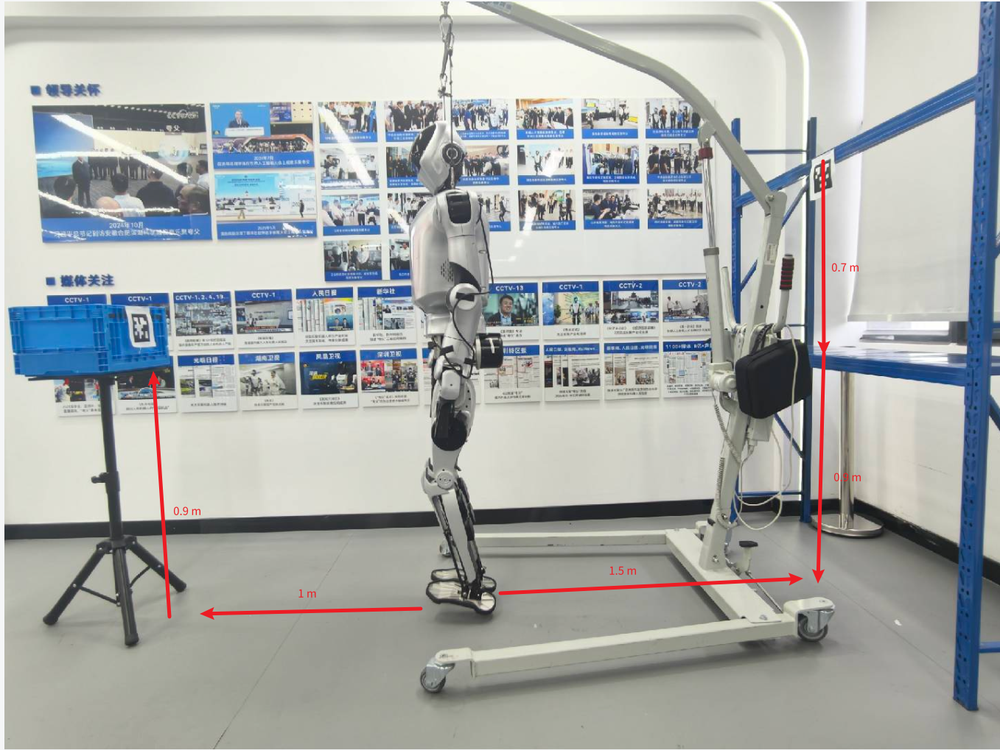

# 真机/仿真搬箱运行命令手册

本文档整理了 Kuavo 人形机器人在真机与仿真环境中运行搬箱任务所需的全部命令，基于 WS SDK（WebSocket SDK）方案。

---

## 一、一次性环境配置

### 上位机

```bash
cd ~/kuavo_ros_application
git checkout dev
catkin build apriltag_ros kuavo_camera dynamic_biped kuavo_tf2_web_republisher ar_control
```

### 下位机

**依赖与编译：**

```bash
# 依赖
sudo apt-get update
sudo apt-get install ros-noetic-geographic-msgs libudev-dev -y

# rosbridge WebSocket 服务（WS SDK 客户端需通过 127.0.0.1:9090 连接）
sudo apt install ros-noetic-rosbridge-suite

# 编译
cd ~/kuavo-ros-control
sudo su
catkin clean -y
catkin build humanoid_controllers gazebo_sim ar_control mobile_manipulator_controllers kuavo_msgs grab_box
source devel/setup.bash
```

**安装 WS SDK：**

```bash
cd ~/kuavo-ros-control
cd src/kuavo_humanoid_websocket_sdk
chmod +x install.sh
./install.sh

# 验证版本
pip show kuavo-humanoid-sdk-ws | grep Version
```

---

## 二、运行前参数检查


### 零点标定（真机）

首次上电后，需对机器人关节进行零点标定。

**头部标定：**

```bash
sudo su
source devel/setup.bash
roslaunch humanoid_controllers load_kuavo_real.launch cali:=true
```

> 头部通过上述命令自动执行零点标定，标定完成后头部恢复正常工作位姿。

**手臂标定：**

> **⚠️ 重要警告：手臂不可通过 `cali:=true` 标定脚本进行标定。**
>
> 搬箱任务使用的夹板末端执行器相对于其他末端执行器**向内突出**。如果通过 `cali:=true` 脚本进行标定，机器人在标定过程中自动执行全关节运动时，**夹板会打到腿部电机**。

手臂需通过**手动摆放**的方式进行标定：

1. 机器人上电后，手动将手臂摆放到零点位置：两个大臂自然下垂，小臂朝前水平伸展，夹板张开
2. 确认手臂位置正确、夹板与腿部之间有足够安全距离后，再启动机器人站立流程（终端 3）

**上位机 — 修改 tag 尺寸：**

```bash
vim ~/kuavo_ros_application/src/ros_vision/detection_apriltag/apriltag_ros/config/tags.yaml
```

确保 `standalone_tags` 中 tag 的 `size` 与实际物理尺寸一致（单位：米）。

**下位机 — 修改 config_real.py：**

编辑 `src/kuavo_humanoid_websocket_sdk/kuavo_humanoid_sdk/kuavo_strategy_pytree/configs/config_real.py`：

> **坐标基准说明：** 所有偏移参数均以 **tag 中心** 为原点。
> `box_width` 为抓取宽度，需略小于箱子实际宽度（约 5 cm）以补偿手臂零位误差，抓取点按 `±box_width/2` 分配到箱子左右边缘。

```python
# 搬箱 tag_id（箱子上的码）
config.pick.tag_id = [0, 1, 2]   # 支持列表，多轮循环使用

# 放置点 tag_id（货架上的码）
config.place.tag_id = 5

# 机器人站立位置（以 tag 中心为基准）
stand_in_tag_pos = (0.0, 0.0, 0.30)    # 机器人停在 tag 前方距离（z），单位米。越小越靠近 tag
stand_in_tag_euler = (…, …, …)         # 站立朝向，单位弧度

# 抓取偏移参数（以 tag 中心为基准，根据机况微调）
# 注意：实机验证 box_beneath_tag 减小→抓取点上移，增大→抓取点下移
box_behind_tag = 0.15    # 从 tag 中心往箱子后方（-z）的距离，单位米
box_beneath_tag = 0.05   # 抓取点高度：减小上移，增大下移，单位米
box_left_tag = -0.0      # 从 tag 中心往箱子左侧（-x）的偏移，单位米

# 搬箱次数
config.common.grab_box_num = 10
config.common.enable_round_stop = True  # 每轮暂停，按 Enter 继续
```

---

### 场景布置要求

> **⚠️ 核心约束：机器人只能识别 2 米以内的 AprilTag。搬起箱子转腰后，与货架的距离不得超过 2 m，否则无法检测货架上的 tag。**

#### 布局示意图



上图展示了 Kuavo 5 转腰搬箱任务的典型场景布局，关键数据说明如下：

- **机器人初始位置**：位于场景中央，距桌子与货架均在 **2.0 m 以内**（建议 1.0 ~ 1.5 m），确保转腰后能分别检测到两侧的 AprilTag。
- **搬起点（桌子）**：位于机器人一侧，台面高度 **0.9 m**；箱子置于台面上，tag 贴于箱子前侧立面上方。
- **摆放点（货架）**：位于机器人对侧，放置层高度 **0.9 m**；tag 贴于货架放置层前侧立面上方。机器人通过转腰切换面向桌子或货架。

> 布局要点：桌子和货架分置机器人两侧，二者距机器人均不超过 2.0 m；太近（< 0.25 m）手臂无操作空间，太远（> 2.0 m）tag 无法被检测。

#### 箱子搬起点（桌子）

| 项目 | 真机 | 仿真 | 说明 |
|------|------|------|------|
| 桌子台面高度 | **0.9 m** | 0.9 m | 台面离地高度 |
| 箱子规格 | 高 0.23 × 宽 0.40 × 长 0.30 m | — | 物理箱子尺寸 |
| 箱子顶部离地高度 | ≈ 1.13 m | — | 台面高度 + 箱子高度 |
| 抓取点离地高度 | ≈ 1.05 m | — | 箱子顶部往下 8 cm 处 |
| tag 贴附位置 | 箱子前侧立面上方 | 箱子前侧立面上方 | tag 贴于箱子前侧立面上方 |
| 机器人距 tag 距离 | 0.30 m | 0.40 m | `stand_in_tag_pos[2]`，机器人站在 tag 正前方 |
| 机器人距箱子前侧距离 | ≈ 0.30 m | ≈ 0.40 m | tag 贴于箱子前侧，与机器人站立距离一致 |

> 控制抓取点高度的参数：
>
> - `box_beneath_tag`（真机 `0.05` / 仿真 `0.1`）：抓取点在 tag 中心下方的偏移。减小→抓取点上移，增大→抓取点下移。
> - 抓取点在箱子顶部往下 8 cm 处，调整 `box_beneath_tag` 可微调抓取高度。
> - `box_width` 需略小于箱子实际宽度（约 5 cm），以补偿手臂零位误差，否则无法抓起箱子。

#### 箱子摆放点（货架）

| 项目 | 真机 | 仿真 | 说明 |
|------|------|------|------|
| 货架放置层高度 | **0.9 m** | 0.9 m | 放置箱子的货架层离地高度 |
| tag 贴附位置 | 货架放置层前侧立面上方 0.7 m | 货架放置层前侧立面上方 0.7 m | tag 贴于货架前侧立面，放置层上方 0.7 m 处 |
| tag 中心离地高度 | ≈ 1.3 m | ≈ 1.4 m | tag 中心 = 货架放置层高度 + `box_beneath_tag` |
| 实际放置点离地高度 | ≈ 0.9 m | ≈ 0.9 m | 放置点 = tag 中心 − `box_beneath_tag` |
| 机器人距 tag 距离 | 0.35 m | 0.35 m | `stand_in_tag_pos[2]` |
| 机器人距货架前侧距离 | ≈ 0.35 m | ≈ 0.35 m | |

> 控制放置点高度的参数：
>
> - `box_beneath_tag`（真机 `0.45` / 仿真 `0.50`）：放置点在 tag 中心下方的距离。减小→放置点上移，增大→放置点下移。

#### 机器人初始位置要求

- 首次运行建议将机器人放在桌子正前方约 **1.0 m** 处，确保 tag 稳定可见后再根据实际布局调整。
- 桌子和货架分别位于机器人的两侧（典型布局：桌子在身体左侧/右侧，货架在对侧），机器人通过转腰切换面向。

---

## 三、每次运行命令（真机）

| 终端 | 机器 | 命令 |
|:---:|------|------|
| 1 | 上位机 | 头部摄像头 |
| 2 | 上位机 | TF 转发 |
| 3 | 下位机 | 机器人站立 |
| 4 | 下位机 | SDK WebSocket 服务 |
| 5 | 下位机 | Tag Tracker |
| 6 | 下位机 | rosbridge WebSocket |
| 7 | 下位机 | 搬箱脚本 |

> **前置条件：** 上位机可通过 `leju_kuavo@192.168.26.12` SSH 访问（密码 `leju_kuavo`）。

### 上位机

**终端 1（上位机）— 头部摄像头：**

```bash
cd ~/kuavo_ros_application && source devel/setup.bash
roslaunch dynamic_biped kuavo5_head_waist_camera.launch camera_select:=head
```

> `camera_select`：`head`（仅头部）、`waist`（仅腰部）、`both`（默认）。
> 该 launch 通过序列号区分相机，集成 AprilTag 检测和 TF 对齐。
> ar_control_node 由下位机 `robot_strategies.launch` 负责启动。

**终端 2（上位机）— TF 转发：**

```bash
cd ~/kuavo_ros_application && source devel/setup.bash
roslaunch kuavo_tf2_web_republisher start_websocket_server.launch
```

### 下位机

```bash
# 进入编译工作空间
cd ~/kuavo-ros-control
source devel/setup.bash
```

**终端 3（下位机）— 机器人站立：**

```bash
sudo su
source devel/setup.bash
roslaunch humanoid_controllers load_kuavo_real.launch with_mm_ik:=true
```

**终端 4（下位机）— SDK WebSocket 服务：**

```bash
sudo su
source devel/setup.bash
roslaunch h12pro_controller_node kuavo_humanoid_sdk_ws_srv.launch
```

**终端 5（下位机）— Tag Tracker：**

```bash
sudo su
source devel/setup.bash
roslaunch ar_control robot_strategies.launch real:=true
```

**终端 6（下位机）— rosbridge WebSocket：**

```bash
sudo su
source devel/setup.bash
roslaunch rosbridge_server rosbridge_websocket.launch
```

**终端 7（下位机）— 搬箱脚本：**

```bash
cd ~/kuavo-ros-control
source devel/setup.bash

# PyTree 行为树模式（推荐，默认真机配置）
python3 ./src/kuavo_humanoid_websocket_sdk/kuavo_humanoid_sdk/kuavo_strategy_pytree/pick_place_box/case_new.py
```

> 默认加载 `config_real.py`，无需再设 `KUAVO_REAL`。如需仿真则 `export KUAVO_REAL=false`。

---

## 四、仿真运行

> 仿真环境使用 Gazebo，所有节点均在同一台机器（下位机）运行，无需上位机。

### 4.1 仿真参数配置

编辑 `src/kuavo_humanoid_websocket_sdk/kuavo_humanoid_sdk/kuavo_strategy_pytree/configs/config_sim.py`：

> **坐标基准说明：** 所有偏移参数均以 **tag 中心** 为原点。
> `box_width` 为抓取宽度，需略小于箱子实际宽度（约 5 cm）以补偿手臂零位误差，抓取点按 `±box_width/2` 分配到箱子左右边缘。

```python
# 搬箱 tag_id（箱子上的码）
config.pick.tag_id = [1, 2, 3, 2, 1]   # 支持列表，多轮循环使用

# 放置点 tag_id（货架上的码）
config.place.tag_id = 0

# 机器人站立位置（以 tag 中心为基准）
stand_in_tag_pos = (0.0, 0.0, 0.4)    # 机器人停在 tag 前方距离（z），单位米。越小越靠近 tag
stand_in_tag_euler = (…, …, …)         # 站立朝向，单位弧度

# 抓取偏移参数（以 tag 中心为基准，根据机况微调）
# 注意：box_beneath_tag 减小→抓取点上移，增大→抓取点下移
box_behind_tag = 0.17    # 从 tag 中心往箱子后方（-z）的距离，单位米
box_beneath_tag = 0.1    # 抓取点高度：减小上移，增大下移，单位米
box_left_tag = -0.0      # 从 tag 中心往箱子左侧（-x）的偏移，单位米

# 搬箱次数
config.common.grab_box_num = 5
config.common.enable_round_stop = True  # 每轮暂停，按 Enter 继续
```

> **注意：** `case_new.py` 会根据环境变量 `KUAVO_REAL` 自动选择配置：默认使用 `config_real`，设置 `KUAVO_REAL=false` 时使用 `config_sim`。

### 4.2 运行前清理残留进程

> **重要：** 每次运行仿真前必须先清理上一次的残留进程，否则会出现 tag 检测失败、关节数据不更新、节点冲突等问题。

```bash
pkill -9 -f "case_new.py"
pkill -9 -f "robot_strategies"
pkill -9 -f "kuavo_humanoid_sdk_ws_srv"
pkill -9 -f "gzclient"; pkill -9 -f "gzserver"
pkill -9 -f "rosbridge_websocket"
pkill -9 -f "kuavo_tf2_web_republisher"
```

确认无残留：

```bash
ps aux | grep -E "gzserver|gzclient|rosbridge|ws_srv|strategies|case_new|tf2_web_republisher" | grep -v grep
```

### 4.3 启动命令

| 终端 | 命令 | 说明 |
|:---:|------|------|
| 1 | Gazebo 仿真 | 启动物理仿真环境和机器人模型 |
| 2 | TF 转发 | TF 重发布服务（SDK TF 查询依赖） |
| 3 | rosbridge | WebSocket 通信桥接（WS SDK 依赖） |
| 4 | SDK WS 服务 | WebSocket SDK 服务端 |
| 5 | Tag Tracker | AprilTag 检测与控制节点 |
| 6 | 搬箱脚本 | 执行搬箱任务 |

> **前置条件：** 已完成编译（参考第一章 `catkin build` 命令）。

**终端 1 — Gazebo 仿真：**

```bash
cd ~/kuavo-ros-control
source devel/setup.bash
sudo su
source devel/setup.bash
roslaunch humanoid_controllers load_kuavo_gazebo_manipulate.launch
```

> 等待 Gazebo 界面出现且 ROS topic 就绪后再继续下一步。

**终端 2 — TF 转发：**

```bash
cd ~/kuavo-ros-control
source devel/setup.bash
roslaunch kuavo_tf2_web_republisher start_websocket_server.launch
```

> `kuavo_tf2_web_republisher` 提供 `/republish_tfs` 服务，供 SDK 查询手臂末端和 TF 变换。
> 仿真环境下与 Gazebo 共享同一个 ROS Master，无需上位机。

**终端 3 — rosbridge WebSocket：**

```bash
cd ~/kuavo-ros-control
source devel/setup.bash
sudo su
source devel/setup.bash
roslaunch rosbridge_server rosbridge_websocket.launch
```

**终端 4 — SDK WebSocket 服务：**

```bash
cd ~/kuavo-ros-control
source devel/setup.bash
sudo su
source devel/setup.bash
roslaunch h12pro_controller_node kuavo_humanoid_sdk_ws_srv.launch
```

**终端 5 — Tag Tracker：**

```bash
cd ~/kuavo-ros-control
source devel/setup.bash
sudo su
source devel/setup.bash
roslaunch ar_control robot_strategies.launch
```

> 仿真环境下 **不需要** `real:=true` 参数（默认为 `false`），此时会额外启动运动学 MPC 和虚拟手位置节点。

**终端 6 — 搬箱脚本：**

```bash
cd ~/kuavo-ros-control
source devel/setup.bash

export KUAVO_REAL=false

# PyTree 行为树模式（推荐）
python3 ./src/kuavo_humanoid_websocket_sdk/kuavo_humanoid_sdk/kuavo_strategy_pytree/pick_place_box/case_new.py
```

> **注意：** 仿真运行需设置 `export KUAVO_REAL=false`，否则会错误加载真机配置 `config_real.py`。

### 4.4 仿真 vs 真机差异速查

| 项目 | 仿真 | 真机 |
|------|------|------|
| 配置文件 | `config_sim.py` | `config_real.py` |
| 环境变量 | `export KUAVO_REAL=false` | 不设（默认真机） |
| TF 转发 | 本机启动 `kuavo_tf2_web_republisher` | 上位机启动 `kuavo_tf2_web_republisher` |
| 机器人站立 | `load_kuavo_gazebo_manipulate.launch` | `load_kuavo_real.launch with_mm_ik:=true` |
| Tag Tracker | `robot_strategies.launch` | `robot_strategies.launch real:=true` |

---

## 五、常用调参速查

> **坐标基准：** 所有偏移以 **tag 中心** 为原点。
> 抓取点位于箱子左右边缘 `±box_width/2` 处，加偏移后得到最终的机械臂目标位姿。

| 参数 | 位置 | 说明 | 默认值 |
|------|------|------|--------|
| `stand_in_tag_pos[2]` (z) | config_real.py | 机器人停在 tag 前方距离，越小越靠近 | 0.30 m |
| `walk_pos_threshold` | config_real.py | 走路到达容忍误差 | 0.1 m |
| `box_width` | config_real.py | 抓取宽度，需略小于实际宽度约 5 cm 补偿零位误差 | 0.35 m（实际 0.40 m） |
| `box_behind_tag` | config_real.py | tag 中心 → 箱子后方（-z） | 0.15 m |
| `box_beneath_tag` | config_real.py | 抓取点高度：减小上移，增大下移 | 0.05 m |
| `box_left_tag` | config_real.py | tag 中心 → 箱子左侧（-x） | -0.0 m |
| `grab_box_num` | config_real.py | 搬箱循环次数 | 10 |
| `enable_round_stop` | config_real.py | 每轮是否暂停 | True |

---

## 六、运行前检查清单

### 仿真

- [ ] 已清理残留进程（`pkill` 旧 `gzserver`/`gzclient`/`rosbridge`/`ws_srv`/`strategies`/`case_new`/`tf2_web_republisher`）
- [ ] `config_sim.py` 中 `pick.tag_id`（箱码）和 `place.tag_id`（货架码）已正确填写
- [ ] 抓取偏移参数（`box_behind_tag` / `box_beneath_tag` / `box_left_tag`）已调整
- [ ] 机器人站立方向正确
- [ ] 已设置 `export KUAVO_REAL=false` 使用仿真配置
- [ ] 已启动 TF 转发（`kuavo_tf2_web_republisher`），否则手臂 TF 查询会失败
- [ ] 机器人搬起箱子转腰后，与货架距离不超过 2 m（超出无法检测货架 tag）

### 真机

- [ ] `tags.yaml` 中 tag `size` 与实际物理尺寸一致
- [ ] `config_real.py` 中 `pick.tag_id`（箱码）和 `place.tag_id`（货架码）已正确填写
- [ ] 抓取偏移参数（`box_behind_tag` / `box_beneath_tag` / `box_left_tag`）已根据机况调整
- [ ] 机器人站立方向正确
- [ ] 确认未设置 `KUAVO_REAL=false`（默认即真机模式）
- [ ] WS SDK 方案确保 `websocket_sdk_start_node` 节点已启动
- [ ] 机器人搬起箱子转腰后，与货架距离不超过 2 m（超出无法检测货架 tag）

---

## 七、常见问题

**Q：机器人离 tag 太远/太近？**

- 减小 `stand_in_tag_pos[2]`（z）→ 更靠近 tag
- 增大 `stand_in_tag_pos[2]`（z）→ 离 tag 更远
- 注意 `walk_pos_threshold`（默认 0.1m）是到达容忍误差，实际停靠距离 ≈ `stand_in_tag_pos[2]` − `walk_pos_threshold`

**Q：抓取点偏前/偏上/偏右怎么调？**

所有偏移以 **tag 中心** 为基准：

- 抓取点偏前（机器人方向）→ 增大 `box_behind_tag`（tag 往后 -z 偏移更大）
- 抓取点偏上 → 减小 `box_beneath_tag`（减小该值 = 抓取点上移）
- 抓取点偏下 → 增大 `box_beneath_tag`（增大该值 = 抓取点下移）
- 抓取点偏右 → 减小 `box_left_tag`（tag 往左 -x 偏移变小 = 抓取点相对右移）

**Q：找不到 AprilTag？**

1. **距离太远：机器人只能识别 2 米以内的 tag。** 搬起箱子转腰后与货架距离超过 2 m 则无法检测货架 tag，走近一些。
2. tag 不在相机视野内：检查 `head_search_yaws` / `head_search_pitchs` 搜索范围是否覆盖 tag 所在方向，必要时调整搜索角度。
3. 相机或光照问题：检查 `roslaunch dynamic_biped kuavo5_head_waist_camera.launch` 是否正常运行，摄像头是否被遮挡。
4. tag 尺寸配置错误：检查 `tags.yaml` 中 `standalone_tags` 的 `size` 是否与实际物理尺寸一致（单位：米）。
5. 残留进程干扰（仿真）：运行前执行 `pkill` 清理残留的 `gzserver`/`rosbridge`/`ws_srv`/`strategies`/`case_new`/`tf2_web_republisher` 进程。

**Q：搬起点/摆放点高度不合适？**

- **搬起点（桌子）**台面高度为 **0.9 m**；**摆放点（货架）**放置层高度为 **0.9 m**。
- 抓取/放置高度通过 `box_beneath_tag` 微调：减小→抓取/放置点上移，增大→下移。
- 如果需要大幅调整高度，移动 tag 贴附位置，同时更新 `box_beneath_tag` 保持偏移量准确。
