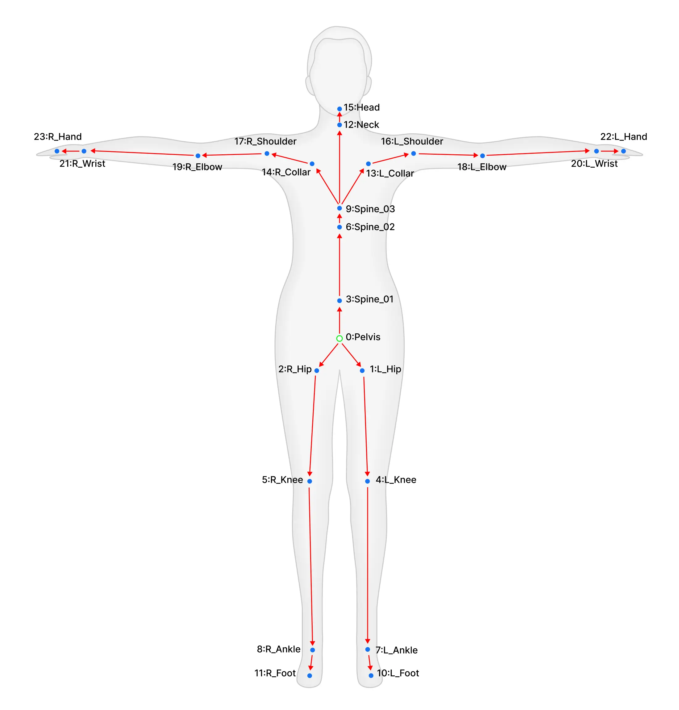
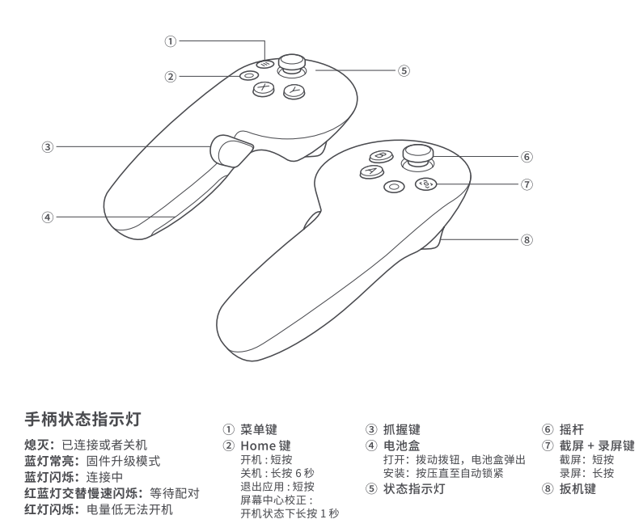

# Pico-Body-Tracking-Server


## Getting started

1. 运行服务器

先运行 roscore
```bash
roscore
```

再运行服务器
```bash
python3 body_tracking_server.py
```

2. 启动 PICO VR 中 **Pico-Body-Tracking-Demo** 项目

    2.1 按照指示校准传感器（如果校准完进入APP后没有任何UI反馈，请重新进入 **Pico-Body-Tracking-Demo** APP）

    2.2 进入 **Pico-Body-racking-Demo** APP 后，在左侧 UI 在线列表选择已上线的机器人服务器

    2.3 点击左侧 UI 中的 **连接** 按钮

    2.4 连接后，点击左侧 UI 中的 **开始遥操作** 按钮，此时 APP 会把 full-body-tracking-pose 发送到机器人服务器


3. 可视化

```bash
rviz
```

启动 `rviz` 后，更改 `Global Options` 中的 `Fixed Frame` 为 `world`，然后添加 `TF` 选项，就可以看到 full-body-tracking-pose **的实时可视化**

## full-body-tracking-pose 说明


人体参考图：




full-body-tracking-pose 的骨骼节点说明：
```python
body_tracker_role = [    
    "Pelvis",
    "LEFT_HIP",
    "RIGHT_HIP",
    "SPINE1",
    "LEFT_KNEE",
    "RIGHT_KNEE",
    "SPINE2",
    "LEFT_ANKLE",
    "RIGHT_ANKLE",
    "SPINE3",
    "LEFT_FOOT",
    "RIGHT_FOOT",
    "NECK",
    "LEFT_COLLAR",
    "RIGHT_COLLAR",
    "HEAD",
    "LEFT_SHOULDER",
    "RIGHT_SHOULDER",
    "LEFT_ELBOW",
    "RIGHT_ELBOW",
    "LEFT_WRIST",
    "RIGHT_WRIST",
    "LEFT_HAND",
    "RIGHT_HAND",
]
```

手柄参考图：

  

## 手柄操作说明

### 按键定义对照表

| 缩写 | 英文全称 | 中文名称 | 按键类型 |
|------|----------|----------|----------|
| LT   | Left Trigger | 左扳机 | 扳机键 |
| RT   | Right Trigger | 右扳机 | 扳机键 |
| LG   | Left Gripper | 左抓握键 | 按键 |
| RG   | Right Gripper | 右抓握键 | 按键 |
| X    | X Button | X按钮 | 功能键 |
| Y    | Y Button | Y按钮 | 功能键 |
| A    | A Button | A按钮 | 功能键 |
| B    | B Button | B按钮 | 功能键 |

### 模式切换功能
以下按键组合用于在不同的遥操模式之间切换：

| 按键组合 | 功能描述 | 操作说明 | 备注 |
|----------|----------|----------|------|
| **RT+X** | 全身遥操模式 | 按右扳机 + 点按X键 | 切换到全身遥操作模式 |
| **RT+B** | 上半身遥操模式 | 按右扳机 + 点按B键 | 切换到上半身遥操作模式 |
| **RT+A** | 下半身遥操模式 | 按右扳机 + 点按A键 | 切换到下半身遥操作模式 |
| **RT+Y** | 躯干模式切换 | 按右扳机 + 点按Y键 | 切换躯干控制模式 |

#### 遥操模式说明
- **WholeBody全身遥操模式**: 同时控制机器人的上半身和下半身动作
- **UpperBody上半身遥操模式**: 仅控制机器人的上半身动作，下半身保持稳定
- **LowerBody下半身遥操模式**: 仅控制机器人的下半身动作，上半身保持默认姿态
- **躯干模式**: 启用或禁用躯干控制功能， 仅在上半身遥操模式下有效，机器人会自动根据手末端的位置调整躯干高低, **控制躯干时无法使用左右摇杆控制行走+旋转**

### 模式一：基础控制模式

#### 摇杆控制

**注意：控制躯干时无法使用左右摇杆控制行走+旋转**

- **左摇杆**：前进后退 + 左右横移
  - 前后速度：-0.4 ~ 0.4 m/s
  - 横移速度：-0.2 ~ 0.2 m/s
- **右摇杆**：仅控制旋转
  - 旋转范围：-0.4 ~ 0.4 rad/s
  - 前后推动：无响应

#### 按键功能表

| 按键组合 | 功能描述 | 操作说明 | 备注 |
|----------|----------|----------|------|
| **LT+LG** | 解锁手臂规划 | 按住左扳机 +按住左抓握 | 可替换为 LT+RT |
| **RT+RG** | 锁定手臂规划 | 按右扳机 + 按住右抓握 | 可替换为 LG+RG |
| **LG/RG** | 末端抓握控制 | 单独按下对应抓握键 | 左/右手独立控制 |
| **B** | 开始踏步 | 单独按下B键 | 进入踏步模式 |
| **A** | 停止踏步/站立 | 单独按下A键 | 回到站立姿态 |
| **Y** | 抓握状态锁定 | 点按Y键切换 | 锁定/解锁抓握状态 |
| **X** | 录制控制 | 点按X键 | 开始/停止录制(此功能暂不支持) |
| **LT+A** | 末端力控制 | 按左扳机 + 点按A键 | 施加/释放末端力 |
| **LT+Y** | 手臂复位/外部控制模式 | 按左扳机 + 点按Y键 | 恢复到默认位置/手臂切换到外部控制模式 |
| **LT+X** | 开始/停止增量控制模式 | 按左扳机 + 点按X键 | 只有在界面上切换到增量控制模式时才生效 |
| **LT+RT+A_LONG** | 机器人解锁 | 按住左右上板机然后同时长按A键 | 解锁机器人控制 |


### 模式二：全身遥操作模式

#### 摇杆控制
- **左摇杆**：暂不响应（预留扩展）
- **右摇杆**：暂不响应（预留扩展）

#### 按键功能表

| 按键组合 | 功能描述 | 操作说明 | 备注 |
|----------|----------|----------|------|
| **LT+LG** | 开始全身规划 | 按左扳机 + 按左抓握 | 可替换为 LT+RT |
| **RT+RG** | 停止全身规划 | 按右扳机 + 按右抓握 | 可替换为 LG+RG |
| **LG/RG** | 末端抓握控制 | 单独按下对应抓握键 | 左/右手独立控制 |
| **LT+A** | 末端力控制 | 按左扳机 + 点按A键 | 施加/释放末端力 |
| **B** | 回归站立姿势 | 单独按下B键 | 会先踏步调整，然后回到OCS2站立姿态 |
| **Y** | 抓握状态锁定 | 点按Y键切换 | 锁定/解锁抓握状态 |
| **X** | 录制控制 | 点按X键 | 开始/停止录制(此功能暂不支持) |
| **LT+Y** | 手臂复位/外部控制模式 | 按左扳机 + 点按Y键 | 恢复到默认位置/手臂切换到外部控制模式 |
| **LT+X** | 开始/停止增量控制模式 | 按左扳机 + 点按X键 | 只有在界面上切换到增量控制模式时才生效 |
| **LT+RT+A_LONG** | 机器人解锁 | 按住左右上板机然后同时长按A键 | 解锁机器人控制 |

## 录制播放功能

### 录制功能
使用 `robot_pico_recorder.py` 脚本可以录制机器人控制数据，支持录制以下话题：
- `/ik/two_arm_hand_pose_cmd` - 双臂手部位姿命令
- `/mm/two_arm_hand_pose_cmd` - 移动操作手部位姿命令  
- `/humanoid_mpc_foot_pose_target_trajectories` - 人形机器人足部轨迹

#### 录制命令
```bash
# 录制控制数据到指定bag文件
python3 robot_pico_recorder.py record <bag文件名>

# 示例：录制到 my_control_session.bag
python3 robot_pico_recorder.py record my_control_session.bag
```

### 播放功能
播放录制的控制数据，自动调用必要的控制服务：
- `/change_arm_ctrl_mode` - 切换手臂控制模式
- `/mobile_manipulator_mpc_control` - 启用移动操作MPC控制
- `/enable_mm_wbc_arm_trajectory_control` - 启用手臂轨迹控制

#### 播放命令
```bash
# 播放录制的bag文件
python3 robot_pico_recorder.py play <bag文件名>

# 示例：播放 my_control_session.bag
python3 robot_pico_recorder.py play my_control_session.bag
```

### 使用场景
- **动作录制**: 录制复杂的机器人操作序列
- **动作回放**: 重复执行录制的操作
- **教学演示**: 录制标准操作流程用于教学
- **调试分析**: 录制问题场景用于后续分析

### 注意事项
- 录制时确保网络连接稳定
- 播放前检查机器人状态和安全
- 录制的bag文件包含时间戳信息
- Ctrl+C中断录制/播放


## 接口文档

详情见 docs/api_docs.md, [文档链接](./docs/api_docs.md)

