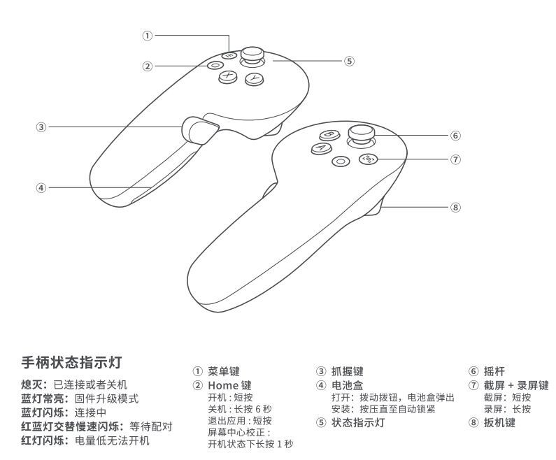

# 数据格式约定文档

## PICO VR 下发的数据格式

PICO VR 中的应用会下发如下几种消息，解析时需要根据消息中的`dataType`字段的值进行解析:
- `bodyTracking`: 全身骨骼数据，详情参考[bodyTracking.json](../assets/data/bodyTracking.json)
- `upperBody`:  仅包含上半身骨骼数据,详情参考[upperBody.json](../assets/data/upperBody.json) 
- `controller`: 手柄数据, 详情参考[controller.json](../assets/data/controller.json)
- `vrCommand`: VR 命令, 详情参考[vrCommand.json](../assets/data/vrCommand.json)

## 机器人端上传 PICO VR 数据格式
- 上传机器人信息数据，包含手臂，手指扭矩等数据，详情参考[uploadrobotData.json](../assets/data/uploadRobotData.json)

## ROS 数据格式

### topics

#### PICO 手柄数据

话题名称: `/pico/joy`

话题描述: 发布 PICO 左右手柄数据

数据类型: `kuavo_msgs/JoySticks`

| 字段 | 类型 | 描述 |
|------|------|------|
| left_x | float32 | 左手柄摇杆X轴位置 |
| left_y | float32 | 左手柄摇杆Y轴位置 |
| left_trigger | float32 | 左手柄扳机值 (0.0 到 1.0) |
| left_grip | float32 | 左手柄握把值 (0.0 到 1.0) |
| left_first_button_pressed | bool | 左手柄主按钮按下状态 (X按键) |
| left_second_button_pressed | bool | 左手柄副按钮按下状态 (Y按键) |
| left_first_button_touched | bool | pico不支持这个参数 |
| left_second_button_touched | bool | pico不支持这个参数 |
| right_x | float32 | 右手柄摇杆X轴位置 |
| right_y | float32 | 右手柄摇杆Y轴位置 |
| right_trigger | float32 | 右手柄扳机值 (0.0 到 1.0) |
| right_grip | float32 | 右手柄握把值 (0.0 到 1.0) |
| right_first_button_pressed | bool | 右手柄主按钮按下状态 (A按键) |
| right_second_button_pressed | bool | 右手柄副按钮按下状态 (B按键) |
| right_first_button_touched | bool | pico不支持这个参数 |
| right_second_button_touched | bool | pico不支持这个参数 |

  