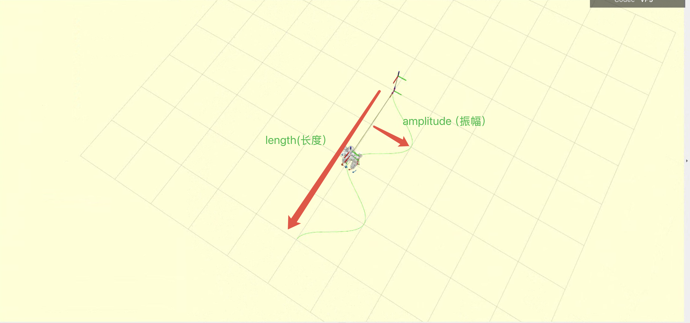
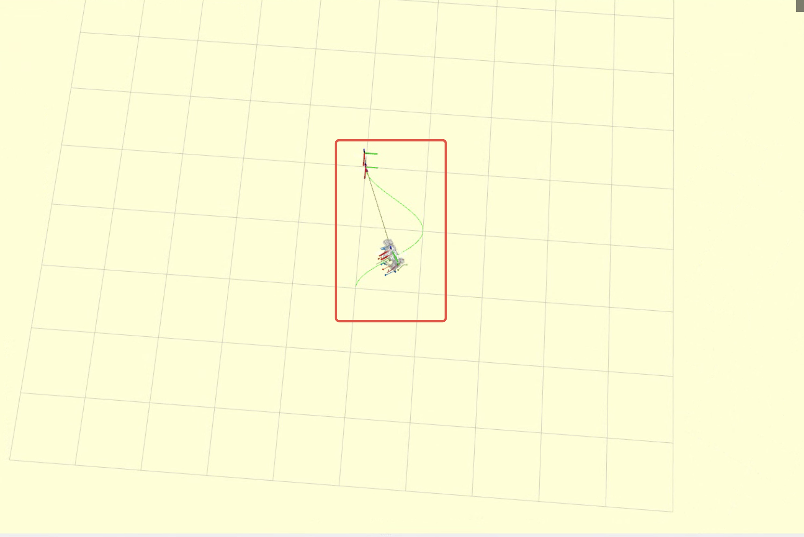
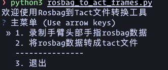
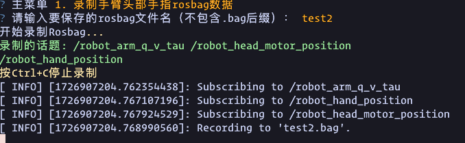
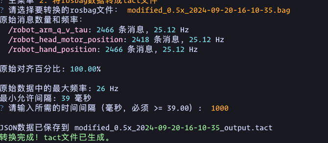

# ARM ACTION SERVER

## 安装

1. 克隆仓库
   
   ```shell
   # 此仓库需要依赖 ocs2_msgs 和 kuavo_ros_interfaces, 请此仓库克隆到在 kuavo-ros-control 或者 kuavo_ros1_workspace 工作空间中
   git clone https://www.lejuhub.com/highlydynamic/planarmwebsocketservice.git
   ```

2. 编译功能包
   
   ```shell
   catkin build humanoid_controllers humanoid_plan_arm_trajectory planarmwebsocketservice
   ```

3. 安装依赖
   
   ```shell
   cd planarmwebsocketservice
   pip install -r requirements.txt
   ```

4. 运行
   
   ```shell
   cd <catkin_workspace>
   source devel/setup.bash
   # kuavo 仿真
   roslaunch humanoid_controllers load_kuavo_mujoco_sim.launch
   # bezier 曲线
   roslaunch humanoid_plan_arm_trajectory humanoid_plan_arm_trajectory.launch
   # server 如果是ocs2，请使用参数 robot_type:=ocs2
   roslaunch planarmwebsocketservice plan_arm_action_websocket_server.launch robot_type:=kuavo
   # client 成功后可以在 RViz 和 Gazebo 中看到动作
   python3 ./src/manipulation_nodes/planarmwebsocketservice/scripts/websocket_client_demo.py --action_file_path src/manipulation_nodes/planarmwebsocketservice/action_files/wave_hand.tact
   ```

   action_file_path为保存动作的tact文件名，该文件需要事先保存在manipulation_nodes/planarmwebsocketservice/action_files文件夹中

## 注意事项

1. 运行之前要确认当前功能包有 `action_files`, 且包含需要的 `.tact` 文件。

2. 如果在实机运行，确保 kuavo 程序以 ros 节点运行，并且机器人已经在站立状态。

3. 检查参数设置是否指向同一个位置，确保通信中 MD5 校验通过，如：
   
   - `handler.py` 中的 `ACTION_FILE_FOLDER`
   
   - `plan_arm_action_websocket_server.py` 中的 `ROBOT_ACTION_FILE_FOLDER`
   
   - `websocket_client_demo.py` 中的 `message`

## 手臂动作服务器

这是一个 websocket 服务器在启动后会在所属网络中广播 `robot_info` 话题，内容如下：

```json
{
    "data": {
        "robot_name": ROBOT_NAME,
        "robot_ip": ROBOT_IP,
        "robot_connect_wifi": ROBOT_CONNECT_WIFI,
        "robot_ws_address": ROBOT_WS_ADDRESS,
        "robot_ws_logger_address": ROBOT_WS_LOGGER_ADDRESS,
        "robot_upload_folder": ROBOT_UPLOAD_FOLDER,
        "robot_action_file_folder": ROBOT_ACTION_FILE_FOLDER,
        "robot_username": ROBOT_USERNAME,
        "robot_mac_address": ROBOT_MAC_ADDRESS,
    }
}
```
robot_info 字段说明如下：

| 字段名                    | 类型   | 说明                                   |
|-------------------------|------|--------------------------------------|
| robot_name              | str  | 机器人名称                              |
| robot_ip                | str  | 机器人当前IP地址                         |
| robot_connect_wifi      | str  | 机器人当前连接的WiFi名称                  |
| robot_ws_address        | str  | 机器人WebSocket服务地址                   |
| robot_ws_logger_address | str  | 机器人WebSocket日志服务地址                |
| robot_upload_folder     | str  | 机器人执行文件上传目录（同目录下的upload_files文件夹）   |
| robot_username          | str  | 机器人系统用户名                          |
| robot_mac_address       | str  | 机器人MAC地址                             |
| robot_action_file_folder| str  | 机器人动作文件存储目录（通常为~/.config/lejuconfig/action_files） |

这些字段用于客户端自动发现机器人、获取机器人网络与动作文件相关信息，便于后续动作文件的上传、执行与管理。


### 获取机器人信息

request:

```json
{
    "cmd": "get_robot_info"
}
```

response:

```json
{
    "cmd": "get_robot_info",
    "data": {
        "code": 0,
        "robot_type": "40"
    }
}
```

| 名称            | 类型     | 描述             |
| ------------- | ------ | -------------- |
| code          | int    | 错误码 0: 成功      |
| robot_type | string | 机器人的类型         |

### 获取机器人状态

request:

```json
{
    "cmd": "get_robot_status"
}
```

response:

```json
{
    "cmd": "get_robot_status",
    "data": {
        "code": 0,
        "is_run": True
    }
}
```

| 名称     | 类型   | 描述        |
| ------ | ---- | --------- |
| code   | int  | 错误码 0: 成功 |
| is_run | bool | 机器人当前运行状态 |

### 执行脚本命令

request:

```json
{
    "cmd": "run_node",
    "data": {
        "path": "**/main.py"
    }
}
```

| 名称   | 类型     | 描述                      |
| ---- | ------ | ----------------------- |
| path | string | 脚本路径 |

response:

```json
{
    "cmd": "run_node",
    "data": {
        "code": 0,
        "msg": "msg"
    }
}
```

| 名称   | 类型     | 描述                 |
| ---- | ------ | ------------------ |
| code | int    | 错误码 0: 成功 1: 文件不存在 |
| msg  | string | 信息                 |

### 关闭脚本执行

request:

```json
{
    "cmd": "stop_run_node"
}
```

response:

```json
{
    "cmd": "stop_run_node",
    "data": {
        "code": 0
    }
}
```

| 名称   | 类型  | 描述                   |
| ---- | --- | -------------------- |
| code | int | 错误码 0: 成功 1: 超过5s未关闭 |

### 预览动作

request:

```json
{
    "cmd": "preview_action",
    "data": {
        "action_filename": "action_name",
        "action_file_MD5": "action_file_MD5",
    }
}
```

| 名称              | 类型     | 描述      |
| --------------- | ------ | ------- |
| action_filename | string | 动作文件名   |
| action_file_MD5 | string | 动作文件MD5 |

response:

```json
{
    "cmd": "preview_action",
    "data": {
        "code": 0,
        "status": 0,
        "progress": 0
    }
}
```

| 名称       | 类型  | 描述                                                  |
| -------- | --- | --------------------------------------------------- |
| code     | int | 错误码，0: 成功 1: 动作文件不存在 2: 请求动作文件 MD5 与本地动作文件的 MD5 不一致 |
| status   | int | 状态，0: 完成 1: 执行中                                     |
| progress | int | 动作执行进度， 单位为毫秒                                       |

#### 停止预览

request:

```json
{
    "cmd": "stop_preview_action",
}
```

response:

```json
{
    "cmd": "stop_preview_action",
    "data": {
        "code": 0,
    }
}
```

| 名称   | 类型  | 描述        |
| ---- | --- | --------- |
| code | int | 错误码 0: 成功 |

### 下载音频文件后确认由上位机还是下位机来执行

request:

```json
{
    "cmd": "check_music_path",
    "data": {
        "is_reset_cmd": True,
        "music_filename": "music_filename",
    }
}
```

| 名称       | 类型  | 描述                                                  |
| -------- | --- | --------------------------------------------------- |
| is_reset_cmd     | boolean | 是否是重置遥控器配置指令，重置则该值为 True，单独下载音频该值为 False |
| music_filename   | string |   下载音乐文件的名字，单独下载音频的时候传入完整带后缀的文件名，如果改次是重置配置则传入空值  |

response:

```json
{
    "cmd": "check_music_path",
    "data": {
        "code": 0,
        "msg": "Body NUC"
    }
}
```

| 名称       | 类型  | 描述                                                  |
| -------- | --- | --------------------------------------------------- |
| code     | int | 执行结果码，0: 成功，1：失败 |
| msg   | string |   执行结果信息，如果 code 为 0，则返回 Body NUC/Head NUC，表示路径；如果 code 为 1 返回错误信息 |

### 更新 h12 遥控器配置文件

request:

```json
{
    "cmd": "update_h12_config"
}
```

response:

```json
{
    "cmd": "update_h12_config",
    "data": {
        "code": 0,
        "msg": "Body NUC"
    }
}
```

| 名称       | 类型  | 描述                                                  |
| -------- | --- | --------------------------------------------------- |
| code     | int | 执行结果码，0: 成功，1：失败 |
| msg   | string |   执行结果信息，如果 code 为 0，则返回 Body NUC/Head NUC，表示音乐存放路径；如果 code 为 1 返回错误信息 |

### 更新数据采集程序

request:

```json
{
    "cmd": "update_data_pilot"
}
```

response:

```json
{
    "cmd": "update_data_pilot",
    "data": {
        "code": 0,
        "msg": "Success"
    }
}
```

| 名称       | 类型     | 描述                                                  |
| -------- | ------ | --------------------------------------------------- |
| code     | int | 执行结果码，0: 成功，1：失败 |
| msg   | string |   执行结果信息，如果 code 为 0，则返回 "Success"；如果 code 为 1 返回具体错误信息 |

**功能说明：**

该接口用于更新训练场上位机的数据采集程序。系统会：

1. 远程登录到上位机（后面通过 DHCP 配置获取 IP 地址）
2. 在上位机指定目录创建必要的文件夹
3. 下载最新的数据采集程序文件
4. 返回执行结果

**注意事项：**

- 需要确保环境变量 `KUAVO_REMOTE_PASSWORD` 已正确设置（base64 编码的远程登录密码）
- 需要确保网络连接正常，能够访问下载地址
- 上位机需要有足够的磁盘空间存储下载的文件
#### 获取零点

从文件中获取所有电机的零点值

request:

```json
{
    "cmd": "get_zero_point"
}
```

response:

```json
{
    "cmd": "get_zero_point",
    "data": {
        "code": 0,
        "zero_pos": list,
        "message": "Zero point retrieved successfully"
    }
}
```

| 名称        | 类型     | 描述        |
| --------- | ------ | --------- |
| code      | int    | 错误码 0: 成功 |
| zero_pos | list   | 零点位置列表单位degree|
| message   | string | 结果描述      |

zero_pos列表关节顺序和sensors_data_raw话题一致：

对于ROBOT_VERSION >= 40

- 其中关节数据的数组长度为28, 对应的数据顺序为:
  - 前 12 个数据为下肢电机数据, 
    - 0~5 为左下肢数据, 从髋部到脚踝,
    - 6 ~ 11 为右边下肢数据, 从髋部到脚踝,
  - 接着 14 个数据为手臂电机数据, 
    - 12 ~ 18 左臂电机数据, 从肩部到手腕,
    - 19 ~ 25 为右臂电机数据, 从肩部到手腕
  - 最后 2 个为头部电机数据, 分别为 head_yaw 和 head_pitch

对于roban ROBOT_VERSION >= 11 ROBOT_VERSION < 20

- 其中关节数据的数组长度为 21, 对应的数据顺序为:
  - 第 0 个数据为腰部电机数据
  - 1 ~ 12 个数据为下肢电机数据, 
    - 1 ~ 6 为左下肢数据, 从髋部到脚踝,
    - 7 ~ 12 为右边下肢数据, 从髋部到脚踝,
  - 接着 8 个数据为手臂电机数据, 
    - 13 ~ 16 左臂电机数据, 从肩部到手腕,
    - 17 ~ 20 为右臂电机数据, 从肩部到手腕


#### 调整零点

设置调整单个电机零点值

request:

```json
{
    "cmd": "adjust_zero_point",
    "data": {
        "motor_index": int,
        "adjust_pos": float
    }
}
```

| 名称         | 类型   | 描述        |
| ---------- | ---- | --------- |
| motor_index | int  | 电机索引，顺序和 get_zero_point 中的zero_pos一致     |
| adjust_pos  | float | 零点调整值（degree） |

response:

```json
{
    "cmd": "adjust_zero_point",
    "data": {
        "code": int,
        "message": str
    }
}
```

| 名称   | 类型  | 描述        |
| ---- | --- | --------- |
| code | int | 错误码 0: 成功 |

#### 设置零点

将接收的零点值写入零点文件

request:

```json
{
    "cmd": "set_zero_point",
    "data": {
        "zero_pos": list
    }
}
```

| 名称      | 类型   | 描述        |
| ------- | ---- | --------- |
| zero_pos | list | 零点值（degree），顺序和 get_zero_point 中的zero_pos一致 |

response:

```json
{
    "cmd": "set_zero_point",
    "data": {
        "code": 0,
        "message": "Zero point set successfully"
    }
}
```

| 名称   | 类型  | 描述        |
| ---- | --- | --------- |
| code | int | 错误码 0: 成功 |


### 执行或停止指定上传的脚本
该接口用于通过 websocket 启动或停止指定上传的 Python 脚本。  
- 当 `action_data` 为 `"start_action"` 时，服务器会在后台启动 `scripts_name` 指定的脚本文件，并返回执行结果。  
- 当 `action_data` 为 `"stop_action"` 时，服务器会查找并终止与 `scripts_name` 匹配的脚本进程，并返回操作结果。  
- `scripts_name` 可以带绝对路径，也可以单纯为文件名；如果仅包含文件名，则会默认脚本文件位于上传目录（**"ROBOT_UPLOAD_FOLDER"**）的路径，需确保文件存在且有执行权限。  
- 返回的 `code` 字段表示操作结果，`message` 字段为详细信息。  

request:

```json
{
    "cmd": "execute_python_script",
    "data": {
        "action_data": "start/stop_action",
        "scripts_name":"**/test.py"
    }
}
```

| 名称   | 类型     | 描述                      |
| ---- | ------ | ----------------------- |
| action_data | string | 启动或停止脚本 |
| scripts_name | string | 脚本名字或路径 |
response:

```json
{
    "cmd": "execute_python_script",
    "data": {
        "code": 0,
        "message": "message"
    }
}
```
| 名称   | 类型     | 描述                 |
| ---- | ------ | ------------------ |
| code | int    | 错误码 0: 成功 1:参数错误  2：文件不存在 3：脚本执行失败 4：接口内部异常|
| message  | string | 信息                 |

### 执行预置演示程序

request:

```json
{
    "cmd": "execute_demo",
    "data": {
        "demo_name": "demo_name",
        "parameters": {}
    }
}
```

| 名称   | 类型     | 描述                      |
| ---- | ------ | ----------------------- |
| demo_name | string | 演示程序名称，人脸追踪：face_track, S 型曲线行走：trace_path |
| parameters | map | 演示程序参数（可选），参数名和参数值的映射 |


response:

```json
{
    "cmd": "execute_demo",
    "data": {
        "code": 0,
        "msg": "Demo execution started"
    }
}
```

| 名称   | 类型     | 描述                 |
| ---- | ------ | ------------------ |
| code | int    | 错误码 0: 成功 1: 演示程序不存在 |
| msg  | string | 执行状态信息             |


#### S 型曲线行走


S 型曲线行走



弧形曲线行走




可配置参数：

| 名称   | 类型     | 描述                 |
| ---- | ------ | ------------------ |
| --length | float | 曲线长度(可选),  默认值为 4.0 m |
| --amplitude | float | 曲线幅度(可选), 默认值为 2.0 m |
| --half_scurve | bool | 是否为弧形曲线(可选), 默认值为 false |

例如：

```json
{
    "cmd": "execute_demo",
    "data": {
        "demo_name": "trace_path",
        "parameters": {
            "--length": 4.0,
            "--amplitude": 2.0,
            "--half_scurve": true
        }
    }
}

```

**注意：**

- 弧形曲线是半个 S 型曲线的意思
- length 参数表示 S 型曲线的长度
- 如果类型为弧形曲线, 则实际的曲线 length 为 length / 2


### 停止演示程序

request:

```json
{
    "cmd": "stop_execute_demo"
}
```

response:

```json
{
    "cmd": "stop_execute_demo",
    "data": {
        "code": 0,
        "msg": "Demo execution stopped"
    }
}
```

| 名称   | 类型     | 描述                 |
| ---- | ------ | ------------------ |
| code | int    | 错误码 0: 成功 1: 停止失败 |
| msg  | string | 停止状态信息             |

### logger 日志 websocket

这是一个用于实时获取机器人日志的 websocket 服务。服务器会在启动时广播 `robot_ws_logger_address` 地址，客户端可以通过该地址连接获取实时日志。

#### 连接日志服务

客户端可以通过以下地址连接日志服务：

```
ws://{robot_ws_logger_address}
```

#### 日志消息格式

日志消息格式如下：

```json
{
    "level": "LEVEL",
    "timestamp": "TIMESTAMP",
    "message": "MESSAGE",
    "module": "MODULE",
    "function": "FUNCTION"
}
```

| 名称        | 类型     | 描述                                       |
| --------- | ------ | ---------------------------------------- |
| level     | string | 日志级别 (DEBUG/INFO/WARNING/ERROR/CRITICAL) |
| timestamp | string | 时间戳，格式：YYYY-MM-DD HH:MM:SS.mmm           |
| message   | string | 日志消息内容                                   |
| module    | string | 产生日志的模块名                                 |
| function  | string | 产生日志的函数名                                 |

#### 日志级别说明

| 级别       | 描述              |
| -------- | --------------- |
| DEBUG    | 调试信息，用于开发调试     |
| INFO     | 一般信息，用于记录程序运行状态 |
| WARNING  | 警告信息，表示可能的问题    |
| ERROR    | 错误信息，表示程序错误     |
| CRITICAL | 严重错误，表示程序无法继续运行 |

#### 示例

```json
{
    "level": "INFO",
    "timestamp": "2024-03-21 14:30:45.123",
    "message": "running finish",
    "module": "robot_control",
    "function": "start_robot"
}
```

### 11. 获取音乐列表 (get_music_list)

**描述**: 获取可用的音乐文件列表。判断音频设备是否下位机，如果在下位机本地音乐文件列表，否则获取上位机的音乐文件列表

**请求**:
```json
{
  "cmd": "get_music_list",
  "data": {}
}
```

**响应**:
```json
{
  "cmd": "get_music_list",
  "data": {
    "code": 0,
    "music_list": [
      "/home/robot/.config/lejuconfig/music/music.mp3",
      "/home/robot/.config/lejuconfig/music/music.wav"
    ]
  }
}

```

## 导航功能

### 加载地图
request:

```json
{
    "cmd": "load_map",
    "data":{
        "map_name":"target_map_name"
    }
}
```

response:

```json
{
    "cmd": "load_map",
    "data": {
        "code": 0,
        "map_path":"/home/lab/.config/lejuconfig/maps/target_map_name.pgm",
        "msg": "Map loaded successfully"
    }
}
```

| 名称            | 类型     | 描述             |
| ------------- | ------ | -------------- |
| code          | int    | 错误码 0: 成功,1:地图加载成功,但地图下载失败, 2:地图加载失败,且地图下载也失败      |
| map_path | string | 目标地图的图片路径         |
| msg | string | 接口结果的描述         |


### 获取所有的地图
request:

```json
{
    "cmd": "get_all_maps"
}
```

response:

```json
{
    "cmd": "get_all_maps",
    "data": {
        "code": 0,
        "maps":["map1_name","map2_name"],
        "msg": "Init successfully"
    }
}
```

| 名称            | 类型     | 描述             |
| ------------- | ------ | -------------- |
| code          | int    | 错误码 0: 获取成功,1:获取失败      |
| maps           | list | 地图名字列表        |
| msg           | string | 接口结果的描述         |


### 通过目标位姿进行初始化
request:

```json
{
    "cmd": "init_localization_by_pose",
    "data":{
        "x":0.0,
        "y":0.0,
        "z":0.0,
        "roll":0.0,
        "pitch":0.0,
        "yaw":0.0
    }
}
```

response:

```json
{
    "cmd": "init_localization_by_pose",
    "data": {
        "code": 0,
        "msg": "Init successfully"
    }
}
```

| 名称            | 类型     | 描述             |
| ------------- | ------ | -------------- |
| code          | int    | 错误码 0: 初始化成功,1:初始化失败      |
| msg           | string | 接口结果的描述         |


### 获取当前机器人的位置
request:

```json
{
    "cmd": "get_robot_position"
}
```

response:

```json
{
    "cmd": "get_robot_position",
    "data": {
        "code": 0,
        "position":{"png_x":249,
        "png_y":476,
        "origin_grid_x":249,
        "origin_grid_y":202},
        "msg": "Get robot position successfully"
    }
}
```

| 名称            | 类型     | 描述             |
| ------------- | ------ | -------------- |
| code          | int    | 错误码 0: 获取成功,1:获取失败      |
| position           | list | 点位列表，包含当前机器人位置(png_x,png_y),和地图原点位置(origin_grid_x,origin_grid_y)        |
| msg           | string | 接口结果的描述         |


## YOLO目标检测

`model_utils.py` 中 `YOLO_detection` 为 YOLO目标检测类，用于处理图像检测和结果发布。

### load_model(model_path)

加载YOLO模型。

**参数:**

- `model_path` (str): YOLO模型文件的路径

**返回:**

- model: 加载成功的YOLO模型对象
- None: 加载失败时返回

### get_detections(camera, model)

获取当前图像的目标检测结果。

**参数:**

- `camera` (str): 相机名称
- `model`: YOLO模型对象

**返回:**

- results: 检测结果列表
- None: 无图像数据时返回

### get_max_area_object(results)

从检测结果中返回最大面积的目标。

**参数:**

- `results`: YOLO检测结果

**返回:**

```python
{
    'x': float,      # x坐标
    'y': float,      # y坐标
    'w': float,      # 宽度
    'h': float,      # 高度
    'area': float,   # 面积
    'class_name': str  # 目标名称
}
```

### get_min_area_object(results)

从检测结果中返回最小面积的目标。

**参数:**

- `results`: YOLO检测结果

**返回:**

```python
{
    'x': float,      # x坐标
    'y': float,      # y坐标
    'w': float,      # 宽度
    'h': float,      # 高度
    'area': float,   # 面积
    'class_name': str  # 目标名称
}
```

## Rosbag 到 Tact 文件转换工具

这是一个用于将 ROS bag 文件转换为 Tact 文件格式的工具。它主要用于处理机器人手臂、头部和手指的运动数据，并生成可用于动画或其他目的的 Tact 文件。

## 功能

- 录制手臂、头部和手指的 rosbag 数据
- 将 rosbag 数据转换为 tact 文件
- 数据平滑处理和控制点生成

## 使用方法

1. 运行主程序：
   
   ```
   cd <catkin_workspace>
   source devel/setup.bash
   cd planarmwebsocketservice
   python3 rosbag_to_act_frames.py
   ```

2. 在主菜单中选择所需的操作：
   
   - 录制手臂头部手指 rosbag 数据
   - 将 rosbag 数据转成 tact 文件

3. 按照屏幕上的提示进行操作。

main menu:



record arm, head and hand rosbag:



rosbag to tact:



## 注意事项

- 确保您有足够的磁盘空间来存储生成的 tact 文件。
- 处理大型 rosbag 文件可能需要较长时间，请耐心等待。

## 故障排除

如果遇到问题，请检查以下几点：

- 确保所有依赖都已正确安装
- 检查 rosbag 文件是否完整且未损坏

## 贡献

欢迎提交 issues 和 pull requests 来帮助改进这个工具。
