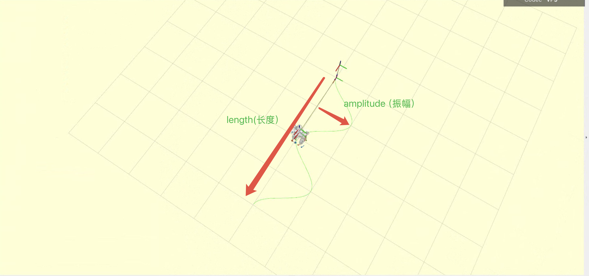
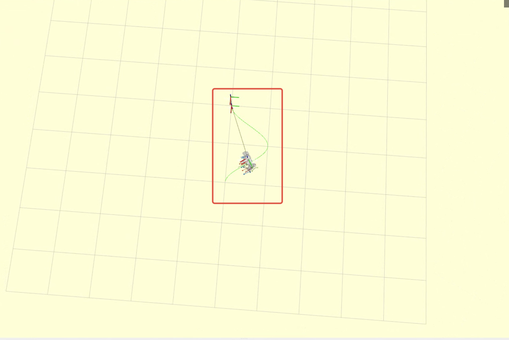
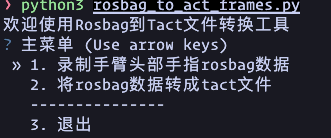
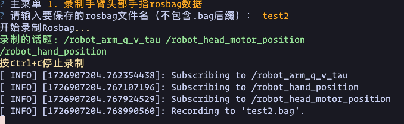
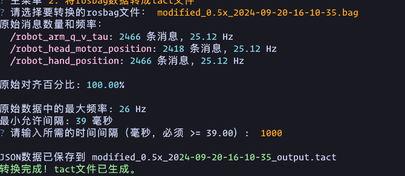

# ARM ACTION SERVER

## 安装

1. 编译功能包

   ```shell
   catkin build humanoid_controllers humanoid_plan_arm_trajectory 
   catkin build planarmwebsocketservice
   ```
2. 安装依赖

   ```shell
   cd src/manipulation_nodes/planarmwebsocketservice
   pip install -r requirements.txt
   ```
3. 运行

   ```shell
   cd <catkin_workspace>
   source devel/setup.bash
   # kuavo 仿真
   roslaunch humanoid_controllers load_kuavo_mujoco_sim.launch
   # bezier 曲线
   roslaunch humanoid_plan_arm_trajectory humanoid_plan_arm_trajectory.launch
   # server 如果是ocs2，请使用参数 robot_type:=ocs2
   roslaunch planarmwebsocketservice plan_arm_action_websocket_server.launch robot_type:=kuavo
   # client 成功后可以在 RViz 和 Gazebo 中看到动作
   python3 ./src/manipulation_nodes/planarmwebsocketservice/scripts/websocket_client_demo.py --action_file_path src/manipulation_nodes/planarmwebsocketservice/action_files/wave_hand.tact
   ```

   action_file_path为保存动作的tact文件名，该文件需要事先保存在manipulation_nodes/planarmwebsocketservice/action_files文件夹中

## 注意事项

1. 运行之前要确认当前功能包有 `action_files`, 且包含需要的 `.tact` 文件。
2. 如果在实机运行，确保 kuavo 程序以 ros 节点运行，并且机器人已经在站立状态。
3. 检查参数设置是否指向同一个位置，确保通信中 MD5 校验通过，如：
   - `handler.py` 中的 `ACTION_FILE_FOLDER`
   - `plan_arm_action_websocket_server.py` 中的 `ROBOT_ACTION_FILE_FOLDER`
   - `websocket_client_demo.py` 中的 `message`

## 部署开机自启动

### websocket_deploy_script.sh

**主要功能：**
- 停止并禁用现有的websocket_start服务
- 更新服务配置文件中的机器人名称和版本
- 设置配置文件权限
- 安装Python依赖和SDK环境
- 重新编译相关ROS包
- 安装sshpass工具
- 启动并启用websocket_start服务

**使用方法：**

1. 运行部署脚本：添加 websocket_start.service 开机自启动系统服务

    ```shell
    cd <catkin_workspace>
    bash ./src/manipulation_nodes/planarmwebsocketservice/service/websocket_deploy_script.sh
    ```

2. 查看日志：websocket 连接和接口调用情况

    ```shell
    journalctl -u websocket_start.service -f
    ```

3. 服务使用

    ```shell
    # 服务为开启状态时修改代码，需要重启服务
    systemctl restart websocket_start.service

    # 手动开启，需要关闭服务以防冲突
    systemctl stop websocket_start.service
    ```


## 机器人状态

### 启动机器人（缩腿）

request:

```json
{
    "cmd": "start_robot"
}
```

response:

```json
{
    "cmd": "start_robot",
    "data": {
        "code": 0,
        "message": "Robot started successfully"
    }
}
```

|  名称  |  类型  | 描述                          |
| :-----: | :----: | ----------------------------- |
|  code  |  int  | 错误码 0: 获取成功,1:获取失败 |
| message | string | 启动结果描述                  |

### 站立机器人（伸直腿）

request:

```json
{
    "cmd": "stand_robot"
}
```

response:

```json
{
    "cmd": "stand_robot",
    "data": {
        "code": 0,
        "message": "Robot stand command sent successfully"
    }
}
```

|  名称  |  类型  | 描述                          |
| :-----: | :----: | ----------------------------- |
|  code  |  int  | 错误码 0: 获取成功,1:获取失败 |
| message | string | 站立结果描述                  |

### 停止机器人

request:

```json
{
    "cmd": "stop_robot"
}
```

response:

```json
{
    "cmd": "stop_robot",
    "data": {
        "code": 0,
        "message": "Robot stopped successfully"
    }
}
```

|  名称  |  类型  | 描述                          |
| :-----: | :----: | ----------------------------- |
|  code  |  int  | 错误码 0: 获取成功,1:获取失败 |
| message | string | 停止结果描述                  |

### 获取机器人当前状态

request:

```json
{
    "cmd": "get_robot_launch_status"
}
```

response:

```json
，{
    "cmd": "get_robot_launch_status",
    "data": {
        "code": 0,
        "message": "launched"
    }
}


{
    "cmd": "get_robot_launch_status",
    "data": {
        "code": 0,
        "status": "launched",
	"message": "Get robot status successfully"
    }
}

```

|  名称  |  类型  |             描述             |
| :-----: | :----: | :---------------------------: |
|  code  |  int  | 错误码 0: 获取成功,1:获取失败 |
| status | string |        机器人当前状态        |
| message | string |      获取机器人状态描述      |

机器人状态说明：

- "unlaunch": 未启动
- "crouching": 屈腿中
- "standing": 站立中

## 手臂动作服务器

这是一个 websocket 服务器在启动后会在所属网络中广播 `robot_info` 话题，内容如下：

```json
{
    "data": {
        "robot_name": ROBOT_NAME,
        "robot_ip": ROBOT_IP,
        "robot_connect_wifi": ROBOT_CONNECT_WIFI,
        "robot_ws_address": ROBOT_WS_ADDRESS,
        "robot_ws_logger_address": ROBOT_WS_LOGGER_ADDRESS,
        "robot_upload_folder": ROBOT_UPLOAD_FOLDER,
        "robot_action_file_folder": ROBOT_ACTION_FILE_FOLDER,
        "robot_username": ROBOT_USERNAME,
        "robot_mac_address": ROBOT_MAC_ADDRESS,
    }
}
```

robot_info 字段说明如下：

| 字段名                   | 类型 | 说明                                                              |
| ------------------------ | ---- | ----------------------------------------------------------------- |
| robot_name               | str  | 机器人名称                                                        |
| robot_ip                 | str  | 机器人当前IP地址                                                  |
| robot_connect_wifi       | str  | 机器人当前连接的WiFi名称                                          |
| robot_ws_address         | str  | 机器人WebSocket服务地址                                           |
| robot_ws_logger_address  | str  | 机器人WebSocket日志服务地址                                       |
| robot_upload_folder      | str  | 机器人执行文件上传目录（同目录下的upload_files文件夹）            |
| robot_username           | str  | 机器人系统用户名                                                  |
| robot_mac_address        | str  | 机器人MAC地址                                                     |
| robot_action_file_folder | str  | 机器人动作文件存储目录（通常为~/.config/lejuconfig/action_files） |

这些字段用于客户端自动发现机器人、获取机器人网络与动作文件相关信息，便于后续动作文件的上传、执行与管理。

### 获取机器人信息

request:

```json
{
    "cmd": "get_robot_info"
}
```

response:

```json
{
    "cmd": "get_robot_info",
    "data": {
        "code": 0,
        "robot_type": "40",
        "music_folder_path": "/home/lab/.config/lejuconfig/music",
        "maps_folder_path": "/home/lab/.config/lejuconfig/maps",
        "h12_config_path": "/home/lab/kuavo-ros-control/src/.../config/customize_config.json",
        "repo_path": "/home/lab/kuavo-ros-control",
        "vr_recording_path": "/home/lab/.config/lejuconfig/vr_recording",
        "creator_dance_upload_path": "/home/lab/.config/lejuconfig/creator_dance_upload",
        "workspace_setup_path": "/home/lab/kuavo-ros-control/devel/setup.bash"
    }
}
```

| 名称                       | 类型   | 描述                                                            |
| -------------------------- | ------ | --------------------------------------------------------------- |
| code                       | int    | 错误码 0: 成功                                                  |
| robot_type                 | string | 机器人的类型                                                    |
| music_folder_path          | string | 音乐文件存放目录(桌面端 scp wav 的目标)                       |
| maps_folder_path           | string | 地图文件目录                                                    |
| h12_config_path            | string | H12 遥控器 / joy 按键自定义配置 `customize_config.json` 的绝对路径 |
| repo_path                  | string | 仓库根目录                                                      |
| vr_recording_path          | string | VR 录制文件保存目录                                             |
| creator_dance_upload_path  | string | Creator 舞蹈 zip 暂存目录,见下"Creator 舞蹈 zip 导入"          |
| workspace_setup_path       | string | catkin 工作区 `setup.bash` 绝对路径                             |

### 获取机器人状态

request:

```json
{
    "cmd": "get_robot_status"
}
```

response:

```json
{
    "cmd": "get_robot_status",
    "data": {
        "code": 0,
        "is_run": True
    }
}
```

| 名称   | 类型 | 描述               |
| ------ | ---- | ------------------ |
| code   | int  | 错误码 0: 成功     |
| is_run | bool | 机器人当前运行状态 |

### 执行脚本命令

request:

```json
{
    "cmd": "run_node",
    "data": {
        "path": "**/main.py"
    }
}
```

| 名称 | 类型   | 描述     |
| ---- | ------ | -------- |
| path | string | 脚本路径 |

response:

```json
{
    "cmd": "run_node",
    "data": {
        "code": 0,
        "msg": "msg"
    }
}
```

| 名称 | 类型   | 描述                         |
| ---- | ------ | ---------------------------- |
| code | int    | 错误码 0: 成功 1: 文件不存在 |
| msg  | string | 信息                         |

### 关闭脚本执行

request:

```json
{
    "cmd": "stop_run_node"
}
```

response:

```json
{
    "cmd": "stop_run_node",
    "data": {
        "code": 0
    }
}
```

| 名称 | 类型 | 描述                           |
| ---- | ---- | ------------------------------ |
| code | int  | 错误码 0: 成功 1: 超过5s未关闭 |

### 预览动作

request:

```json
{
    "cmd": "preview_action",
    "data": {
        "action_filename": "action_name",
        "action_file_MD5": "action_file_MD5",
    }
}
```

| 名称            | 类型   | 描述        |
| --------------- | ------ | ----------- |
| action_filename | string | 动作文件名  |
| action_file_MD5 | string | 动作文件MD5 |

response:

```json
{
    "cmd": "preview_action",
    "data": {
        "code": 0,
        "status": 0,
        "progress": 0
    }
}
```

| 名称     | 类型 | 描述                                                                              |
| -------- | ---- | --------------------------------------------------------------------------------- |
| code     | int  | 错误码，0: 成功 1: 动作文件不存在 2: 请求动作文件 MD5 与本地动作文件的 MD5 不一致 |
| status   | int  | 状态，0: 完成 1: 执行中                                                           |
| progress | int  | 动作执行进度， 单位为毫秒                                                         |

#### 停止预览

request:

```json
{
    "cmd": "stop_preview_action",
}
```

response:

```json
{
    "cmd": "stop_preview_action",
    "data": {
        "code": 0,
    }
}
```

| 名称 | 类型 | 描述           |
| ---- | ---- | -------------- |
| code | int  | 错误码 0: 成功 |

### 下载音频文件后确认由上位机还是下位机来执行

request:

```json
{
    "cmd": "check_music_path",
    "data": {
        "is_reset_cmd": True,
        "music_filename": "music_filename",
    }
}
```

| 名称           | 类型    | 描述                                                                                       |
| -------------- | ------- | ------------------------------------------------------------------------------------------ |
| is_reset_cmd   | boolean | 是否是重置遥控器配置指令，重置则该值为 True，单独下载音频该值为 False                      |
| music_filename | string  | 下载音乐文件的名字，单独下载音频的时候传入完整带后缀的文件名，如果改次是重置配置则传入空值 |

response:

```json
{
    "cmd": "check_music_path",
    "data": {
        "code": 0,
        "msg": "Body NUC"
    }
}
```

| 名称 | 类型   | 描述                                                                                          |
| ---- | ------ | --------------------------------------------------------------------------------------------- |
| code | int    | 执行结果码，0: 成功，1：失败                                                                  |
| msg  | string | 执行结果信息，如果 code 为 0，则返回 Body NUC/Head NUC，表示路径；如果 code 为 1 返回错误信息 |

### 更新 h12 遥控器配置文件

request:

```json
{
    "cmd": "update_h12_config"
}
```

response:

```json
{
    "cmd": "update_h12_config",
    "data": {
        "code": 0,
        "msg": "Body NUC"
    }
}
```

| 名称 | 类型   | 描述                                                                                                  |
| ---- | ------ | ----------------------------------------------------------------------------------------------------- |
| code | int    | 执行结果码，0: 成功，1：失败                                                                          |
| msg  | string | 执行结果信息，如果 code 为 0，则返回 Body NUC/Head NUC，表示音乐存放路径；如果 code 为 1 返回错误信息 |

### 更新数据采集程序

request:

```json
{
    "cmd": "update_data_pilot"
}
```

response:

```json
{
    "cmd": "update_data_pilot",
    "data": {
        "code": 0,
        "msg": "Success"
    }
}
```

| 名称 | 类型   | 描述                                                                            |
| ---- | ------ | ------------------------------------------------------------------------------- |
| code | int    | 执行结果码，0: 成功，1：失败                                                    |
| msg  | string | 执行结果信息，如果 code 为 0，则返回 "Success"；如果 code 为 1 返回具体错误信息 |

**功能说明：**

该接口用于更新训练场上位机的数据采集程序。系统会：

1. 远程登录到上位机（后面通过 DHCP 配置获取 IP 地址）
2. 在上位机指定目录创建必要的文件夹
3. 下载最新的数据采集程序文件
4. 返回执行结果

**注意事项：**

- 需要确保环境变量 `KUAVO_REMOTE_PASSWORD` 已正确设置（base64 编码的远程登录密码）
- 需要确保网络连接正常，能够访问下载地址
- 上位机需要有足够的磁盘空间存储下载的文件

#### 获取零点

从文件中获取所有电机的零点值

request:

```json
{
    "cmd": "get_zero_point"
}
```

response:

```json
{
    "cmd": "get_zero_point",
    "data": {
        "code": 0,
        "zero_pos": list,
        "message": "Zero point retrieved successfully"
    }
}
```

| 名称     | 类型   | 描述                   |
| -------- | ------ | ---------------------- |
| code     | int    | 错误码 0: 成功         |
| zero_pos | list   | 零点位置列表单位degree |
| message  | string | 结果描述               |

zero_pos列表关节顺序和sensors_data_raw话题一致：

对于ROBOT_VERSION >= 40

- 其中关节数据的数组长度为28, 对应的数据顺序为:
  - 前 12 个数据为下肢电机数据,
    - 0~5 为左下肢数据, 从髋部到脚踝,
    - 6 ~ 11 为右边下肢数据, 从髋部到脚踝,
  - 接着 14 个数据为手臂电机数据,
    - 12 ~ 18 左臂电机数据, 从肩部到手腕,
    - 19 ~ 25 为右臂电机数据, 从肩部到手腕
  - 最后 2 个为头部电机数据, 分别为 head_yaw 和 head_pitch

对于roban ROBOT_VERSION >= 11 ROBOT_VERSION < 20

- 其中关节数据的数组长度为 21, 对应的数据顺序为:
  - 第 0 个数据为腰部电机数据
  - 1 ~ 12 个数据为下肢电机数据,
    - 1 ~ 6 为左下肢数据, 从髋部到脚踝,
    - 7 ~ 12 为右边下肢数据, 从髋部到脚踝,
  - 接着 8 个数据为手臂电机数据,
    - 13 ~ 16 左臂电机数据, 从肩部到手腕,
    - 17 ~ 20 为右臂电机数据, 从肩部到手腕

#### 调整零点

设置调整单个电机零点值

request:

```json
{
    "cmd": "adjust_zero_point",
    "data": {
        "motor_index": int,
        "adjust_pos": float
    }
}
```

| 名称        | 类型  | 描述                                             |
| ----------- | ----- | ------------------------------------------------ |
| motor_index | int   | 电机索引，顺序和 get_zero_point 中的zero_pos一致 |
| adjust_pos  | float | 零点调整值（degree）                             |

response:

```json
{
    "cmd": "adjust_zero_point",
    "data": {
        "code": int,
        "message": str
    }
}
```

| 名称 | 类型 | 描述           |
| ---- | ---- | -------------- |
| code | int  | 错误码 0: 成功 |

#### 设置零点

将接收的零点值写入零点文件

request:

```json
{
    "cmd": "set_zero_point",
    "data": {
        "zero_pos": list
    }
}
```

| 名称     | 类型 | 描述                                                     |
| -------- | ---- | -------------------------------------------------------- |
| zero_pos | list | 零点值（degree），顺序和 get_zero_point 中的zero_pos一致 |

response:

```json
{
    "cmd": "set_zero_point",
    "data": {
        "code": 0,
        "message": "Zero point set successfully"
    }
}
```

| 名称 | 类型 | 描述           |
| ---- | ---- | -------------- |
| code | int  | 错误码 0: 成功 |

### 执行或停止指定上传的脚本

该接口用于通过 websocket 启动或停止指定上传的 Python 脚本。

- 当 `action_data` 为 `"start_action"` 时，服务器会在后台启动 `scripts_name` 指定的脚本文件，并返回执行结果。
- 当 `action_data` 为 `"stop_action"` 时，服务器会查找并终止与 `scripts_name` 匹配的脚本进程，并返回操作结果。
- `scripts_name` 可以带绝对路径，也可以单纯为文件名；如果仅包含文件名，则会默认脚本文件位于上传目录（**"ROBOT_UPLOAD_FOLDER"**）的路径，需确保文件存在且有执行权限。
- 返回的 `code` 字段表示操作结果，`message` 字段为详细信息。

request:

```json
{
    "cmd": "execute_python_script",
    "data": {
        "action_data": "start/stop_action",
        "scripts_name":"**/test.py"
    }
}
```

| 名称         | 类型   | 描述           |
| ------------ | ------ | -------------- |
| action_data  | string | 启动或停止脚本 |
| scripts_name | string | 脚本名字或路径 |
| response:    |        |                |

```json
{
    "cmd": "execute_python_script",
    "data": {
        "code": 0,
        "message": "message"
    }
}
```

| 名称    | 类型   | 描述                                                                     |
| ------- | ------ | ------------------------------------------------------------------------ |
| code    | int    | 错误码 0: 成功 1:参数错误  2：文件不存在 3：脚本执行失败 4：接口内部异常 |
| message | string | 信息                                                                     |

### 执行预置演示程序

request:

```json
{
    "cmd": "execute_demo",
    "data": {
        "demo_name": "demo_name",
        "parameters": {}
    }
}
```

| 名称       | 类型   | 描述                                                         |
| ---------- | ------ | ------------------------------------------------------------ |
| demo_name  | string | 演示程序名称，人脸追踪：face_track, S 型曲线行走：trace_path |
| parameters | map    | 演示程序参数（可选），参数名和参数值的映射                   |

response:

```json
{
    "cmd": "execute_demo",
    "data": {
        "code": 0,
        "msg": "Demo execution started"
    }
}
```

| 名称 | 类型   | 描述                             |
| ---- | ------ | -------------------------------- |
| code | int    | 错误码 0: 成功 1: 演示程序不存在 |
| msg  | string | 执行状态信息                     |

#### S 型曲线行走

S 型曲线行走



弧形曲线行走



可配置参数：

| 名称          | 类型  | 描述                                 |
| ------------- | ----- | ------------------------------------ |
| --length      | float | 曲线长度(可选),  默认值为 4.0 m      |
| --amplitude   | float | 曲线幅度(可选), 默认值为 2.0 m       |
| --half_scurve | bool  | 是否为弧形曲线(可选), 默认值为 false |

例如：

```json
{
    "cmd": "execute_demo",
    "data": {
        "demo_name": "trace_path",
        "parameters": {
            "--length": 4.0,
            "--amplitude": 2.0,
            "--half_scurve": true
        }
    }
}

```

**注意：**

- 弧形曲线是半个 S 型曲线的意思
- length 参数表示 S 型曲线的长度
- 如果类型为弧形曲线, 则实际的曲线 length 为 length / 2

### 停止演示程序

request:

```json
{
    "cmd": "stop_execute_demo"
}
```

response:

```json
{
    "cmd": "stop_execute_demo",
    "data": {
        "code": 0,
        "msg": "Demo execution stopped"
    }
}
```

| 名称 | 类型   | 描述                       |
| ---- | ------ | -------------------------- |
| code | int    | 错误码 0: 成功 1: 停止失败 |
| msg  | string | 停止状态信息               |

### logger 日志 websocket

这是一个用于实时获取机器人日志的 websocket 服务。服务器会在启动时广播 `robot_ws_logger_address` 地址，客户端可以通过该地址连接获取实时日志。

#### 连接日志服务

客户端可以通过以下地址连接日志服务：

```
ws://{robot_ws_logger_address}
```

#### 日志消息格式

日志消息格式如下：

```json
{
    "level": "LEVEL",
    "timestamp": "TIMESTAMP",
    "message": "MESSAGE",
    "module": "MODULE",
    "function": "FUNCTION"
}
```

| 名称      | 类型   | 描述                                         |
| --------- | ------ | -------------------------------------------- |
| level     | string | 日志级别 (DEBUG/INFO/WARNING/ERROR/CRITICAL) |
| timestamp | string | 时间戳，格式：YYYY-MM-DD HH:MM:SS.mmm        |
| message   | string | 日志消息内容                                 |
| module    | string | 产生日志的模块名                             |
| function  | string | 产生日志的函数名                             |

#### 日志级别说明

| 级别     | 描述                           |
| -------- | ------------------------------ |
| DEBUG    | 调试信息，用于开发调试         |
| INFO     | 一般信息，用于记录程序运行状态 |
| WARNING  | 警告信息，表示可能的问题       |
| ERROR    | 错误信息，表示程序错误         |
| CRITICAL | 严重错误，表示程序无法继续运行 |

#### 示例

```json
{
    "level": "INFO",
    "timestamp": "2024-03-21 14:30:45.123",
    "message": "running finish",
    "module": "robot_control",
    "function": "start_robot"
}
```

### 11. 获取音乐列表 (get_music_list)

**描述**: 获取可用的音乐文件列表。判断音频设备是否下位机，如果在下位机本地音乐文件列表，否则获取上位机的音乐文件列表

**请求**:

```json
{
  "cmd": "get_music_list",
  "data": {}
}
```

**响应**:

```json
{
  "cmd": "get_music_list",
  "data": {
    "code": 0,
    "music_list": [
      "/home/robot/.config/lejuconfig/music/music.mp3",
      "/home/robot/.config/lejuconfig/music/music.wav"
    ]
  }
}

```

### 更新语音控制关键词配置

**描述**: 更新语音控制关键词配置。注意：
- 接口仅支持**全量更新**，会使用接口中的上肢动作覆盖原配置中的所有上肢动作。
- 目前**仅支持上肢动作配置**，不支持下肢动作配置，只能使用默认值。

**请求**:

```json
{
  "cmd": "update_voice_keywords",
  "data": {
    "右手打招呼": ["打个招呼", "打招呼", "挥挥手"],
    "握手": ["握手", "握个手", "握握手"]
  }
}
```

**参数说明**:

| 名称   | 类型   | 必填 | 描述                                   |
| ------ | ------ | ---- | -------------------------------------- |
| cmd    | string | 是   | 命令名称，固定为 "update_voice_keywords" |
| data   | object | 是   | 包含动作名称和对应关键词列表的对象     |

**注意**:

data中的key应该为实际的动作名称，需要和机器人本地目录 `~/.config/lejuconfig/action_files` 中的动作名称一致（对于上述例子，需要本地存在 `右手打招呼.tact` 文件和 `握手.tact` 文件）；value为关键词列表，多个关键词用英文逗号隔开。语音识别出关键词后，会根据配置执行和key同名的动作。

**响应**:

```json
{
  "cmd": "update_voice_keywords",
  "data": {
    "code": 0,
    "message": "Update voice keywords successfully"
  }
}
```

**响应参数说明**:

| 名称    | 类型   | 描述                               |
| ------- | ------ | ---------------------------------- |
| code    | int    | 错误码，0: 成功，1: 更新失败 |
| message | string | 执行结果信息                       |

### 读取语音控制关键词配置

**描述**: 读取语音控制关键词配置，并根据本地动作文件目录 (~/.config/lejuconfig/action_files) 的实时内容，**动态同步上肢动作的配置项**，返回最终的配置数据。

注意: 此过程仅在内存中进行，不会修改本地磁盘上的配置文件。同步规则如下：
- 自动新增: 若本地存在动作文件但配置中缺失，则将该动作添加到返回结果中（关键词列表默认为空数组）。
- 保持原样: 若本地文件与配置项均存在，则完全保留原配置内容。
- 自动清理: 若配置中存在某动作，但在本地未找到对应文件，则从返回结果中移除该配置项。

**请求**:

```json
{
  "cmd": "get_voice_keywords"
}
```

**响应**:
```json
{
  "cmd": "get_voice_keywords",
  "data": {
    "code": 0,
    "message": "Read voice keywords successfully",
    "result": {
      "前进一步": {
        "type": "SINGLE_STEP",
        "keywords": ["往前走", "往前走一步", "前进一步"],
        "data": {
        "direction": "前",
        "step": 1
        }
      },
      "右手打招呼": {
        "type": "ARM_ACTION",
        "keywords": ["打个招呼", "打招呼", "挥挥手"],
        "data": "右手打招呼"
      }
    }
  }
}
```

**响应参数说明**:

| 名称    | 类型   | 描述                         |
| ------- | ------ | ---------------------------- |
| code    | int    | 错误码，0: 成功，1: 读取失败 |
| message | string | 执行结果信息                 |
| result  | object | 当前配置的所有关键词信息（失败时为空）     |

**result格式说明**:
- data中每个键值对：key为唯一标识，value定义了动作类型type，关键词keywords，以及动作参数data。**暂时只有两种类型：SINGLE_STEP和ARM_ACTION**。前者不允许自定义配置，后者允许自定义配置。
- 对于移动控制关键词配置项，**暂时不允许自定义配置**。value中，属性type为“SINGLE_STEP”；属性keywords为关键词列表；属性data为**目标位置**和**步长**，分别表示移动的方向和距离。 
- 对于上肢动作关键词配置项，key为动作名称（和value中data属性值相同），value中属性type为“ARM_ACTION”；keywords为关键词列表；data为动作名称，**需要和机器人本地目录 `~/.config/lejuconfig/action_files` 中的动作名称一致（不带tact文件后缀）**。

## 导航功能

### 加载地图

request:

```json
{
    "cmd": "load_map",
    "data":{
        "map_name":"target_map_name"
    }
}
```

response:

```json
{
    "cmd": "load_map",
    "data": {
        "code": 0,
        "map_path":"/home/lab/.config/lejuconfig/maps/target_map_name.pgm",
        "msg": "Map loaded successfully"
    }
}
```

| 名称     | 类型   | 描述                                                                          |
| -------- | ------ | ----------------------------------------------------------------------------- |
| code     | int    | 错误码 0: 成功,1:地图加载成功,但地图下载失败, 2:地图加载失败,且地图下载也失败 |
| map_path | string | 目标地图的图片路径                                                            |
| msg      | string | 接口结果的描述                                                                |

### 获取所有的地图

request:

```json
{
    "cmd": "get_all_maps"
}
```

response:

```json
{
    "cmd": "get_all_maps",
    "data": {
        "code": 0,
        "maps":["map1_name","map2_name"],
        "msg": "Init successfully"
    }
}
```

| 名称 | 类型   | 描述                          |
| ---- | ------ | ----------------------------- |
| code | int    | 错误码 0: 获取成功,1:获取失败 |
| maps | list   | 地图名字列表                  |
| msg  | string | 接口结果的描述                |

### 通过目标位姿进行初始化

request:

```json
{
    "cmd": "init_localization_by_pose",
    "data":{
        "x":0.0,
        "y":0.0,
        "z":0.0,
        "roll":0.0,
        "pitch":0.0,
        "yaw":0.0
    }
}
```

response:

```json
{
    "cmd": "init_localization_by_pose",
    "data": {
        "code": 0,
        "msg": "Init successfully"
    }
}
```

| 名称 | 类型   | 描述                              |
| ---- | ------ | --------------------------------- |
| code | int    | 错误码 0: 初始化成功,1:初始化失败 |
| msg  | string | 接口结果的描述                    |

### 获取当前机器人的位置

request:

```json
{
    "cmd": "get_robot_position"
}
```

response:

```json
{
    "cmd": "get_robot_position",
    "data": {
        "code": 0,
        "position":{"png_x":249,
        "png_y":476,
        "origin_grid_x":249,
        "origin_grid_y":202},
        "msg": "Get robot position successfully"
    }
}
```

| 名称     | 类型   | 描述                                                                                  |
| -------- | ------ | ------------------------------------------------------------------------------------- |
| code     | int    | 错误码 0: 获取成功,1:获取失败                                                         |
| position | list   | 点位列表，包含当前机器人位置(png_x,png_y),和地图原点位置(origin_grid_x,origin_grid_y) |
| msg      | string | 接口结果的描述                                                                        |

### 零点调试模式
request:

```json
{
    "cmd": "zero_point_debug",
    "data":{
        "zero_point_debug_status":start/exit
    }
}
```
| 名称 | 类型   | 描述                              |
| ---- | ------ | ------- |
| zero_point_debug_status | string | 零点调试模式状态，start: 开启, exit: 退出 |


response:

```json
{
    "cmd": "zero_point_debug",
    "data": {
        "code": 0,
        "msg": "Debug mode set successfully"
    }
}
```
| 名称 | 类型   | 描述                              |
| ---- | ------ | ------- |
| code | int    | 错误码 0: 成功,1:设置失败 |
| msg  | string | 接口结果的描述                    |


### 机器人状态切换

request:

```json
{
    "cmd": "robot_switch_pose",
    "data":{"robot_pose":stand/ready/cali_zero}
}
```
| 名称 | 类型   | 描述                              |
| ---- | ------ | ------- |
| robot_pose | string | 机器人状态切换，stand: 站立状态, ready: 半蹲状态, cali_zero: 校准零点 |


response:

```json
{
    "cmd": "robot_switch_pose",
    "data": {
        "code": 0,
        "msg": "Debug mode set successfully"
    }
}
```


| 名称 | 类型   | 描述                              |
| ---- | ------ | ------- |
| code | int    | 错误码 0: 状态切换成功,1:状态切换失败 |
| msg  | string | 接口结果的描述                    |

## 大模型相关功能
### 1. 设置实时模型api_key
用于设置实时模型的各项key,存入本地指定文件中

注: `data`中的key可以不全部存在,如data中只有4个条目,未被设置的key将保持原值不变,设为空字符串的key会被覆盖为空值

`request:`

```json
{
    "cmd": "set_api_key",
    "data":{
        "ark_X-Api-App-ID":"123abc",
        "ark_X-Api-Access-Key":"sk-1234567890abcdef1234567890abcdef",
        "xfyun_APPID":"",
        "xfyun_APISecret":"sk-1234567890abcdef1234567890abcdef",
        "xfyun_APIKey":"sk-1234567890abcdef1234567890abcdef",
        "ark_analysis_key":"sk-1234567890abcdef1234567890abcdef"
    }
}
```

| 名称 | 类型   | 描述                              |
| ---- | ------ | ------- |
| ark_X-Api-App-ID | string | 火山api app id |
| ark_X-Api-Access-Key | string | 火山api secret key |
|xfyun_APPID | string | 讯飞api app id |
|xfyun_APISecret| string | 讯飞api secret key |
|xfyun_APIKey| string | 讯飞api key |
|ark_analysis_key| string | 火山非实时模型api key |


`response:`

```json
{
    "cmd": "set_api_key",
    "data": {
        "code": 0,
        "msg": "API密钥存储成功"
    }
}
```
```json
{
    "cmd": "set_api_key",
    "data": {
        "code": 1,
        "msg": "API密钥存储失败"
    }
}
```
| 名称 | 类型   | 描述                              |
| ---- | ------ | ------- |
| code | int    | 错误码 0: 设置成功,1:设置失败 |
| msg  | string | 接口结果的描述                    |

### 2. 获取api_key
用于获取已设置的api_key

注: 未设置的key将返回空字符串

request:

```json
{
    "cmd": "get_api_key",
}
```
| 名称 | 类型   | 描述                              |
| ---- | ------ | ------- |


response:

```json
{
    "cmd": "get_api_key",
    "data": {
        "code": 0,
        "ark_X-Api-App-ID":"",
        "ark_X-Api-Access-Key":"",
        "xfyun_APPID":"123abc",
        "xfyun_APISecret":"sk-1234567890abcdef1234567890abcdef",
        "xfyun_APIKey":"sk-1234567890abcdef1234567890abcdef",
        "ark_analysis_key":"sk-1234567890abcdef1234567890abcdef",
        "msg": "API密钥获取成功"
    }
}
```
| 名称 | 类型   | 描述                              |
| ---- | ------ | ------- |
| code | int    | 错误码 0: 获取成功,1:获取失败 |
| msg  | string | 接口结果的描述                    |
| ark_X-Api-App-ID | string | 火山api app id |
| ark_X-Api-Access-Key | string | 火山api secret key |
| xfyun_APPID | string | 讯飞api app id |
| xfyun_APISecret| string | 讯飞api secret key |
| xfyun_APIKey| string | 讯飞api key |
| ark_analysis_key| string | 火山非实时模型api key |

### 3. 获取模型key状态
用于确认特定模型的key是否已经填充(只验证有无,不验证有效),特定模型包括:(火山,讯飞)

request:

```json
{
    "cmd": "get_api_key_status"
    "data":{
        "type":"realtime"|"non-realtime"
    }
}
```
| 名称 | 类型   | 描述                              |
| ---- | ------ | ------- |
| type | string | 模型类型,可选值:realtime\|non-realtime |


response:

```json
{
    "cmd": "get_api_key_status",
    "data": {
        "code": 0,
        "type":"realtime"|"non-realtime",
        "is_empty":[],
        "message":"模型所需的key已经设置"
    }
}
```
```json
{
    "cmd": "get_api_key_status",
    "data": {
        "code": 1,
        "type":"realtime"|"non-realtime",
        "is_empty":["ark_X-Api-App-ID","ark_X-Api-Access-Key"],
        "message":"存在缺失的key"
    }
}
```

| 名称 | 类型   | 描述                              |
| ---- | ------ | ------- |
| code | int    | 错误码 0: 所有值都已设置,1:存在缺失的key |
| type | string | 模型类型,可选值:realtime\|non-realtime |
| is_empty | array | 未被设置的key的列表 |
| msg  | string | 接口结果的描述                    |
### 4. 开启实时对话
request:
```json
{
    "cmd": "start_real_time_chat"
}
```
| 名称 | 类型   | 描述                              |
| ---- | ------ | ------- |


response:

```json
{
    "cmd": "start_real_time_chat",
    "data": {
        "code": 0,
        "msg": "实时对话已开启"
    }
}
```
```json
{
    "cmd": "start_real_time_chat",
    "data": {
        "code": 1,
        "msg": "实时对话开启失败"
    }
}
```
| 名称 | 类型   | 描述                              |
| ---- | ------ | ------- |
| code | int    | 错误码 0: 开启成功,1:开启失败 |
| msg  | string | 接口结果的描述                    |
### 5. 关闭实时对话
request:
```json
{
    "cmd": "stop_real_time_chat"
}
```
| 名称 | 类型   | 描述                              |
| ---- | ------ | ------- |


response:

```json
{
    "cmd": "stop_real_time_chat",
    "data": {
        "code": 0,
        "msg": "实时对话已关闭"
    }
}
```
```json
{
    "cmd": "stop_real_time_chat",
    "data": {
        "code": 1,
        "msg": "实时对话关闭失败"
    }
}
```
| 名称 | 类型   | 描述                              |
| ---- | ------ | ------- |
| code | int    | 错误码 0: 关闭成功,1:关闭失败 |
| msg  | string | 接口结果的描述                    |
### 6. 实时对话状态查询
request:
```json
{
    "cmd": "get_real_time_chat_status"
}
```
| 名称 | 类型   | 描述                              |
| ---- | ------ | ------- |
response:
```json
{
    "cmd": "get_real_time_chat_status",
    "data": {
        "code": 1,
        "msg": "实时对话正在进行"
    }
}
```
```json
{
    "cmd": "get_real_time_chat_status",
    "data": {
        "code": 1,
        "msg": "实时对话未开启"
    }
}
```
| 名称 | 类型   | 描述                              |
| ---- | ------ | ------- |
| code | int    | 状态码: 1-实时对话正在进行,0-实时对话未开启 |
| msg  | string | 接口结果的描述                    |


## YOLO目标检测

`model_utils.py` 中 `YOLO_detection` 为 YOLO目标检测类，用于处理图像检测和结果发布。

### load_model(model_path)

加载YOLO模型。

**参数:**

- `model_path` (str): YOLO模型文件的路径

**返回:**

- model: 加载成功的YOLO模型对象
- None: 加载失败时返回

### get_detections(camera, model，confidence=0.6)

获取当前图像的目标检测结果。

**参数:**

- `camera` (str): 相机名称
- `model`: YOLO模型对象
- `confidence` (float): 置信度阈值，默认为0.6

**返回:**

- results: 检测结果列表
- None: 无图像数据时返回

### get_max_area_object(results)

从检测结果中返回最大面积的目标。

**参数:**

- `results`: YOLO检测结果

**返回:**

```python
{
    'x': float,      # x坐标
    'y': float,      # y坐标
    'w': float,      # 宽度
    'h': float,      # 高度
    'area': float,   # 面积
    'area_ratio': float,   # 面积占比，检测框占整幅图像面积的比例 [0, 1]
    'class_name': str  # 目标名称
}
```

### get_min_area_object(results)

从检测结果中返回最小面积的目标。

**参数:**

- `results`: YOLO检测结果

**返回:**

```python
{
    'x': float,      # x坐标
    'y': float,      # y坐标
    'w': float,      # 宽度
    'h': float,      # 高度
    'area': float,   # 面积
    'area_ratio': float,   # 面积占比，检测框占整幅图像面积的比例 [0, 1]
    'class_name': str  # 目标名称
}
```

## 对齐楼梯坐标标定
### 在上楼梯之前，需要先对齐楼梯，获取目标点相较于 tag 码的偏移，在对齐时走到标定的位置
**使用注意**
- 请提前将 tag 码按照规定的方式贴在楼梯第三阶的左方，将机器人置于楼梯前，脚尖距离楼梯 `2cm` 处.
- 请使用我们提供的 tag 码进行印贴：[下载TAG](https://kuavo.lejurobot.com/assets/target_tag_id_66.pdf)

request:

```json
{
    "cmd": "set_align_stair_param",
}
```

response:

```json
{
    "cmd": "set_align_stair_param",
    "data": {
        "code": 0,
        "msg": "align stair set successfully"
    }
}
```

```json
{
    "cmd": "set_align_stair_param",
    "data": {
        "code": 1,
        "msg": "align stair set failed"
    }
}
```

## Rosbag 到 Tact 文件转换工具

这是一个用于将 ROS bag 文件转换为 Tact 文件格式的工具。它主要用于处理机器人手臂、头部和手指的运动数据，并生成可用于动画或其他目的的 Tact 文件。

### 功能

- 录制手臂、头部和手指的 rosbag 数据
- 将 rosbag 数据转换为 tact 文件
- 数据平滑处理和控制点生成

### 使用方法

1. 运行主程序：

   ```
   cd <catkin_workspace>
   source devel/setup.bash
   cd planarmwebsocketservice
   python3 rosbag_to_act_frames.py
   ```
2. 在主菜单中选择所需的操作：

   - 录制手臂头部手指 rosbag 数据
   - 将 rosbag 数据转成 tact 文件
3. 按照屏幕上的提示进行操作。

main menu:



record arm, head and hand rosbag:



rosbag to tact:



### 注意事项

- 确保您有足够的磁盘空间来存储生成的 tact 文件。
- 处理大型 rosbag 文件可能需要较长时间，请耐心等待。

### 故障排除

如果遇到问题，请检查以下几点：

- 确保所有依赖都已正确安装
- 检查 rosbag 文件是否完整且未损坏

## Creator 舞蹈 zip 导入

把 Leju Creator 导出的舞蹈 zip 注册为一个 `DANCE_CONTROLLER`。**本接口职责单一**,只做:

- 解压 zip,落盘 `dance_param_<controller>.info` / `<controller>.onnx` / `<controller>.csv`
- 在 `rl_controllers.yaml` 追加一条 `DANCE_CONTROLLER` 条目
- 把 `展示名 → 英文控制器名` 写进 `creator_dance_upload/dance_name_map.json`

**不动 `customize_config.json`,不动任何 wav 文件**(即便 zip 里携带 wav 也一律忽略)。按键绑定和音乐都由桌面端自己管。

**展示名 vs 控制器名**:控制器名要当 ROS 服务名段和文件前缀,必须纯 ASCII;所以接口里 **zip 去后缀名 = 展示名(`dance_name`,可中文)**,服务端据它**自动派生**纯英文控制器名(形如 `dance_<hash>`),并写映射表。前端 json 的 `dance_name` 填**展示名**即可,joy 运行时查表换成英文名(查不到则原值直达)。完整字段含义、`force` 建议、NFC 一致性、时序见 [`docs/桌面端 Creator 舞蹈 zip 导入约定.md`](docs/桌面端%20Creator%20舞蹈%20zip%20导入约定.md)。

### 上传 zip 的暂存目录

桌面端先 scp zip 到机器人暂存目录,路径**不要硬编码**,从 `get_robot_info` 的 `creator_dance_upload_path` 字段拿(ws 服务启动时自动 `mkdir -p` 这个目录)。当前默认是 `~/.config/lejuconfig/creator_dance_upload/`。

### import_creator_dance

接口只接 `zip_filename` + `force`。**zip 去掉 `.zip` 后缀 = 展示名(`dance_name`,可中文)**;控制器名由服务端自动派生为纯英文(不接收、也不需要前端传)。

request:

```json
{
    "cmd": "import_creator_dance",
    "data": {
        "zip_filename": "爱情鸟.zip",
        "force": true
    }
}
```

| 名称          | 类型   | 必填 | 描述                                                                                       |
| ------------- | ------ | ---- | ------------------------------------------------------------------------------------------ |
| zip_filename  | string | 是   | 相对 `creator_dance_upload_path` 的文件名(不带路径);去掉 `.zip` 后即为**展示名**(可中文) |
| force         | bool   | 否   | 默认 `false`,**强烈建议传 `true`**;同名 controller / 文件已存在时是否覆盖                 |

response(成功):

```json
{
    "cmd": "import_creator_dance",
    "data": {
        "code": 0,
        "dry_run": false,
        "robot_version": "17",
        "dance_name": "爱情鸟",
        "controller": "dance_e36aef9d91",
        "info_path": ".../rl/dance_param_dance_e36aef9d91.info",
        "onnx_path": ".../model/networks/dance_e36aef9d91.onnx",
        "csv_path": ".../rl/dance_e36aef9d91.csv",
        "controller_existed": false
    }
}
```

| 名称                | 类型      | 描述                                                                                |
| ------------------- | --------- | ----------------------------------------------------------------------------------- |
| code                | int       | 0: 成功;2: 失败,看 `error_kind`                                                    |
| robot_version       | string    | 实际使用的 `ROBOT_VERSION`                                                          |
| dance_name          | string    | 展示名(= zip 去 `.zip` 后缀, NFC 归一化后)。**前端 json 的 `dance_name` 用它**        |
| controller          | string    | 服务端派生并注册到 `rl_controllers.yaml` 的英文控制器名,已写入映射表(前端无需写 json) |
| info_path           | string    | 生成的 `.info` 文件绝对路径                                                         |
| onnx_path           | string    | 生成的 `.onnx` 文件绝对路径                                                         |
| csv_path            | string    | 生成的 `.csv` 文件绝对路径                                                          |
| controller_existed  | bool      | 之前 `rl_controllers.yaml` 是否已有同名 controller(`true` 表示覆盖更新)            |

response(失败):

```json
{
    "cmd": "import_creator_dance",
    "data": {
        "code": 2,
        "error": "controller already exists in .../rl_controllers.yaml: dance_balei; pass --force to update it",
        "error_kind": "E_BINDING_EXISTS"
    }
}
```

错误码 `error_kind`:

| 值                  | 含义                                                                                       |
| ------------------- | ------------------------------------------------------------------------------------------ |
| E_BAD_ZIP           | zip 不在暂存目录 / 损坏 / 内缺少或多个 yaml·onnx·csv(各须恰好一个) / trajectory 列数不对 |
| E_JOINT_MISMATCH    | zip 导出关节数与当前机器人 `ROBOT_VERSION` 模板不匹配                                       |
| E_BINDING_EXISTS    | 同名 controller 或落盘文件已存在,且未传 `force`                                            |
| E_GENERIC           | 其他(`ROBOT_VERSION` 未设置、控制器名哈希冲突等)                                          |

### 注意事项

- **时序**:先调本接口(写映射表)→ 再替换仓库 json → 再触发 joy 重载;joy 在 `/update_joy_customize_config` 时**同时重载 json 与映射表**,顺序颠倒会查不到映射。
- 调用成功后,**按键真正可用需要等下一次重启 humanoid controller / 重载 `rl_controllers.yaml`**(joy 节点会在 reload 后才看到新 controller)。
- 按键绑定:本接口**不写** `customize_config.json`,桌面端用自己的 json 写入通路把目标 key 的 `type` 改成 `dance`、`dance_name` 写成**展示名**(= 返回的 `dance_name`,可中文)、`music_name` 自己填。**注意 `dance_name` 是 string,`music_name` 是 string[],别把 `dance_name` 写成数组**,详见 [`docs/桌面端 Creator 舞蹈 zip 导入约定.md`](docs/桌面端%20Creator%20舞蹈%20zip%20导入约定.md#customize_configjson-字段类型写入时务必匹配)。
- 音乐:本接口**不动 wav**(zip 里有 wav 也忽略),桌面端要自行 scp wav 到 `music_folder_path`。
- 本接口同步阻塞,典型耗时 1~3 秒。

## 贡献

欢迎提交 issues 和 pull requests 来帮助改进这个工具。

