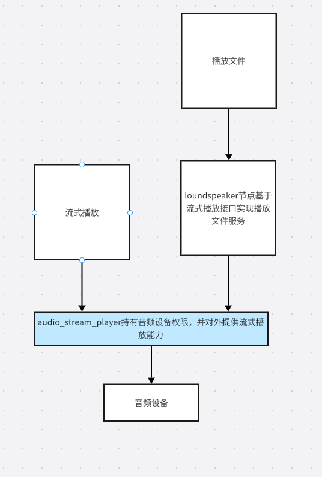

# kuavo_audio_player 使用说明

## 1. 系统架构说明
### **************** 建议先看架构图***************
kuavo_audio_player 是一个 ROS 音频播放系统，由两个主要节点组成：

1. **音频流播放节点(audio_stream_player_node)**：订阅 `audio_data` 话题，接收音频流数据并播放。
2. **音乐播放节点(music_player_node)**：提供 `/play_music` 服务，用于播放本地音频文件。

系统设计确保只有一个节点可以独占音频设备，避免多个进程同时访问音频设备导致的冲突。

## 2. 服务与话题接口

### 2.1 播放本地音频文件

#### 服务接口: `/play_music`
- **服务类型**: `kuavo_msgs/playmusic`
- **参数说明**:
  - `music_number`: 音乐文件名（如 `test.wav`、`test.mp3`），需放在配置的音乐目录下
  - `volume`: 音量参数，单位为 dB（分贝），建议范围为 0-10，过大可能导致音频失真
  - `speed`: 播放速度参数，1.0 为原速，大于 1 加速，小于 1 减速

#### 示例调用:
```bash
rosservice call /play_music "music_number: '1_挥手.mp3'
volume: 3"
```

### 2.2 音频流播放接口

#### 话题: `audio_data`
- **话题类型**: `std_msgs/Int16MultiArray`
- **数据格式**:
  - `data`: 音频采样数据，格式为 16 位有符号整数（INT16）数组
  - `layout.dim`: 可包含采样率信息，通过 `dim.label="sample_rate"` 和 `dim.size=采样率值` 指定

#### 采样率说明:
- 默认采样率为 16000Hz
- 如需使用其他采样率，可在消息的 `layout.dim` 中添加采样率信息
- 系统会自动将不同采样率的音频重采样至设备支持的采样率

#### 示例代码:
```python
# 创建音频消息
msg = Int16MultiArray()
msg.data = audio_chunk.tolist()  # audio_chunk 是 numpy int16 数组

# 添加采样率信息（如果不是默认的 16000Hz）
from std_msgs.msg import MultiArrayDimension
dim = MultiArrayDimension()
dim.label = "sample_rate"
dim.size = 44100  # 设置实际采样率，例如 44100Hz
dim.stride = 1
msg.layout.dim.append(dim)

# 发布消息
audio_publisher.publish(msg)
```

### 2.3 停止播放接口

#### 话题: `stop_music`
- **话题类型**: `std_msgs/Bool`
- **功能**: 发送 `True` 可立即停止当前正在播放的所有音频

#### 示例调用:
```bash
rostopic pub /stop_music std_msgs/Bool "data: true" -1
```

## 3. 软件依赖

- `pyaudio`: 用于音频流播放（`sudo apt-get install python3-pyaudio -y`）
- `samplerate`: 用于高质量音频重采样（`pip install samplerate`）
- `scipy`: 科学计算库（用于音频处理）
- `ffmpeg` 和 `ffplay`: 用于音频格式转换和播放（`sudo apt-get install ffmpeg -y`）
- 若依赖缺失，节点会尝试自动安装

## 4. 音频格式支持

系统支持各种常见音频格式：
- MP3、WAV、OGG、AAC、FLAC 等
- 音频会被自动转换为 16 位 PCM 流
- 支持音量调节和播放速度控制
- 支持实时音频重采样，适配不同声卡设备

> 注意：音频格式支持基于 ffmpeg，请确保系统已安装该软件

## 5. 使用流程

### 5.1 启动节点
通过 launch 文件启动：
```bash
roslaunch kuavo_audio_player play_music.launch
```

### 5.2 播放本地音频文件
```bash
rosservice call /play_music "music_number: '1_挥手.mp3'
volume: 3"
```

### 5.3 发布音频流测试
使用测试节点发布音频流：
```bash
rosrun kuavo_audio_player audio_stream_test.py
```

### 5.4 停止当前播放
```bash
rostopic pub /stop_music std_msgs/Bool "data: true" -1
```

## 6. 服务

### 6.1 获取音频缓冲区使用情况
```bash
rosservice call /get_used_audio_buffer_size
```


## 注意
避免播放过大音频文件，否则会导致音频播放卡顿。
* 实测26M，11分钟的mp3格式的音频文件，播放延时在0.9s左右。

## 6. 架构图
