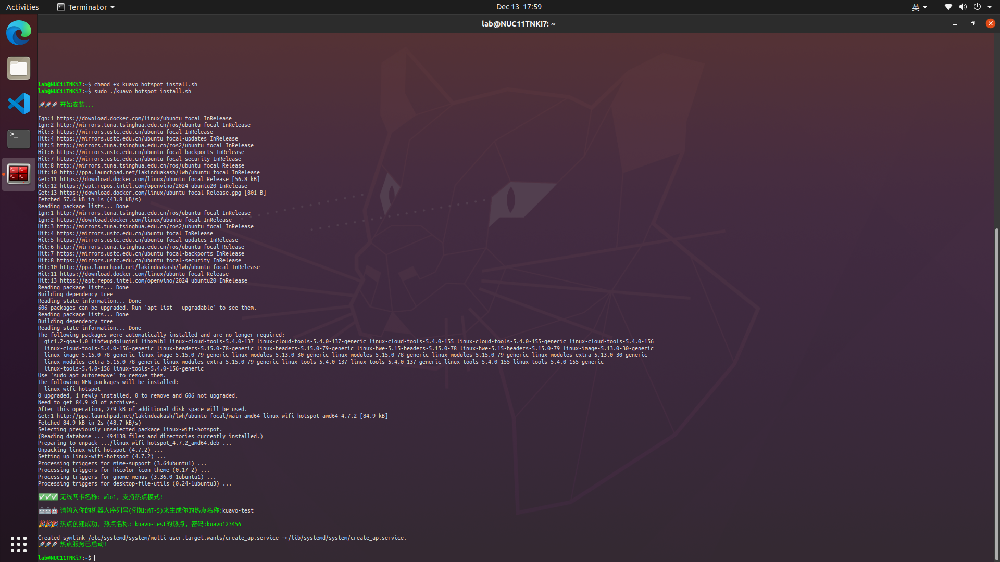
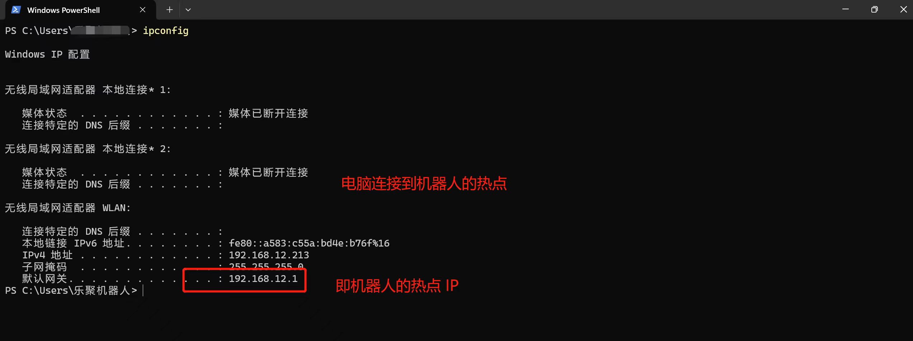
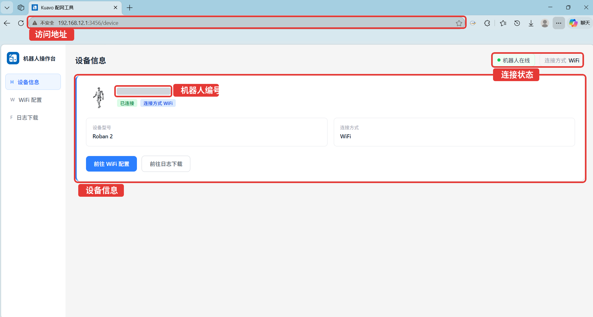
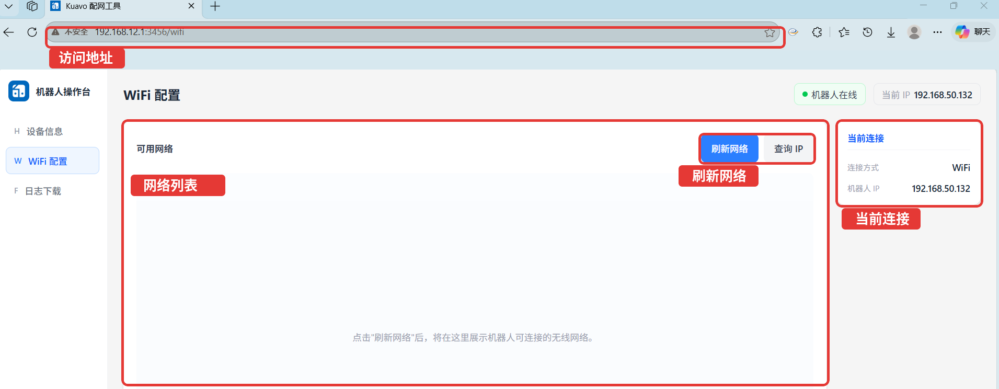
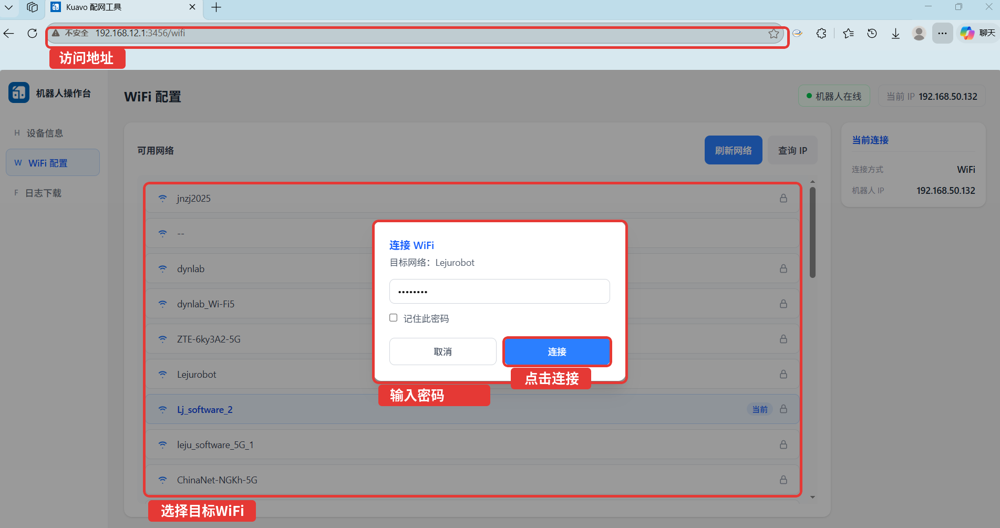
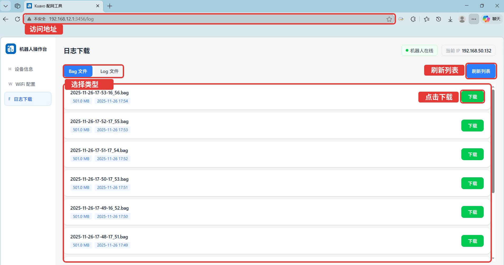
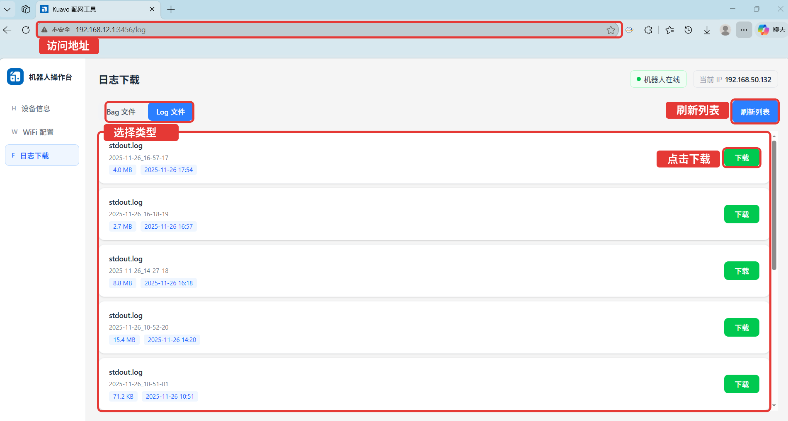
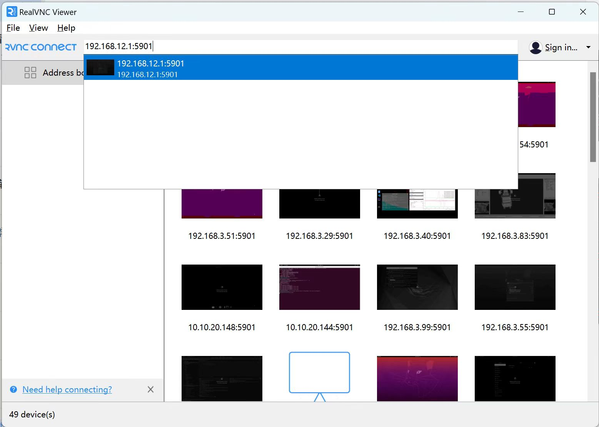
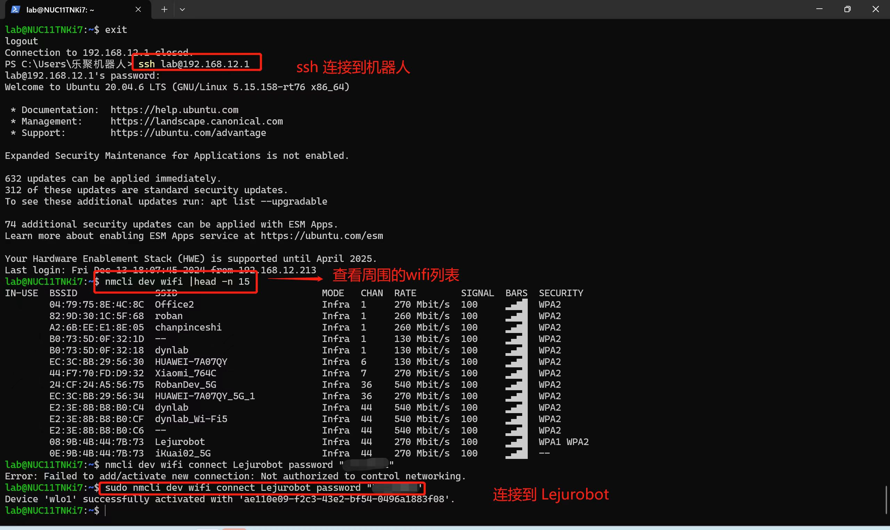

# Tools - Linux WiFi Hotspot

## 描述
> 热点的名称: `XXX的热点`, 其中 XXX 是你输入的机器人名称。
> 热点的密码: `kuavo123456`
> 默认的热点 IP 地址: `192.168.12.1`

本工具用于在机器人上创建一个 WiFi 热点, 并将其名称设置为 `XXX的热点`, 密码为 `kuavo123456`.

执行安装脚本后, 除了配置机器人热点, 还会自动安装并启动 Kuavo 配网工具. 连接机器人热点后, 可通过浏览器打开以下地址使用网页工具:

```text
http://192.168.12.1:3456
```

Kuavo 配网工具提供以下功能:

- 查看设备信息、机器人型号、连接状态和连接方式
- 扫描并连接 WiFi
- 查询机器人当前 IP
- 下载机器人上的 bag 文件和 log 文件


## 安装&启用
执行以下命令安装热点和 Kuavo 配网工具:
```bash
cd ./tools/linux_wifi_hotspot/ # 请替换在你的仓库中的实际路径
chmod +x ./kuavo_hotspot_install.sh # 添加可执行权限
sudo ./kuavo_hotspot_install.sh
```


## 使用方法
**1. 连接到机器人的热点**
> 默认的热点 IP 地址是: `192.168.12.1`

以 Windows 系统为例, `win +r ` 输入 `cmd` 打开命令行窗口:
```bat
# 输入以下命令查看当前连接的网络的网关地址 即机器人的热点 ip 地址
ipconfig 
```


### 使用 Kuavo 配网工具

连接机器人热点后, 在浏览器中打开:

```text
http://192.168.12.1:3456
```

#### 设备信息

进入网页后默认显示设备信息页, 可查看机器人名称、设备型号、在线状态和当前连接方式.



#### WiFi 配置

点击左侧 `WiFi 配置`, 进入 WiFi 配置页. 页面右上角会显示机器人在线状态和当前 IP.



点击 `刷新网络` 扫描附近 WiFi, 选择目标网络后输入密码, 点击 `连接` 即可切换机器人连接的 WiFi.



连接成功后, 可以点击 `查询 IP` 查看机器人在目标 WiFi 下的新 IP. 如果电脑仍连接机器人热点, 可继续使用:

```text
http://192.168.12.1:3456
```

如果机器人热点断开或电脑切换到了同一个目标 WiFi, 可使用页面显示的新 IP 访问:

```text
http://机器人新IP:3456
```

#### 日志下载

点击左侧 `日志下载`, 可下载机器人上的 bag 文件和 log 文件.

`Bag 文件` 页面:



`Log 文件` 页面:



点击 `刷新列表` 获取最新文件列表, 点击文件右侧的 `下载` 保存文件.

### 使用 VNC 或 SSH 连接到机器人
**使用 VNC 连接到机器人**
你可以使用 VNC 连接到机器人, 然后切换 WIFI 或查看机器人的 IP 地址:


**或者也可以使用 SSH 连接到机器人**
以 Windows 系统为例, `win +r ` 输入 `cmd` 打开命令行窗口:
```bat
ssh lab@192.168.x.x # 192.168.x.x # 替换为机器人的 ip 地址
```

以下是通过 ssh 连接/切换机器人 WIFI 的示例:
```bash
ssh lab@192.168.x.x # 192.168.x.x # 替换为机器人的 ip 地址


# 查看周围的 WIFI
sudo nmcli dev wifi list

# 切换到指定 WIFI
sudo nmcli dev wifi connect "WIFI名称" password "WIFI密码"
```



## 停用
你可以执行以下命令来停用 kuavo 热点:

tips: 执行该命令会关闭热点, 但是开机后会再次开启热点.
```bash
sudo systemctl stop create_ap # 关闭热点, 但是开机后还是会自动开启热点
```
你也可以执行以下命令来停止开机自动开启 kuavo 热点:

tips: 执行该命令会关闭热点, 并且后续开机不会自动开启热点.
```bash
sudo systemctl disable create_ap # 关闭开机自动开启热点
```

如果您想重新设置开机自动开启热点, 您可以执行以下命令:
```bash 
sudo systemctl enable create_ap # 执行该命令后, 热点将在开机时自动开启
```

## 卸载
执行以下命令会卸载热点, 卸载后开机将不会有对应的热点开启, 如需再次使用本工具, 请重新安装.
```bash
cd ./tools/linux_wifi_hotspot/ # 请替换在你的仓库中的实际路径
chmod +x ./uninstall.sh # 添加可执行权限
sudo ./uninstall.sh

# 以下是卸载过程部分内容输出:
🚀🚀🚀 开始卸载...
...

🚀🚀🚀 卸载成功...
```
