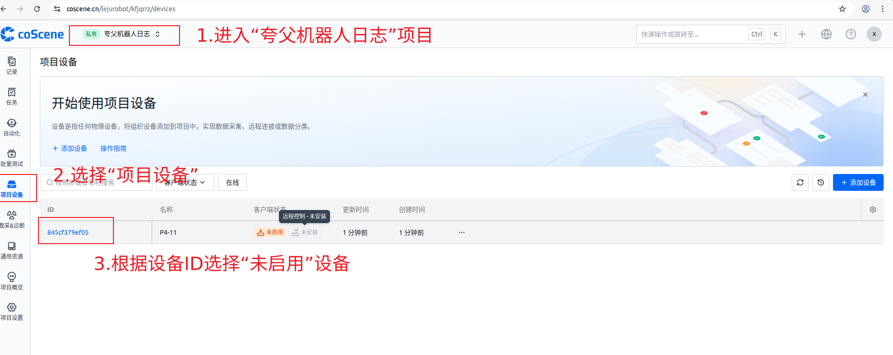
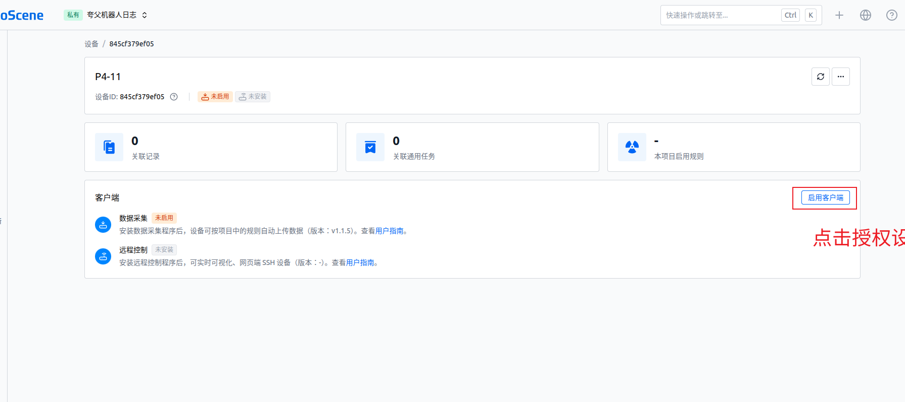
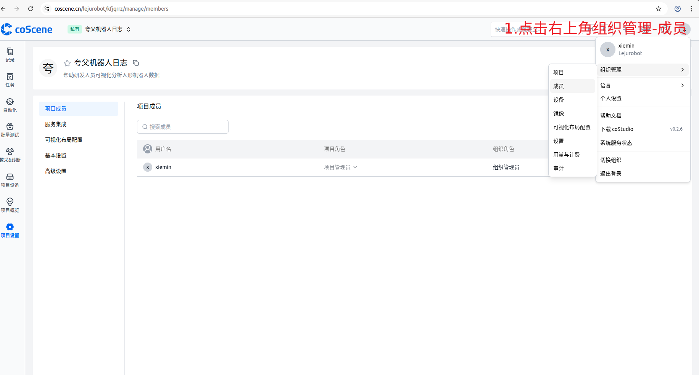
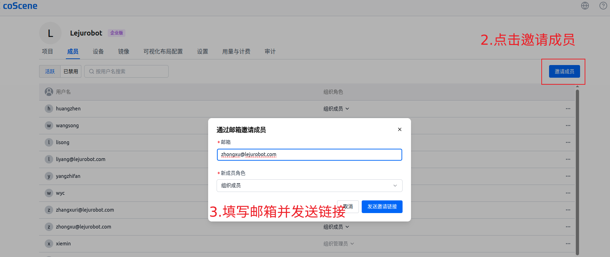
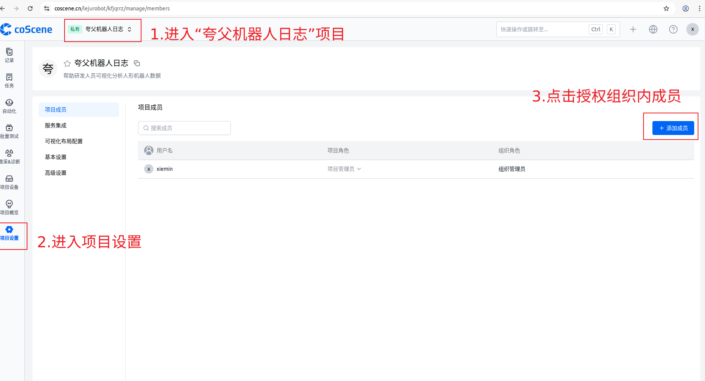
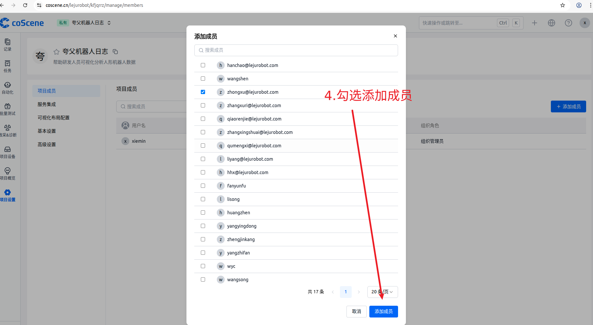
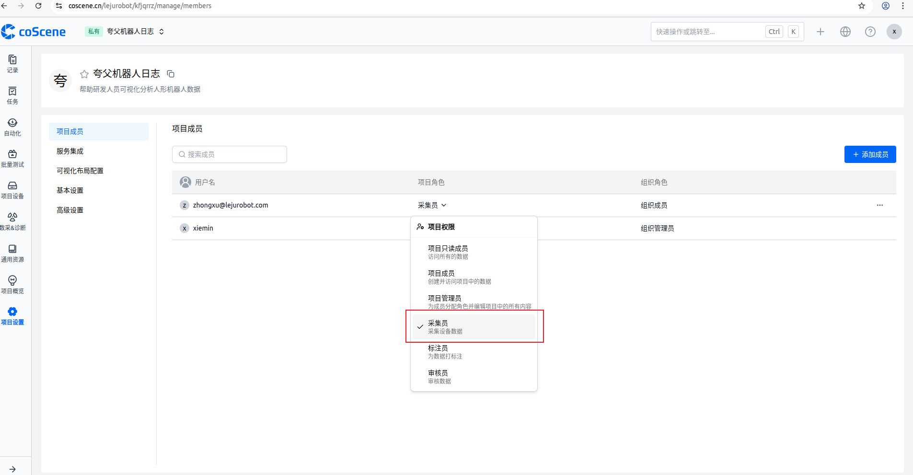

# 日志上传 coScene 云端说明文档

## 授权新设备

登录 coScene 网页端 https://coscene.cn/ 授权新设备

**授权新设备需要有组织管理员权限的账号，需要添加管理员权限账号请联系黄怀贤 hhx@lejurobot.com**

1. 进入‘夸父机器人日志’项目 https://coscene.cn/lejurobot/kfjqrrz/devices
2. 点击左侧菜单栏 "设备管理"
3. 找到未启用的设备，**注意设备编号是否是需要添加的设备**

4. 点击 "启用客户端" 完成设备添加

5. 设备状态变为 "在线" 即表示授权成功，点击右上角编辑给设备起别名用于标识，如当前设备为“P4-11”

## 授权成员查看日志

登录 coScene 网页端 https://coscene.cn/ 

**授权新人员需要有组织管理员权限的账号**

### 邀请新成员加入云端组织

1.登录后点击右上角组织管理-成员

2.点击邀请成员
3.填写新成员的邮箱，角色选填组织成员

### 授予组织内成员访问日志项目

1.进入“夸父机器人日志”项目
2.进入项目设置
3.点击添加成员

4.勾选组织内的成员并添加

5.给调试人员设置项目采集员权限

