# coScene 云端日志查看

登录 coScene 网页端 https://coscene.cn/ ，账号需要管理员授权才能查看，详情见 请参考 [ coScene 管理员授权文档](coScene_admin.md#授权成员查看日志)

## 云端日志采集

**云端采集需要采集员权限**，没有权限需要组织管理员授权

1.进入“夸父机器人日志”项目，选择任务-采集任务，点击创建任务
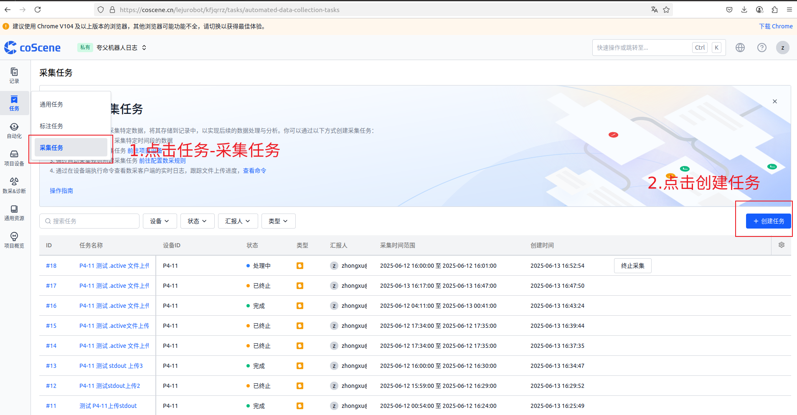
2.根据设备编号和用户给的出现问题的时间范围填写任务采集参数，**需要删除 `/home/kuavo/Data/bag/` 和 `/home/kuavo/Data/log/` 两个目录，这两个目录是其他项目的采集目录**。任务名称建议填 <设备编号>+<采集原因>，如 ”P4-11 测试 .active 文件上传”。**注意！判断是否在上传时间范围依据的是文件的修改时间**。
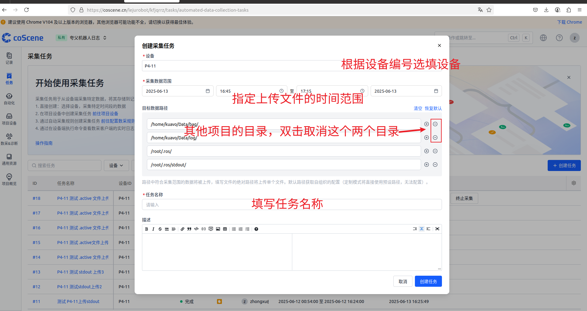
3.等待上传，若采集完成没有关联记录生成则表示设定的采集范围没有符合的文件。
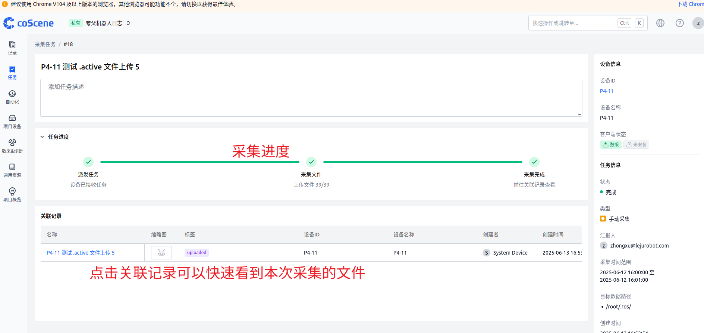

## 查看上传的日志

1.进入“夸父机器人日志”项目
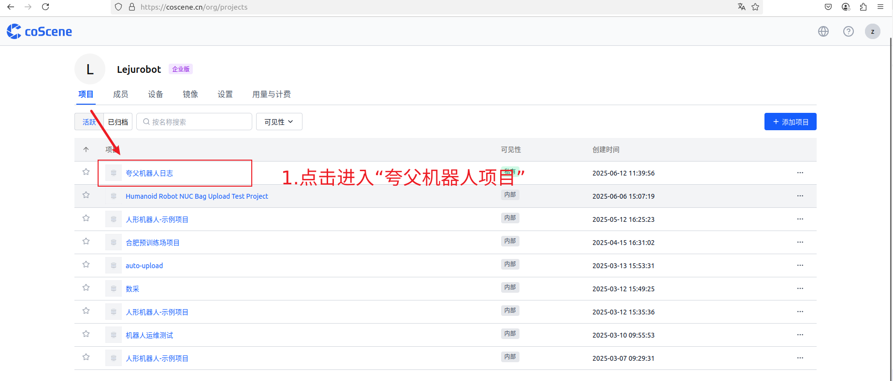
2.根据设备 ID 进入相应设备
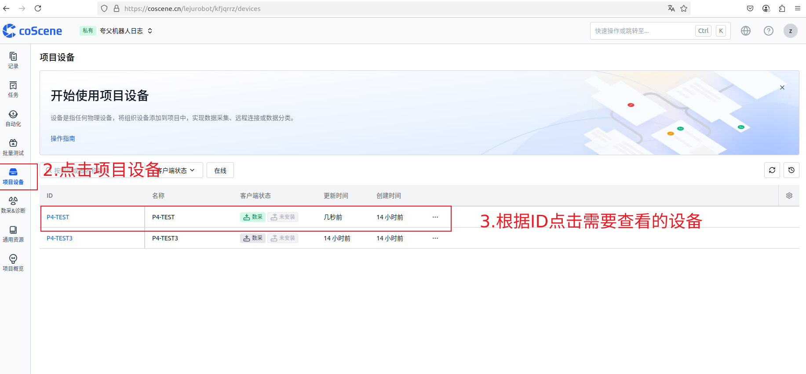
3.点击进入关联记录
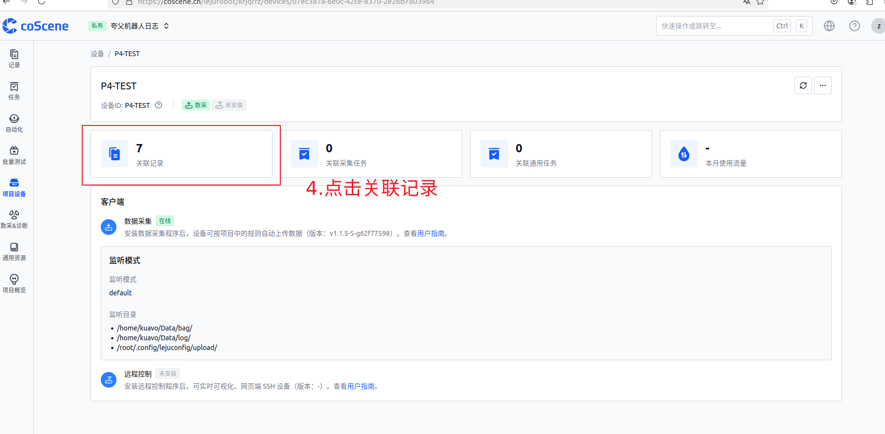
4.选择最新上传的记录
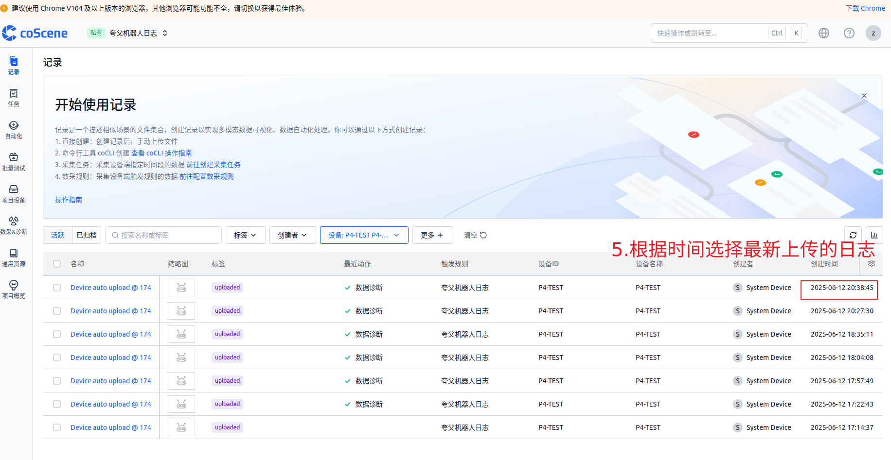
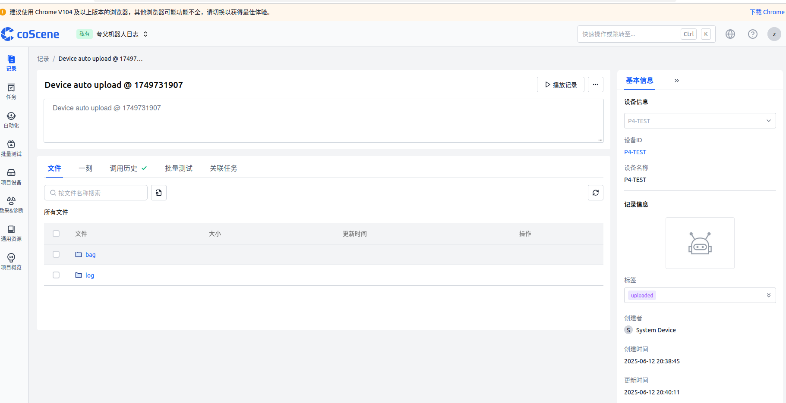

## 日志图表在线查看

### 使用已有布局查看 bag 日志

云端有已经设定的布局可以快速查看数据，点击设备记录中的bag文件，选择组织内的 leju-layout 布局
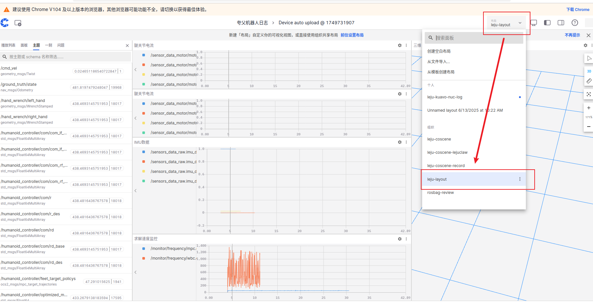

### 自定义布局查看 bag 日志中的指定话题

可以通过新建自定义布局来查看指定话题数据，例如想要查看 /sensors_data_raw/sensors_data_raw.joint_data.joint_q[0] 的数据

1.创建空白布局
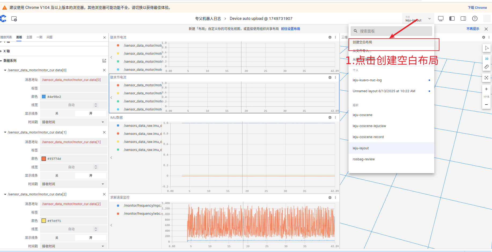
2.选择图表
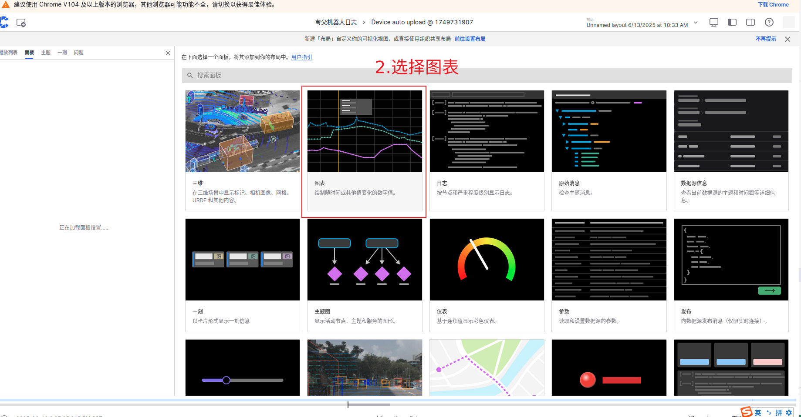
3.输入指定话题
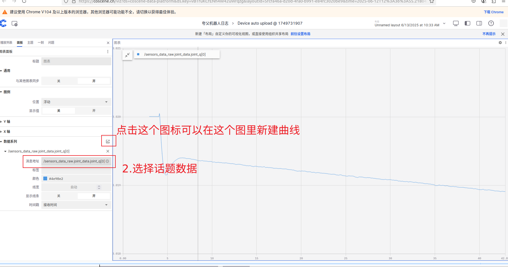
4.创建新面板，点击拆分可以将画面分屏，同时查看不同的图表
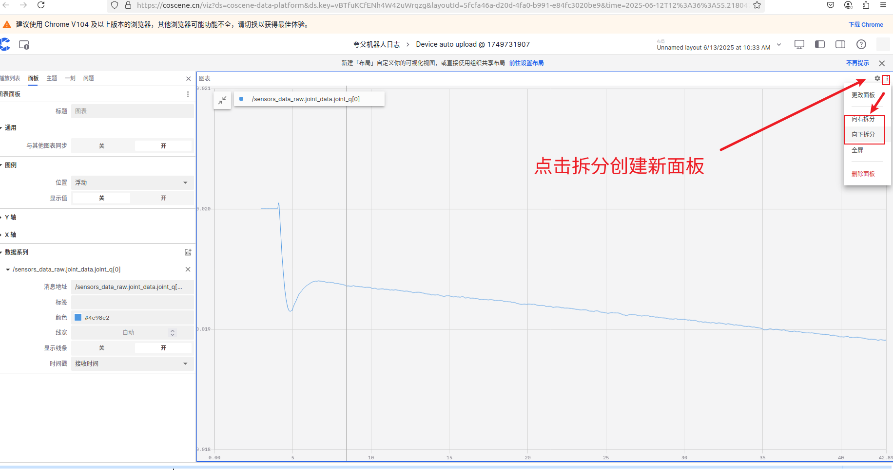