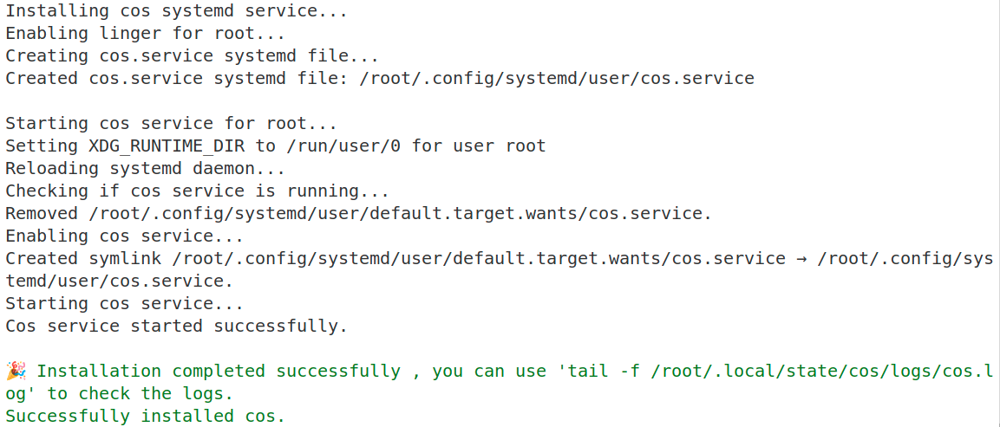

# 日志上传到 coScene 云端流程

## 机器人端配置日志上传服务

机器人配置日志上传服务需要在机器人端安装 coScene 服务，并需要有 coScene 项目管理员权限的成员授权新机器

可以通过 `sudo tail -f /root/.local/state/cos/logs/cos.log` 命令查看是否有日志出现，若命令报错或者无日志刷新则表示服务已经安装。

### 机器人端 coScene 服务安装

#### 方法一：下载安装脚本

- `curl -fsSL https://kuavo.lejurobot.com/statics/install_log_uploader-latest.sh | sudo bash`

#### 方法二：使用仓库内脚本安装

- `cd <kuavo-ros-opensource>`
- `sudo tools/upload_log/doc/install_log_uploader.sh`

当前机器人在云端的编号为 wlo1 网卡的 mac 地址去掉冒号，获得机器编号的命令如下：

`ip link show wlo1 | grep -o -E '([[:xdigit:]]{2}:){5}[[:xdigit:]]{2}' | head -n1 | tr -d ':'`


服务安装成功命令行结果如下：



### coScene 后台服务日志查看命令

`sudo tail -f /root/.local/state/cos/logs/cos.log`

### 项目管理员授权新机器

使用 `sudo tail -f /root/.local/state/cos/logs/cos.log` 查看日志，设备需要授权

```bash
time="2025-06-12T11:44:57+08:00" level=warning msg="Device is not authorized, waiting..." func=85 file=daemon.go
```

请参考 [ coScene 管理员授权文档](coScene_admin.md#授权新设备)


授权后部分日志结果如下：

```bash
time="2025-06-12T11:50:58+08:00" level=info msg="device P4-TEST heartbeat sent" func=95 file=heartbeat.go
time="2025-06-12T11:50:59+08:00" level=info msg="Starting task handler" func=66 file=handler.go
time="2025-06-12T11:50:59+08:00" level=error msg="remote config is empty" func=126 file=manager.go
time="2025-06-12T11:50:59+08:00" level=info msg="received rules: 0" func=116 file=handler.go
time="2025-06-12T11:50:59+08:00" level=info msg="Updated 0 valid rules" func=127 file=engine.go
time="2025-06-12T11:50:59+08:00" level=info msg="handling topics: Set{}" func=119 file=handler.go
time="2025-06-12T11:50:59+08:00" level=info msg="Task handler completed" func=105 file=handler.go
time="2025-06-12T11:50:59+08:00" level=info msg="Remote config refreshed" func=122 file=daemon.go
time="2025-06-12T11:51:00+08:00" level=info msg="Starts to scan collect info dir" func=296 file=handler.go
```

### 上传日志到云端

调试人员在云端采集指定时间段的日志，请参考 [日志采集](coScene_developer.md#日志采集)

### 调试人员在云端查看日志

请参考 [ coScene 管理员授权文档](coScene_developer.md#云端日志查看)